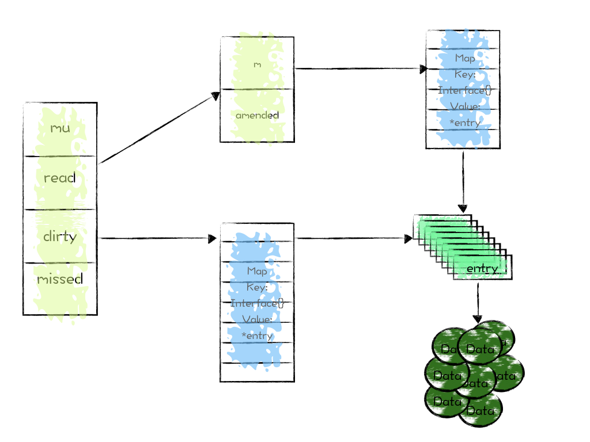

# Go Sync

[TOC]

## notifyList 

### 基本原理

相比 Semaphore 来说，sync.Cond 非常简单，它没有 treap 树，只有一个单链表连接着所有被 cond 阻塞的 G。

notifyList 有两个非常重要的成员，wait 和 notify，这两个都是 int 类型的变量，每次调用 cond.wait，wait 就自增 1，每次调用 cond.notify，notify 就自增 1，并且唤醒 sodog.ticket 和当前 notify 数值相同的 Goroutine。

### 数据结构

```
type notifyList struct {
	wait uint32

	notify uint32

	// List of parked waiters.
	lock mutex
	head *sudog
	tail *sudog
}

```

### notifyListAdd

调用 wait 函数之前，要先调用 add 函数，自增 wait 属性。

```
func notifyListAdd(l *notifyList) uint32 {
	return atomic.Xadd(&l.wait, 1) - 1
}

```

### notifyListWait

- 如果自增之后的 wait 还是小于等于 notify，那么说明其他 Goroutine 已经调用了 notify 函数，直接返回即可
- 设置 ticket 为当前的 wait 数
- 更新队列链表
- goparkunlock 进行调度

```
func notifyListWait(l *notifyList, t uint32) {
	lock(&l.lock)

	// Return right away if this ticket has already been notified.
	if less(t, l.notify) {
		unlock(&l.lock)
		return
	}

	// Enqueue itself.
	s := acquireSudog()
	s.g = getg()
	s.ticket = t
	s.releasetime = 0
	t0 := int64(0)

	if l.tail == nil {
		l.head = s
	} else {
		l.tail.next = s
	}
	l.tail = s
	goparkunlock(&l.lock, waitReasonSyncCondWait, traceEvGoBlockCond, 3)

	releaseSudog(s)
}

```

### notifyListNotifyOne

- 这个函数先判断是否有新增的 waiter，如果没有那也不必 notify 了，直接返回
- 加锁
- 递增 notify 属性值
- 在链表中找到 ticket 为 wait 的那个 sodog，唤醒它

```
func notifyListNotifyOne(l *notifyList) {
	// Fast-path: if there are no new waiters since the last notification
	// we don't need to acquire the lock at all.
	if atomic.Load(&l.wait) == atomic.Load(&l.notify) {
		return
	}

	lock(&l.lock)

	// Re-check under the lock if we need to do anything.
	t := l.notify
	if t == atomic.Load(&l.wait) {
		unlock(&l.lock)
		return
	}

	// Update the next notify ticket number.
	atomic.Store(&l.notify, t+1)

	for p, s := (*sudog)(nil), l.head; s != nil; p, s = s, s.next {
		if s.ticket == t {
			n := s.next
			if p != nil {
				p.next = n
			} else {
				l.head = n
			}
			if n == nil {
				l.tail = p
			}
			unlock(&l.lock)
			s.next = nil
			readyWithTime(s, 4)
			return
		}
	}
	unlock(&l.lock)
}

```

### notifyListNotifyAll

```
func notifyListNotifyAll(l *notifyList) {
	// Fast-path: if there are no new waiters since the last notification
	// we don't need to acquire the lock.
	if atomic.Load(&l.wait) == atomic.Load(&l.notify) {
		return
	}

	lock(&l.lock)
	s := l.head
	l.head = nil
	l.tail = nil

	atomic.Store(&l.notify, atomic.Load(&l.wait))
	unlock(&l.lock)

	// Go through the local list and ready all waiters.
	for s != nil {
		next := s.next
		s.next = nil
		readyWithTime(s, 4)
		s = next
	}
}

```

## sync.Cond

```
// Cond 实现了一种条件变量，可以让 goroutine 都等待、或宣布一个事件的发生
//
// 每一个 Cond 都有一个对应的 Locker L，可以是一个 *Mutex 或者 *RWMutex
// 当条件发生变化及调用 Wait 方法时，必须持有该锁
//
// Cond 在首次使用之后同样不能被拷贝
type Cond struct {
    noCopy noCopy

    // 在观测或修改条件时，必须持有 L
    L Locker

    notify  notifyList
    checker copyChecker
}

func NewCond(l Locker) *Cond {
    return &Cond{L: l}
}

// Wait 会原子地解锁 c.L，并挂起当前调用 Wait 的 goroutine
// 之后恢复执行时，Wait 在返回之前对 c.L 加锁。和其它系统不一样
// Wait 在被 Broadcast 或 Signal 唤醒之前，是不能返回的
//
// 因为 c.L 在 Wait 第一次恢复执行之后是没有被锁住的，调用方
// 在 Wait 返回之后没办法假定 condition 为 true。
// 因此，调用方应该在循环中调用 Wait
//
//    c.L.Lock()
//    for !condition() {
//        c.Wait()
//    }
//    .. 这时候 condition 一定为 true..
//    c.L.Unlock()
//
func (c *Cond) Wait() {
    c.checker.check()
    t := runtime_notifyListAdd(&c.notify)
    c.L.Unlock()
    runtime_notifyListWait(&c.notify, t)
    c.L.Lock()
}

// Signal 只唤醒等待在 c 上的一个 goroutine。
// 对于 caller 来说在调用 Signal 时持有 c.L 也是允许的，不过没有必要
func (c *Cond) Signal() {
    c.checker.check()
    runtime_notifyListNotifyOne(&c.notify)
}

// Broadcast 唤醒所有在 c 上等待的 goroutine
// 同样在调用 Broadcast 时，可以持有 c.L，但没必要
func (c *Cond) Broadcast() {
    c.checker.check()
    runtime_notifyListNotifyAll(&c.notify)
}

// 检查结构体是否被拷贝过，因为其持有指向自身的指针
// 指针值和实际地址不一致时，即说明发生了拷贝
type copyChecker uintptr

func (c *copyChecker) check() {
    if uintptr(*c) != uintptr(unsafe.Pointer(c)) &&
        !atomic.CompareAndSwapUintptr((*uintptr)(c), 0, uintptr(unsafe.Pointer(c))) &&
        uintptr(*c) != uintptr(unsafe.Pointer(c)) {
        panic("sync.Cond is copied")
    }
}

// noCopy may be embedded into structs which must not be copied
// after the first use.
//
// See https://golang.org/issues/8005#issuecomment-190753527
// for details.
type noCopy struct{}

// Lock is a no-op used by -copylocks checker from `go vet`.
func (*noCopy) Lock() {}

```


## sync.map

### 用法

- Store 写入
- Load 读取，返回值有两个，第一个是value，第二个是bool变量表示key是否存在
- Delete 删除
- LoadOrStore 存在就读，不存在就写
- Range 遍历，注意遍历的快照

并发hashmap的方案有很多，下面简单提一下几种，然后再讨论golang实现时的考虑。
第一种是最简单的，直接在不支持并发的hashmap上，使用一个读写锁的保护，这也是golang sync map还没出来前，大家常用的方法。这种方法的缺点是写会堵塞读。

第二种是数据库常用的方法，分段锁，每一个读写锁保护一段区间，golang的第三方库也有人是这么实现的。java的ConcurrentHashMap也是这么实现的。平均情况下这样的性能还挺好的，但是极端情况下，如果某个区间有热点写，那么那个区间的读请求也会受到影响。

第三种方法是我们C++自己造轮子时经常用的，使用使用链表法解决冲突，然后链表使用CAS去解决并发下冲突，这样读写都是无锁，我觉得这种挺好的，性能非常高，不知为啥其他语言不这么实现。

然后在《An overview of sync.Map》中有提到，在cpu核数很多的情况下，因为cache contention，reflect.New、sync.RWMutex、atomic.AddUint32都会很慢，golang团队为了适应cpu核很多的情况，没有采用上面的几种常见的方案。

golang sync map的目标是实现适合读多写少的场景、并且要求稳定性很好，不能出现像分段锁那样读经常被阻塞的情况。golang sync map基于map做了一层封装，在大部分情况下，不过写入性能比较差。下面来详细说说实现。

### 基本原理

要读受到的影响尽量小，那么最容易想到的想法，就是读写分离。golang sync map也是受到这个想法的启发（我自认为）设计出来的。使用了两个map，一个叫read，一个叫dirty，两个map存储的都是指针，指向value数据本身，所以两个map是共享value数据的，更新value对两个map同时可见。

#### 增

和普通的读写分离不同，并发 map 的 read 实际上除了读，还可以改和删，但是不能进行增。

read不能新增key，那么数据怎么来的呢？sync map中会记录miss cache的次数，当miss次数大于等于dirty元素个数时，就会把dirty变成read，原来的dirty清空。

为了方便dirty直接变成read，那么得保证read中存在的数据dirty必须有，所以在dirty是空的时候，如果要新增一个key，那么会把read中的元素复制到dirty中，然后写入新key。

我们可以把这个时间段称之为一个 map 周期。

#### 改查

对于 read 和 dirty 中都存在的 key，直接利用 CAS 对 read 进行删改查就可以了，由于 read 和 dirty 共享 entry，因此 read 一旦更改了 entry，dirty 那里的数据就被一并更改了。

#### 删

golang 的并发 map 并不是真正的删除 map 中的 key，而是在 read 中为 entry.p 赋值为 nil，这样 read 和 dirty 这个 key 就会共享 nil，代表数据已经被删除了。这么做，实际上是为删除的 key 做一个缓存，缓存时间为一个 map 周期，假如删除一段时间后，又想重新用这个 key，直接执行更新操作即可，对 map 的影响比较小。

前面说过，当 miss 的数量过多，会触发 read 被 dirty 替换，dirty 会被清空。这个时候，被删除的 key 会跟随着 dirty 来到 read，但是他的 value 仍然是 nil。

当又有新的 key 需要写入的时候，需要将 read 的所有 key 同步到 dirty 中去。那么 value 是 nil 的那些 key 如何处理呢？

答案是，不会被同步到 dirty 中去，但是会把 read 中 value 从 nil 改为 expunged。这个时候被删除的 key 就危险了。

如果这个时候，key 被重利用，那么 read 会重新从 expunged 改为 nil，并且向 dirty 写入这个新的 key，它就像一个正常的 key 一样了。

但是如果这个 key 一直没有人重新赋值了，那么下一个周期，read 被 dirty 替换的时候，这个 key 就真的不存在了。

总结下就是：

- 周期一：key 被删除，value 在 read 和 dirty 中都是 nil
- 周期二：key 只存在与 read，value 为 expunged；dirty 中没有这个 key
- 周期三：key 在 read 和 dirty 中都不存在。

### 数据结构

- Map 中的 mu 是保护 dirty 的锁
- read 实际上是 readOnly 类型，只是 golang 使用了 atomic 对它进行了保护，让它可以在更新之后，立刻被其他的 Goroutine 看到
- dirty 就是专门负责添加新元素的 map，注意 entry 是指针，它实际上和 readOnly 的 map 共享一个 entry
- misses 就是查询 read 失败的次数，达到一个阈值，就会将 dirty 替换 read

注意对于 entry.p，有两个特殊值，一个是nil，另一个是expunged。我们在上面已经讲过了它的作用，分别代表着被删除的 key 所处的周期状态。

```
type Map struct {
	mu Mutex

	read atomic.Value // readOnly
	
	dirty map[interface{}]*entry

	misses int
}

// readOnly is an immutable struct stored atomically in the Map.read field.
type readOnly struct {
	m       map[interface{}]*entry
	amended bool // true if the dirty map contains some key not in m.
}

// expunged is an arbitrary pointer that marks entries which have been deleted
// from the dirty map.
var expunged = unsafe.Pointer(new(interface{}))

// An entry is a slot in the map corresponding to a particular key.
type entry struct {
	p unsafe.Pointer // *interface{}
}

```



### Load 读取

- 读取时，先去read读取；
- 如果没有，并且 read.amended 为 false，那么说明，自从 read 被 dirty 替换，还没有新的 key 写入，此时 ditry 为空，read 没有那就是真的没有，直接返回 nil，false
- 如果没有，而且 read.amended 为 true，说明有新的 key 写入到了 dirty。那么加锁，然后去 dirty 读取，同时调用 missLocked()，再解锁。
- 在 missLocked 中，会递增 misses 变量，如果 misses>len(dirty)，那么把 dirty 提升为 read，清空原来的dirty。

在代码中，我们可以看到一个double check，检查read没有，上锁，再检查read中有没有，是因为有可能在第一次检查之后，上锁之前的间隙，dirty提升为read了，这时如果不double check，可能会导致一个存在的key却返回给调用方说不存在。 在下面的其他操作中，我们经常会看到这个double check。

```
func (m *Map) Load(key interface{}) (value interface{}, ok bool) {
	read, _ := m.read.Load().(readOnly)
	e, ok := read.m[key]
	
	if !ok && read.amended {
		m.mu.Lock()

		read, _ = m.read.Load().(readOnly)
		e, ok = read.m[key]
		if !ok && read.amended {
			e, ok = m.dirty[key]

			m.missLocked()
		}
		m.mu.Unlock()
	}
	
	if !ok {
		return nil, false
	}
	
	return e.load()
}

func (e *entry) load() (value interface{}, ok bool) {
	p := atomic.LoadPointer(&e.p)
	if p == nil || p == expunged {
		return nil, false
	}
	return *(*interface{})(p), true
}

func (m *Map) missLocked() {
	m.misses++
	if m.misses < len(m.dirty) {
		return
	}
	m.read.Store(readOnly{m: m.dirty})
	m.dirty = nil
	m.misses = 0
}
```

### Store 写入

- 写入的时候，先看read中能否查到key，
	- 在read中存在的话，而且不是 expunged 状态，直接通过read中的entry来更新值；但是如果更新的过程中，被别的 G 更改为 expunged，那就不能再更新了，因为会涉及到 dirty 的写入。
	- 如果是 expunged 状态，因为涉及到 dirty 的写入，所以要加锁。
- 在read中不存在，那么就上锁，然后double check。这里需要留意，分几种情况：
	- double check发现read中存在，直接更新。
	- double check发现read中存在，但是是expunged，那么有可能加锁之前就是 expunged 状态，或者在加锁的过程中，这个 key 经历了周期一的删除，现在处于周期二的 read 中。我们需要将 expunged 改为 nil，并且将 key 添加到 dirty 中，然后更新它的值。
- dirty中存在，直接更新。说明这个 key 是当前这个周期新建的 key，只存在与 dirty 中，还没有同步到 read 中去。
- read 和 dirty中都不存在，那就是说明此时不是更新操作，而是插入的操作： 
	- 如果 read.amended 为 false，那这次就是自从 read 被 dirty 替换之后的第一次新 key 插入。需要将read复制到dirty中，最后再把新值写入到dirty中。复制的时候调用的是dirtyLocked()，在复制到dirty的时候，read中为nil的元素，会更新为expunged，并且不复制到dirty中。
	- 如果 read.amended 为 true，那么直接对 dirty 插入新增就可以了

我们可以看到，在更新read中的数据时，使用的是tryStore，通过CAS来解决冲突，在CAS出现冲突后，如果发现数据被置为expung，tryStore那么就不会写入数据，而是会返回false，在Store流程中，就是接着往下走，在dirty中写入。


```
func (m *Map) Store(key, value interface{}) {
	read, _ := m.read.Load().(readOnly)
	if e, ok := read.m[key]; ok && e.tryStore(&value) {
		return
	}

	m.mu.Lock()
	read, _ = m.read.Load().(readOnly)
	if e, ok := read.m[key]; ok {
		if e.unexpungeLocked() {
			// 将 expunged 转为 nil
			m.dirty[key] = e
		}
		e.storeLocked(&value)
	} else if e, ok := m.dirty[key]; ok {
		e.storeLocked(&value)
	} else {
		if !read.amended {
			// We're adding the first new key to the dirty map.
			// Make sure it is allocated and mark the read-only map as incomplete.
			m.dirtyLocked()
			m.read.Store(readOnly{m: read.m, amended: true})
		}
		m.dirty[key] = newEntry(value)
	}
	m.mu.Unlock()
}

func (e *entry) tryStore(i *interface{}) bool {
	for {
		p := atomic.LoadPointer(&e.p)
		if p == expunged {
			return false
		}
		if atomic.CompareAndSwapPointer(&e.p, p, unsafe.Pointer(i)) {
			return true
		}
	}
}

func (e *entry) unexpungeLocked() (wasExpunged bool) {
	return atomic.CompareAndSwapPointer(&e.p, expunged, nil)
}

func (m *Map) dirtyLocked() {
	if m.dirty != nil {
		return
	}

	read, _ := m.read.Load().(readOnly)
	m.dirty = make(map[interface{}]*entry, len(read.m))
	for k, e := range read.m {
		if !e.tryExpungeLocked() { // 将 nil 转为 expunged 状态，并且不会赋值给 dirty
			m.dirty[k] = e
		}
	}
}

func (e *entry) tryExpungeLocked() (isExpunged bool) {
	p := atomic.LoadPointer(&e.p)
	for p == nil {
		if atomic.CompareAndSwapPointer(&e.p, nil, expunged) {
			return true
		}
		p = atomic.LoadPointer(&e.p)
	}
	return p == expunged
}
```

### Delete 删除

删除很简单，read中存在，就把read中的entry.p置为nil，如果只在ditry中存在，那么就直接从dirty中删掉对应的entry。

```
func (m *Map) Delete(key interface{}) {
	read, _ := m.read.Load().(readOnly)
	e, ok := read.m[key]
	if !ok && read.amended {
		m.mu.Lock()
		read, _ = m.read.Load().(readOnly)
		e, ok = read.m[key]
		if !ok && read.amended {
			delete(m.dirty, key)
		}
		m.mu.Unlock()
	}
	if ok {
		e.delete()
	}
}

func (e *entry) delete() (hadValue bool) {
	for {
		p := atomic.LoadPointer(&e.p)
		if p == nil || p == expunged {
			return false
		}
		if atomic.CompareAndSwapPointer(&e.p, p, nil) {
			return true
		}
	}
}

```

## sync.waitgroup

我们先了解下 waitgroup 的用法，它最常用的场景是需要并发 n 个 G，需要等待 n 个 G 全部结束后，跑接下来的代码。

- 首先会在当前 G 中调用 add 函数，传入一个数目 n；
- 然后开始创建 Goroutine，并调用 wait 函数，阻塞
- 每个 G 在将要结束的时候，调用 done 函数
- 所有的 G 运行接受之后，n 被减为 0，这时候唤醒被 wait 阻塞的 G

waitgroup 的原理也是十分简单，属性中有一个 state1 的 64 位数组，前 32 位代表着当前的 waitgroup 现有的counter 数目，后 32 为代表着调用 waitgroup.wait 的协程数目。

- 当调用 add 函数的时候，前 32 为加上 n 数目
- 当调用 done 函数的时候，前 32 为减 1
- 当调用 wait 函数的时候，递增后 32 位，并且阻塞在 sema 信号量上
- 当最后一个 G 调用 done 函数后，发现前 32 已经变成了 0，开始利用 sema 信号唤醒所有的等待者

```
// 在主 goroutine 中 Add 和 Wait，在其它 goroutine 中 Done
// 在第一次使用之后，不能对 WaitGroup 再进行拷贝
type WaitGroup struct {
    noCopy noCopy

    // state1 的高 32 位是计数器，低 32 位是 waiter 计数
    // 64 位的 atomic 操作需要按 64 位对齐，但是 32 位编译器没法保证这种对齐
    // 所以分配 12 个字节(多分配了 4 个字节)
    // 当 state 没有按 8 对齐时，我们可以偏 4 个字节来使用
    // 按 8 对齐时：
    // 0000...0000      0000...0000       0000...0000
    // |- 4 bytes-|    |- 4 bytes -|     |- 4 bytes -|
    //     使用              使用             不使用
    // 没有按 8 对齐时：
    // |- 4 bytes-|    |- 4 bytes -|     |- 4 bytes -|
    //    不使用              使用             使用
    // |-low->  ---------> ------> -----------> high-|
    state1 [12]byte
    sema   uint32
}

func (wg *WaitGroup) state() *uint64 {
    // 判断 state 是否按照 8 字节对齐
    if uintptr(unsafe.Pointer(&wg.state1))%8 == 0 {
        // 已对齐时，使用低 8 字节即可
        return (*uint64)(unsafe.Pointer(&wg.state1))
    } else {
        // 未对齐时，使用高 8 字节
        return (*uint64)(unsafe.Pointer(&wg.state1[4]))
    }
}

// Add 一个 delta，delta 可能是负值，在 WaitGroup 的 counter 上增加该值
// 如果 counter 变成 0，所有阻塞在 Wait 函数上的 goroutine 都会被释放
// 如果 counter 变成了负数，Add 会直接 panic
// 当 counter 是 0 且 Add 的 delta 为正的操作必须发生在 Wait 调用之前。
// 而当 counter > 0 且 Add 的 delta 为负的操作则可以发生在任意时刻。
// 一般来讲，Add 操作应该在创建 goroutine 或者其它需要等待的事件发生之前调用
// 如果 wg 被用来等待几组独立的事件集合
// 新的 Add 调用应该在所有 Wait 调用返回之后再调用
// 参见 wg 的 example
func (wg *WaitGroup) Add(delta int) {
    statep := wg.state()

    state := atomic.AddUint64(statep, uint64(delta)<<32)
    v := int32(state >> 32) // counter 高位 4 字节
    w := uint32(state) // waiter counter，截断，取低位 4 个字节

    if v < 0 {
        panic("sync: negative WaitGroup counter")
    }
    if w != 0 && delta > 0 && v == int32(delta) {
        panic("sync: WaitGroup misuse: Add called concurrently with Wait")
    }
    if v > 0 || w == 0 {
        return
    }

    // 当前 goroutine 已经把 counter 设为 0，且 waiter 数 > 0
    // 这时候不能有状态的跳变
    // - Add 不能和 Wait 进行并发调用
    // - Wait 如果发现 counter 已经等于 0，则不应该对 waiter 数加一了
    // 这里是对 wg 误用的简单检测
    if *statep != state {
        panic("sync: WaitGroup misuse: Add called concurrently with Wait")
    }

    // 此时 v 为 0，代表着可以唤醒了
    // 重置 waiter 计数为 0
    *statep = 0
    for ; w != 0; w-- {
        runtime_Semrelease(&wg.sema, false)
    }
}

// Done 其实就是 wg 的 counter - 1
// 进入 Add 函数后
// 如果 counter 变为 0 会触发 runtime_Semrelease 通知所有阻塞在 Wait 上的 g
func (wg *WaitGroup) Done() {
    wg.Add(-1)
}

// Wait 会阻塞直到 wg 的 counter 变为 0
func (wg *WaitGroup) Wait() {
    statep := wg.state()

    for {
        state := atomic.LoadUint64(statep)
        v := int32(state >> 32) // counter
        w := uint32(state) // waiter count
        if v == 0 { // counter
            return
        }

        // 如果没成功，可能有并发，循环再来一次相同流程
        // 成功直接返回
        if atomic.CompareAndSwapUint64(statep, state, state+1) {
            runtime_Semacquire(&wg.sema) // 和上面的 Add 里的 runtime_Semrelease 是对应的
            if *statep != 0 {
                panic("sync: WaitGroup is reused before previous Wait has returned")
            }
            return
        }
    }
}

```

不过新的代码又优化了数据结构

现在如果在 64 系统中，最后的 32bit 也不浪费，变成了信号量。

如果在 32 系统中，前 32bit 是信号量，后面 64bit 还是 counter 和 waiter。

代码原理没有大的变化。

```
type WaitGroup struct {
	noCopy noCopy

	// 64-bit value: high 32 bits are counter, low 32 bits are waiter count.
	// 64-bit atomic operations require 64-bit alignment, but 32-bit
	// compilers do not ensure it. So we allocate 12 bytes and then use
	// the aligned 8 bytes in them as state, and the other 4 as storage
	// for the sema.
	state1 [3]uint32
}

func (wg *WaitGroup) state() (statep *uint64, semap *uint32) {
	if uintptr(unsafe.Pointer(&wg.state1))%8 == 0 {
		return (*uint64)(unsafe.Pointer(&wg.state1)), &wg.state1[2]
	} else {
		return (*uint64)(unsafe.Pointer(&wg.state1[1])), &wg.state1[0]
	}
}
```

## sync.once

golang 的注释解释了为何不建议直接进行 CAS 操作，为何一定要用到锁 mutex，原因是如果 2 个 G 并发调用，要保证 2 个 G 返回的时候，F 已经执行完毕。如果按照注释那种代码，失败的 G 会立刻返回，但是此时 F 还未执行完毕。

```
type Once struct {
	done uint32
	m    Mutex
}

func (o *Once) Do(f func()) {
	// Note: Here is an incorrect implementation of Do:
	//
	//	if atomic.CompareAndSwapUint32(&o.done, 0, 1) {
	//		f()
	//	}
	//
	// Do guarantees that when it returns, f has finished.
	// This implementation would not implement that guarantee:
	// given two simultaneous calls, the winner of the cas would
	// call f, and the second would return immediately, without
	// waiting for the first's call to f to complete.
	// This is why the slow path falls back to a mutex, and why
	// the atomic.StoreUint32 must be delayed until after f returns.
    if atomic.LoadUint32(&o.done) == 0 {
		// Outlined slow-path to allow inlining of the fast-path.
		o.doSlow(f)
	}
}

func (o *Once) doSlow(f func()) {
	o.m.Lock()
	defer o.m.Unlock()
	if o.done == 0 {
		defer atomic.StoreUint32(&o.done, 1)
		f()
	}
}
```