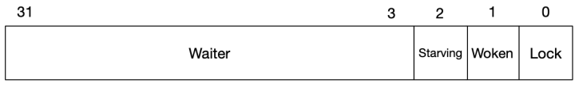

# Go Sync——Mutex

[TOC]

## 基本原理

锁的整体设计有以下几点：

- CAS原子操作。
- 需要有一种阻塞和唤醒机制。
- 尽量减少阻塞和唤醒切换成本。
- 锁尽量公平，后来者要排队。即使被后来者插队了，也要照顾先来者，不能有“饥饿”现象。

### CAS 原子操作

只有通过 CAS 原子操作，我们才能够原子的更改 mutex 的状态，否则很有可能出现多个协程同时进入临界区的情况。

### 阻塞与唤醒

阻塞和唤醒机制是 mutex 必要的功能，这个 Golang 完全依赖信号量 sema。

### 自旋 spin

减少切换成本的方法就是不切换，简单而直接。不切换的方式就是让竞争者自旋。自旋一会儿，然后抢锁。不成功就再自旋。到达上限次数才阻塞。

不同平台上自旋所用的指令不一样。例如在amd64平台下，汇编的实现如下：

```
func sync_runtime_doSpin() {
	procyield(active_spin_cnt)
}

active_spin_cnt = 30

TEXT runtime·procyield(SB),NOSPLIT,$0-0
	MOVL	cycles+0(FP), AX
again:
    // 自旋cycles次，每次自旋执行PAUSE指令
	PAUSE
	SUBL	$1, AX
	JNZ	again
	RET

```

是否允许自旋的判断是严格的。而且最多自旋四次，每次30个CPU时钟周期。

能不能自旋全由这个条件语句决定 `if old&(mutexLocked|mutexStarving) == mutexLocked && runtime_canSpin(iter)`。

```
const 	active_spin     = 4
func sync_runtime_canSpin(i int) bool {
	// 自旋次数不能大于 active_spin(4) 次
	// cpu核数只有一个，不能自旋
	// 没有空闲的p了，不能自旋
	if i >= active_spin || ncpu <= 1 || gomaxprocs <= int32(sched.npidle+sched.nmspinning)+1 {
		return false
	}
	// 当前g绑定的p里面本地待运行队列不为空，不能自旋
	if p := getg().m.p.ptr(); !runqempty(p) {
		return false
	}
	return true
}

```

- 锁已被占用，并且锁不处于饥饿模式。
- 积累的自旋次数小于最大自旋次数（active_spin=4）。
- cpu核数大于1。
- 有空闲的P。
- 当前goroutine所挂载的P下，本地待运行队列为空。

可以看到自旋要求严格，毕竟在锁竞争激烈时，还无限制地自旋就肯定会影响其他goroutine。

### mutex 结构

Mutex结构简单的就只有两个成员变量。sema是信号量。

```
type Mutex struct {
	// [阻塞的goroutine个数, starving标识, woken标识, locked标识]
	state int32
	sema  uint32
}
```

这里主要介绍state的结构：



一个32位的变量，被划分成上图的样子。右边的标识也有对应的常量:

```
const (
	mutexLocked = 1 << iota // mutex is locked
	mutexWoken    
	mutexStarving 
	mutexWaiterShift = iota
)
```

含义如下：

- mutexLocked对应右边低位第一个bit。值为1，表示锁被占用。值为0，表示锁未被占用。
- mutexWoken对应右边低位第二个bit。值为1，表示打上唤醒标记。值为0，表示没有唤醒标记。
- mutexStarving对应右边低位第三个bit。值为1，表示锁处于饥饿模式。值为0，表示锁存于正常模式。
- mutexWaiterShift是偏移量。它值为3。用法是state>>=mutexWaiterShift之后，state的值就表示当前阻塞等待锁的goroutine个数。最多可以阻塞2^29个goroutine。


## mutex 模式: 空闲/正常/饥饿/唤醒

### 空闲模式

在 Golang 中，抢锁实际上要先试图把 mutex 从 Null 状态转为 mutexLocked 状态：

```
func (m *Mutex) Lock() {
	// Fast path: grab unlocked mutex.
	if atomic.CompareAndSwapInt32(&m.state, 0, mutexLocked) {
		return
	}
	
	m.lockSlow()
}

```
值得注意的是这个 CAS 的初值为 0，这个是在 mutex 资源很空闲的情况，一步到位抢锁成功的情况。

但凡 mutex 进入了自旋、锁死、唤醒、饥饿等等状态，这个 CAS 操作都不会成功。

### 正常模式

#### 自旋？/加锁？/CAS 成功？

正常模式下，对于新来的 goroutine 而言，

- 发现此时 mutex 已经被锁住，它首先会尝试自旋，
- 如果 mutex 并没有被锁，或者不符合自旋条件，直接尝试抢锁。
- 符合自旋条件的，说明此时锁已经被占用，开始自旋。自旋过程中会设置 mutexWoken 标志，这样只要 unlock 过程中发现了 mutexWoken 标志，那么 unlock 就不会试图唤醒排队的 G，自旋的 G 可以立刻拿到锁。
- 自旋结束的，取消 woken 状态
- 如果锁此时是占用状态，那么就对 wait 自增。
- 接下来，如果此时锁还没有被占用，那就开始试图利用 CAS 加锁。
- 如果加锁失败，那说明存在并发的 lock 操作，重新开始即可
- 此时 CAS 加锁成功，并且之前是未加锁状态，那么直接结束。

```
func (m *Mutex) lockSlow() {
var waitStartTime int64
	starving := false
	awoke := false
	iter := 0
	old := m.state
	for {
		if old&(mutexLocked|mutexStarving) == mutexLocked && runtime_canSpin(iter) {
			if !awoke && old&mutexWoken == 0 && old>>mutexWaiterShift != 0 &&
				atomic.CompareAndSwapInt32(&m.state, old, old|mutexWoken) {
				awoke = true
			}
			runtime_doSpin()
			iter++
			old = m.state
			continue
		}
		
		new := old
		
		...
		new |= mutexLocked
		
		if old&(mutexLocked) != 0 {
			new += 1 << mutexWaiterShift
		}
	
		if awoke {
			new &^= mutexWoken
		}
		
		if atomic.CompareAndSwapInt32(&m.state, old, new) {
		   if old&(mutexLocked|mutexStarving) == 0 {
				break // locked the mutex with CAS
			}
			...
		} else {
			old = m.state
		}
	}
}
```

#### 阻塞

CAS 操作成功之后：

- 如果之前已经加锁了，CAS 只是增加等待的 G 个数，那么接下来就得考虑进行阻塞了
- 首先更新 waitStartTime，代表第一次阻塞时间
- runtime_SemacquireMutex 利用信号量进行阻塞，由于是第一次阻塞，直接放到等待队列的尾部即可。

```
    if atomic.CompareAndSwapInt32(&m.state, old, new) {
			// If we were already waiting before, queue at the front of the queue.
			queueLifo := 0
			if waitStartTime == 0 {
				waitStartTime = runtime_nanotime()
			}
			
			runtime_SemacquireMutex(&m.sema, queueLifo, 1)
			
			...
		}

```

#### Unlock 解锁

- 解锁之后，如果发现 state 直接为 0 了，说明没有 G 等待着 mutex，直接返回即可。
- 为 mutex.state 添加 mutexWoken 标志，试图让自旋的 G 快速获得 mutex。
- 不断循环直到成功，或者期间其他 G 自旋或者加锁成功。

```
func (m *Mutex) Unlock() {
	// Fast path: drop lock bit.
	new := atomic.AddInt32(&m.state, -mutexLocked)
	if new != 0 {
		// Outlined slow path to allow inlining the fast path.
		// To hide unlockSlow during tracing we skip one extra frame when tracing GoUnblock.
		m.unlockSlow(new)
	}
}

func (m *Mutex) unlockSlow(new int32) {
	if new&mutexStarving == 0 { // 非饥饿状态
		old := new
		for {
		    // 没有等待的 G，直接返回
		    // 如果此时 mutexWoken 标志已经被置 1，那么让自旋的 G 抢到锁，不需要从等待队列中去取
		    // 如果此时锁已经被占用，那说明有新的 G 抢到了锁，直接返回
			if old>>mutexWaiterShift == 0 || old&(mutexLocked|mutexWoken) != 0 {
				return
			}
			
			// 加入 mutexWoken 标志，表明当前锁并不是空闲状态，因此此时还有 G 在等待着锁
			new = (old - 1<<mutexWaiterShift) | mutexWoken
			if atomic.CompareAndSwapInt32(&m.state, old, new) {
			    // 从等待队列中唤醒一个 G
				runtime_Semrelease(&m.sema, false, 1)
				return
			}
			old = m.state
		}
	}
	...
}

```

#### 唤醒

- 唤醒之后，第一个就要统计当前 G 被阻塞的时间，是否达到了饥饿模式的阈值。
- 然后再次进入循环，一切都是和之前相同：判断是否可以自旋/是否可以加锁/是否 CAS 成功
- 如果成功加锁，返回即可。
- 如果进入循环之后，发现 lock 已经被人抢占了，那很有可能在唤醒后的调度时间里面，有 G 抢到了 mutex。并且如果发现被阻塞的时间已经达到了饥饿模式的阈值，那么就要设置 mutexStarving，进入饥饿模式。
- 被唤醒之后，要消除 unlock 设置的 mutexWoken 状态。
- 阻塞的时候，会优先把当前的 G 放到阻塞队列的首位

```
for {
        ...
		if starving && old&mutexLocked != 0 {
			new |= mutexStarving
		}
		if awoke {
			new &^= mutexWoken
		}
		...
		if atomic.CompareAndSwapInt32(&m.state, old, new) {
			...
			queueLifo := waitStartTime != 0
			if waitStartTime == 0 {
				waitStartTime = runtime_nanotime()
			}
			// 再次进入阻塞,放到阻塞队列的首位
			runtime_SemacquireMutex(&m.sema, queueLifo, 1)
			
			// 被唤醒
			starving = starving || runtime_nanotime()-waitStartTime > starvationThresholdNs
			old = m.state
			...
			awoke = true
			iter = 0
		}
	}

```

### 饥饿模式

饥饿模式下，对于新来的goroutine，它只有一个选择，就是追加到阻塞队列尾部，等待被唤醒的。而且在该模式下，所有锁竞争者都不能自旋。

#### 饥饿模式 lock

- 饥饿模式不允许自旋，
- 饥饿模式也不允许试图加锁
- 饥饿模式下，只能递增 mutex 的 wait 数量
- 将当前 G 阻塞

```
func (m *Mutex) lockSlow() {
	old := m.state
	for {
		new := old
		if old&(mutexLocked|mutexStarving) != 0 {
			new += 1 << mutexWaiterShift
		}

		if atomic.CompareAndSwapInt32(&m.state, old, new) {
			runtime_SemacquireMutex(&m.sema, queueLifo, 1)
			
			...
		} else {
			old = m.state
		}
	}
}

```

#### 饥饿模式 unlock

饥饿模式下，调用 runtime_Semrelease，并且使用 handoff 参数唤醒等待队列，handoff 的作用就是在调度等待队列的时候，确保其他 G 调用 runtime_SemacquireMutex 会被阻塞。

```
func (m *Mutex) unlockSlow(new int32) {
	if (new+mutexLocked)&mutexLocked == 0 {
		throw("sync: unlock of unlocked mutex")
	}
	if new&mutexStarving == 0 {
		...
	} else {
		runtime_Semrelease(&m.sema, true, 1)
	}
}

```

#### 饥饿模式唤醒

处于饥饿模式的 G 重新被唤醒之后，如果 mutex 的等待队列为空，那么就取消饥饿模式。

```
if atomic.CompareAndSwapInt32(&m.state, old, new) {
	...
	runtime_SemacquireMutex(&m.sema, queueLifo, 1)
	starving = starving || runtime_nanotime()-waitStartTime > starvationThresholdNs
	old = m.state
	if old&mutexStarving != 0 {
		delta := int32(mutexLocked - 1<<mutexWaiterShift)
		if !starving || old>>mutexWaiterShift == 1 {
			delta -= mutexStarving
		}
		atomic.AddInt32(&m.state, delta)
		break
	}
	awoke = true
	iter = 0
}

```

## 完全版


```
func (m *Mutex) Lock() {
	// 尝试CAS上锁
	if atomic.CompareAndSwapInt32(&m.state, 0, mutexLocked) {
		return
	}
	// 上锁成功，直接返回
	m.lockSlow()
}

func (m *Mutex) lockSlow() {
	var waitStartTime int64
	starving := false
	awoke := false
	iter := 0
	old := m.state
	for {
		// Don't spin in starvation mode, ownership is handed off to waiters
		// so we won't be able to acquire the mutex anyway.
		if old&(mutexLocked|mutexStarving) == mutexLocked && runtime_canSpin(iter) {
			// Active spinning makes sense.
			// Try to set mutexWoken flag to inform Unlock
			// to not wake other blocked goroutines.
			if !awoke && old&mutexWoken == 0 && old>>mutexWaiterShift != 0 &&
				atomic.CompareAndSwapInt32(&m.state, old, old|mutexWoken) {
				awoke = true
			}
			runtime_doSpin()
			iter++
			old = m.state
			continue
		}
		new := old
		// Don't try to acquire starving mutex, new arriving goroutines must queue.
		if old&mutexStarving == 0 {
			new |= mutexLocked
		}
		if old&(mutexLocked|mutexStarving) != 0 {
			new += 1 << mutexWaiterShift
		}
		// The current goroutine switches mutex to starvation mode.
		// But if the mutex is currently unlocked, don't do the switch.
		// Unlock expects that starving mutex has waiters, which will not
		// be true in this case.
		if starving && old&mutexLocked != 0 {
			new |= mutexStarving
		}
		if awoke {
			// The goroutine has been woken from sleep,
			// so we need to reset the flag in either case.
			if new&mutexWoken == 0 {
				throw("sync: inconsistent mutex state")
			}
			new &^= mutexWoken
		}
		if atomic.CompareAndSwapInt32(&m.state, old, new) {
			if old&(mutexLocked|mutexStarving) == 0 {
				break // locked the mutex with CAS
			}
			// If we were already waiting before, queue at the front of the queue.
			queueLifo := waitStartTime != 0
			if waitStartTime == 0 {
				waitStartTime = runtime_nanotime()
			}
			runtime_SemacquireMutex(&m.sema, queueLifo, 1)
			starving = starving || runtime_nanotime()-waitStartTime > starvationThresholdNs
			old = m.state
			if old&mutexStarving != 0 {
				// If this goroutine was woken and mutex is in starvation mode,
				// ownership was handed off to us but mutex is in somewhat
				// inconsistent state: mutexLocked is not set and we are still
				// accounted as waiter. Fix that.
				if old&(mutexLocked|mutexWoken) != 0 || old>>mutexWaiterShift == 0 {
					throw("sync: inconsistent mutex state")
				}
				delta := int32(mutexLocked - 1<<mutexWaiterShift)
				if !starving || old>>mutexWaiterShift == 1 {
					// Exit starvation mode.
					// Critical to do it here and consider wait time.
					// Starvation mode is so inefficient, that two goroutines
					// can go lock-step infinitely once they switch mutex
					// to starvation mode.
					delta -= mutexStarving
				}
				atomic.AddInt32(&m.state, delta)
				break
			}
			awoke = true
			iter = 0
		} else {
			old = m.state
		}
	}
}
```

## sync.RWMutex

读写锁的设计比较简单，它的实现是建立在 mutex 锁的基础上的。

它的原理也很简单：

- 加读锁：只需要递增 readerCount 即可，无需加锁，因为读锁是允许并发读的
- 解读锁：只需要递减 readerCount 即可。
- 加写锁：
	- 因为写锁是独占的，所以就需要先利用 w.lock 加锁。
	- 加锁成功之后，首先要将 readerCount 减去一个常量，代表着这个时候有写锁在等待，更新 readerWait 的值为此时 readerCount 的值，代表着位于读锁前面的，写锁要等待的读锁的个数。
	- 使用 writerSem 信号量阻塞当前的 G
- 加读锁：这个时候如果再想加读锁，就没有那么简单了。这时候发现 readerCount 小于 0，那么就说明此时有写锁，此时仍然递增 readerCount，告诉写锁，自己被阻塞了。然后利用信号量 readerSem 阻塞住当前的 Goroutine。
- 解读锁：递减 readerCount 后发现 readerCount 小于 0，说明我们在临界区的时候，有写锁尝试加锁失败，那么此时我们还需要递减 readerWait，如果 readerWait 为 0 了，说明写锁前面的读锁已经全部处理完毕，使用 writerSem 信号量唤醒写锁所在的 G
- 解写锁：当写锁保护的临界区完毕之后，readerCount 代表着所有等待着写锁的读锁个数，使用 readerSem 唤醒这些阻塞的 G


```
type RWMutex struct {
	w           Mutex  // held if there are pending writers
	writerSem   uint32 // semaphore for writers to wait for completing readers
	readerSem   uint32 // semaphore for readers to wait for completing writers
	readerCount int32  // number of pending readers
	readerWait  int32  // number of departing readers
}

func (rw *RWMutex) RLock() {
	if atomic.AddInt32(&rw.readerCount, 1) < 0 {
		// A writer is pending, wait for it.
		runtime_SemacquireMutex(&rw.readerSem, false, 0)
	}
}

func (rw *RWMutex) RUnlock() {
	if race.Enabled {
		_ = rw.w.state
		race.ReleaseMerge(unsafe.Pointer(&rw.writerSem))
		race.Disable()
	}
	if r := atomic.AddInt32(&rw.readerCount, -1); r < 0 {
		// Outlined slow-path to allow the fast-path to be inlined
		rw.rUnlockSlow(r)
	}
	if race.Enabled {
		race.Enable()
	}
}

func (rw *RWMutex) rUnlockSlow(r int32) {
	if r+1 == 0 || r+1 == -rwmutexMaxReaders {
		race.Enable()
		throw("sync: RUnlock of unlocked RWMutex")
	}
	// A writer is pending.
	if atomic.AddInt32(&rw.readerWait, -1) == 0 {
		// The last reader unblocks the writer.
		runtime_Semrelease(&rw.writerSem, false, 1)
	}
}

func (rw *RWMutex) Lock() {
	rw.w.Lock()
	// Announce to readers there is a pending writer.
	r := atomic.AddInt32(&rw.readerCount, -rwmutexMaxReaders) + rwmutexMaxReaders
	// Wait for active readers.
	if r != 0 && atomic.AddInt32(&rw.readerWait, r) != 0 {
		runtime_SemacquireMutex(&rw.writerSem, false, 0)
	}
}


func (rw *RWMutex) Unlock() {
	// Announce to readers there is no active writer.
	r := atomic.AddInt32(&rw.readerCount, rwmutexMaxReaders)

	// Unblock blocked readers, if any.
	for i := 0; i < int(r); i++ {
		runtime_Semrelease(&rw.readerSem, false, 0)
	}
	// Allow other writers to proceed.
	rw.w.Unlock()
}

```