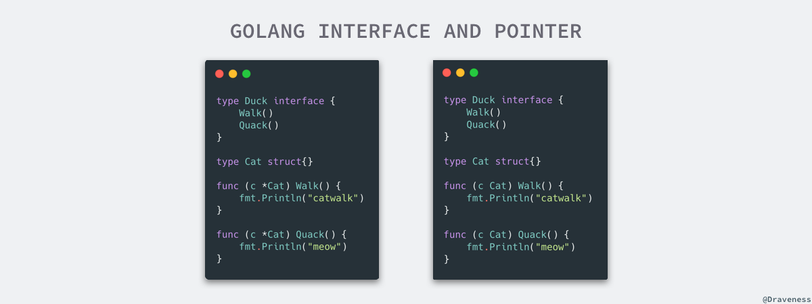
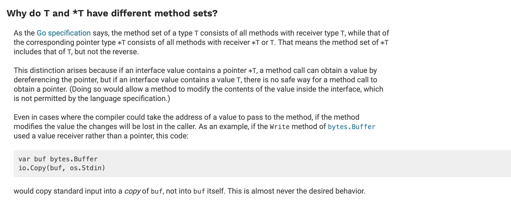
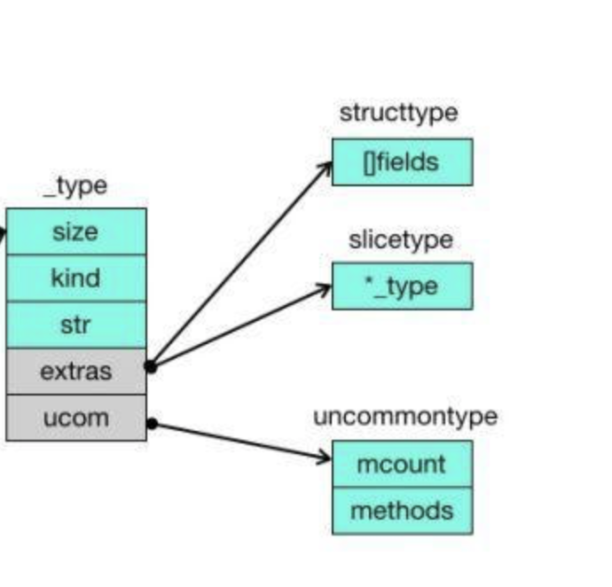
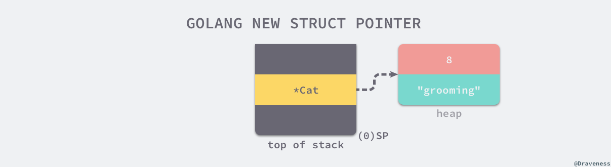
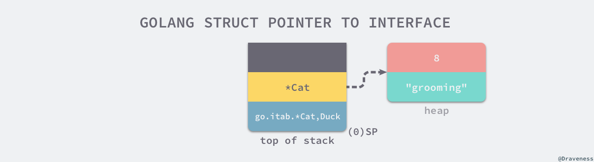
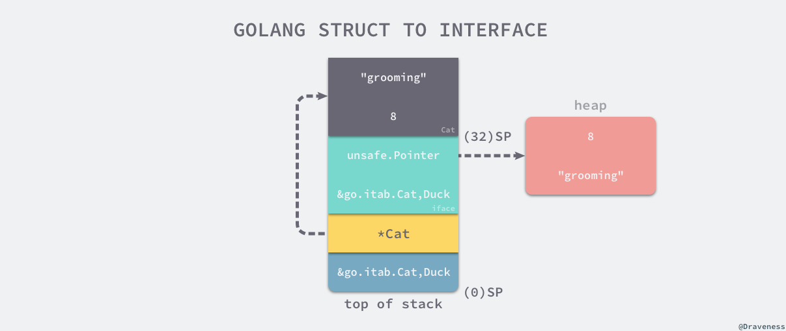

# Go interface

[TOC]

## 基本用法

### 指针和接口

#### 结构体的函数

Go 语言是一个有指针类型的编程语言，当指针和接口同时出现时就会遇到一些让人困惑或者感到诡异的问题，接口在定义一组方法时其实没有对实现的接受者做限制，所以我们其实会在一个类型上看到以下两种不同的实现方式：



- addressable 变量的函数调用

对于函数来说，只要变量是 addressable 的，无所谓变量是 T 还是 `*T`，也无所谓函数的接受者是 T 还是 `*T`，编译器都会进行优化：

对于 Cat 结构体来说，无论函数定义为结构体类型还是指针类型，被初始化为结构体还是指针，它都能直接调用：

```
type Cat struct{}

func (c Cat) Walk() {
	fmt.Println("catwalk")
}
func (c Cat) Quack() {
	fmt.Println("meow")
}

func main() {
   var t Cat
	t.Walk()
	t.Quack()

	var d = &t
	d.Walk()
	d.Quack()
}
```


```
type Cat struct{}

func (c *Cat) Walk() {
	fmt.Println("catwalk")
}
func (c *Cat) Quack() {
	fmt.Println("meow")
}

func main() {
   var t Cat
	t.Walk()
	t.Quack()

	var d = &t
	d.Walk()
	d.Quack()
}

```

- 非 addressable 变量的函数调用

如果使用类似右值的方式调用的话，情况有些不太相同。

如果函数被定义为结构体，右值不管怎么调用都可以。

```
type Cat struct{}

func (c Cat) Walk() {
	fmt.Println("catwalk")
}
func (c Cat) Quack() {
	fmt.Println("meow")
}

func main() {
	Cat{}.Walk()
	Cat{}.Quack()
	
	(&Cat{}).Walk()
	(&Cat{}).Quack()
}
``` 

但是如果函数被定义为指针的话，就比较麻烦, 这个代码编译之后，会报错：

```
type Cat struct{}

func (c *Cat) Walk() {
	fmt.Println("catwalk")
}
func (c *Cat) Quack() {
	fmt.Println("meow")
}

func main() {
	Cat{}.Walk()
	Cat{}.Quack()

	(&Cat{}).Walk()
	(&Cat{}).Quack()
}

./test.go:20:7: cannot call pointer method on Cat literal
./test.go:20:7: cannot take the address of Cat literal

```
原因就是右值匿名结构体可以看做是个只读的变量值，是不允许取到地址的，因此无法调用指针类型的函数。

但是我们在调用之前，先去取地址，类似 `(&Cat{}).Walk()` 这个代码是没有问题的，编译器将在堆中构建 Cat 结构体，将地址存放到栈里，不会把它看做右值。

#### 接口的函数

对于接口和变量的转换来说，是否可以转换成功就不是是否可以 addressable 可以决定的了。决定是否可以转换的关键是  [Method sets](https://golang.org/ref/spec#Method_sets)。

Method sets 规定 `*T` 可以访问所有的 `*T` 和 T 的方法集，而 T 只能访问 T 的方法集。

- *T 赋值

对于 *T 来说，它可以接收所有的函数，无论接受者是什么：

```
type Duck interface {
	Walk()
	Quack()
}

type Cat struct{}

func (c Cat) Walk() {
	fmt.Println("catwalk")
}
func (c Cat) Quack() {
	fmt.Println("meow")
}

func main() {
    var c Duck = &Cat{}
    c.Walk()
    c.Quack()
    
    var t Cat
	var d Duck = &t
	d.Walk()
	d.Quack()
}

```

```
type Duck interface {
	Walk()
	Quack()
}

type Cat struct{}

func (c *Cat) Walk() {
	fmt.Println("catwalk")
}
func (c *Cat) Quack() {
	fmt.Println("meow")
}

func main() {
    var c Duck = &Cat{}
    c.Walk()
    c.Quack()
    
    var t Cat
	var d Duck = &t
	d.Walk()
	d.Quack()
}

```

- T 赋值

T 可以访问接受者为 T 的函数，因此可以转换为相应的 interface 成功

```
type Duck interface {
	Walk()
	Quack()
}

type Cat struct{}

func (c Cat) Walk() {
	fmt.Println("catwalk")
}
func (c Cat) Quack() {
	fmt.Println("meow")
}

func main() {
    var t Cat
	var c Duck = t
	c.Walk()
	c.Quack()
	
	var d Duck = Cat{}
    d.Walk()
    d.Quack()
}
```

但是，和结构体的函数调用不同的是，T 无法调用 `*T` 的函数，因此 T 并没有接受者为 `*T` 的 Walk/Quack 方法，因此它无法转换为 Duck 接口。

```
type Duck interface {
	Walk()
	Quack()
}

type Cat struct{}

func (c *Cat) Walk() {
	fmt.Println("catwalk")
}
func (c *Cat) Quack() {
	fmt.Println("meow")
}

func main() {
    var t Cat
	var c Duck = t
	c.Walk()
	c.Quack()
	
	var d Duck = Cat{}
    d.Walk()
    d.Quack()
}

./test.go:21:6: cannot use t (type Cat) as type Duck in assignment:
        Cat does not implement Duck (Quack method has pointer receiver)

```

编译器会提醒我们『Cat 类型并没有实现 Duck 接口，Quack 方法的接受者是指针』，这两种情况其实非常让人困惑，尤其是对于刚刚接触 Go 语言接口的开发者，想要理解这个问题，首先要知道 Go 语言在进行 参数传递 时都是值传递的。



官方文档写的比较清楚，原因有两个：

- 一个是有些临时变量是无法 addressable 的，这部分变量不允许去取变量的地址，自然没有办法调用 `*T` 的函数
- 另一个原因是，即使是可以 addressable 的变量 S，如果调用 `*T` 的方法目的是改变变量 S 的内部属性值，但是偏偏 interface 的转化过程是复制一份变量 S1(`var d Duck = S` 实际上是复制了一份 S 到 d 的内部属性 d.data 中)，导致改变的也仅仅是 S1，造成了歧义。这里就是 golang 官方为了避免歧义，在接口的转化过程中，直接禁止 `T` 拥有 `*T` 的函数。如果想要改变 S 变量，请传递指针变量，`var d Duck = &S`，这样 interface 复制的就是 *S 的指针地址，调用函数才能真正的更改 S 的内部属性值。
- 对于函数调用来说，如果 T 调用了 (`*T`) 的方法，编译器直接就对 T 进行了取地址的操作；而 interface 在转化阶段因为采取了复制的操作，导致了反直觉的效果。因此这两个采取的策略是不同的。

一般来说，我们提倡声明方法时使用指针，隐式或者显示转化为 interface 的时候也使用指针，可以避免对象的复制。

### nil 和 non-nil

我们可以通过一个例子理解『Go 语言的接口类型不是任意类型』这一句话，下面的代码在 main 函数中初始化了一个 *TestStruct 结构体指针，由于指针的零值是 nil，所以变量 s 在初始化之后也是 nil：

```
package main

type TestStruct struct{}

func NilOrNot(v interface{}) {
    if v == nil {
        println("nil")
    } else {
        println("non-nil")
    }
}

func main() {
    var s *TestStruct
    NilOrNot(s)
}

$ go run main.go
non-nil

```

但是当我们将 s 变量传入 NilOrNot 时，该方法却打印出了 non-nil 字符串，这主要是因为调用 NilOrNot 函数时其实会发生隐式的类型转换，变量 nil 会被转换成 interface{} 类型，interface{} 类型是一个结构体，它除了包含 nil 变量之外还包含变量的类型信息，也就是 TestStruct，所以在这里会打印出 non-nil，我们会在接下来详细介绍结构的实现原理。

## _type

### _type



在Go语言中_type这个结构体非常重要，记录着某种数据类型的一些基本特征，比如这个数据类型占用的内存大小（size字段），数据类型的名称（nameOff字段）等等。每种数据类型都存在一个与之对应的_type结构体。

```
//src/runtime/type.go
type type struct {
    size uintptr     // 大小
    ptrdata uintptr  //size of memory prefix holding all pointers
    hash uint32      //类型Hash
    tflag tflag      //类型的特征标记
    align uint8      //_type 作为整体交量存放时的对齐字节数
    fieldalign uint8 //当前结构字段的对齐字节数
    kind uint8       //基础类型枚举值和反射中的 Kind 一致，kind 决定了如何解析该类型
    alg *typeAlg     //指向一个函数指针表，该表有两个函数，一个是计算类型 Hash 函
                     //数，另一个是比较两个类型是否相同的 equal 函数
    //gcdata stores the GC type data for the garbage collector.
    //If the KindGCProg bit is set in kind, gcdata is a GC program.
    //Otherwise it is a ptrmask bitmap. See mbitmap.go for details.
    gcdata *byte      //GC 相关信息
    str nameOff       //str 用来表示类型名称字符串在编译后二进制文件中某个 section
                      //的偏移量
                      //由链接器负责填充
    ptrToThis typeOff //ptrToThis 用来表示类型元信息的指针在编译后二进制文件中某个
                      //section 的偏移量
                      //由链接器负责填充
}

```

- size 为该类型所占用的字节数量。
- kind 表示类型的种类，如 bool、int、float、string、struct、interface 等。
- str 表示类型的名字信息，它是一个 nameOff(int32) 类型，通过这个 nameOff，可以找到类型的名字字符串

_type 包含所有类型的共同元信息，编译器和运行时可以根据该元信息解析具体类型、类型名存放位置、类型的 Hash 值等基本信息。

这里需要说明一下：＿type 里面的 nameOff 和 typeOff 最终是由链接器负责确定和填充的，它们都是一个偏移量（offset），类型的名称和类型元信息实际上存放在连接后可执行文件的某个段（section）里，这两个值是相对于段内的偏移量，运行时提供两个转换查找函数。

### extras

如果是一些比较特殊的数据类型，可能还会对_type结构体进行扩展，记录更多的信息，我们可以称之为 extras。extras 对于基础类型（如 bool，int, float 等）是 size 为 0 的，它为复杂的类型提供了一些额外信息。例如为 struct 类型提供 structtype，为 slice 类型提供 slicetype 等信息。

```
type arraytype struct {
	typ   _type
	elem  *_type
	slice *_type
	len   uintptr
}

type chantype struct {
	typ  _type
	elem *_type
	dir  uintptr
}

type slicetype struct {
	typ  _type
	elem *_type
}

type functype struct {
	typ      _type
	inCount  uint16
	outCount uint16
}

type ptrtype struct {
	typ  _type
	elem *_type
}

type structtype struct {
	typ     _type
	pkgPath name
	fields  []structfield
}

type structfield struct {
	name       name
	typ        *_type
	offsetAnon uintptr
}

type name struct {
	bytes *byte
}

```

### uncommontype

处理 extras 之外，还存在着 uncommon 字段的类型，ucom 对于基础类型也是 size 为 0 的，但是对于 type Binary int 这种定义或者是其它复杂类型来说，ucom 用来存储类型的函数列表等信息。

```
type uncommontype struct {
	pkgpath nameOff
	mcount  uint16 // number of methods
	xcount  uint16 // number of exported methods
	moff    uint32 // offset from this uncommontype to [mcount]method
	_       uint32 // unused
}

```

我们可以看看 golang 如何提取类型中的 uncommon 字段：

```
func (t *_type) uncommon() *uncommontype {
	if t.tflag&tflagUncommon == 0 {
		return nil
	}
	switch t.kind & kindMask {
	case kindStruct:
		type u struct {
			structtype
			u uncommontype
		}
		return &(*u)(unsafe.Pointer(t)).u
	case kindPtr:
		type u struct {
			ptrtype
			u uncommontype
		}
		return &(*u)(unsafe.Pointer(t)).u
	case kindFunc:
		type u struct {
			functype
			u uncommontype
		}
		return &(*u)(unsafe.Pointer(t)).u
	case kindSlice:
		type u struct {
			slicetype
			u uncommontype
		}
		return &(*u)(unsafe.Pointer(t)).u
	case kindArray:
		type u struct {
			arraytype
			u uncommontype
		}
		return &(*u)(unsafe.Pointer(t)).u
	case kindChan:
		type u struct {
			chantype
			u uncommontype
		}
		return &(*u)(unsafe.Pointer(t)).u
	case kindMap:
		type u struct {
			maptype
			u uncommontype
		}
		return &(*u)(unsafe.Pointer(t)).u
	case kindInterface:
		type u struct {
			interfacetype
			u uncommontype
		}
		return &(*u)(unsafe.Pointer(t)).u
	default:
		type u struct {
			_type
			u uncommontype
		}
		return &(*u)(unsafe.Pointer(t)).u
	}
}

```

## eface 与 iface

### eface

不包含任何方法的 interface{} 类型在底层其实就是 eface 结构体，我们先来看 eface 结构体的组成：


```
type eface struct { // 16 bytes
    _type *_type
    data  unsafe.Pointer
}

```

由于 interface{} 类型不包含任何方法，所以它的结构也相对来说比较简单，只包含指向底层数据和类型的两个指针，从这里的结构我们也就能够推断出: 任意的类型都可以转换成 interface{} 类型。

### iface

另一个用于表示接口 interface 类型的结构体就是 iface 了，在这个结构体中也有指向原始数据的指针 data，在这个结构体中更重要的其实是 itab 类型的 tab 字段。

```
type iface struct { // 16 bytes
    tab  *itab
    data unsafe.Pointer
}

```

### itab 结构体

itab 结构体是接口类型的核心组成部分，每一个 itab 都占 32 字节的空间。

_type 实际上是 iface 实际的对象类型。

itab 结构体中还包含另一个表示接口类型的 interfacetype 字段，它就是一个对 _type 类型的简单封装，属于我们上面所说的 `_type` 的 extras 字段。

hash 字段其实是对 `_type.hash` 的拷贝，它会在从 interface 到具体类型的切换时用于快速判断目标类型和接口中类型是否一致；最后的 fun 数组其实是一个动态大小的数组，如果当前数组中内容为空就表示 `_type` 没有实现 inter 接口，虽然这是一个大小固定的数组，但是在使用时会直接通过指针获取其中的数据并不会检查数组的边界，所以该数组中保存的元素数量是不确定的。

```
type itab struct {
	inter *interfacetype
	_type *_type
	hash  uint32 // copy of _type.hash. Used for type switches.
	_     [4]byte
	fun   [1]uintptr // variable sized. fun[0]==0 means _type does not implement inter.
}

type interfacetype struct {
	typ     _type
	pkgpath name
	mhdr    []imethod
}
```


## 接口的转换

### 指针类型

```
package main

type Duck interface {
    Quack()
}

type Cat struct {
    Name string
}

//go:noinline
func (c *Cat) Quack() {
    println(c.Name + " meow")
}

func main() {
    var c Duck = &Cat{Name: "grooming"}
    c.Quack()
}
```

将上述代码编译成汇编语言之后，我们删掉其中一些对理解接口原理无用的指令，只保留与赋值语句 var c Duck = &Cat{Name: "grooming"} 相关的代码，先来了解一下结构体指针被装到接口变量 c 的过程：

```
LEAQ    type."".Cat(SB), AX
MOVQ    AX, (SP)
CALL    runtime.newobject(SB)
MOVQ    8(SP), DI
MOVQ    $8, 8(DI)
LEAQ    go.string."grooming"(SB), AX
MOVQ    AX, (DI)
LEAQ    go.itab.*"".Cat,"".Duck(SB), AX
TESTB   AL, (AX)
MOVQ    DI, (SP)

```

这段代码的第一部分其实就是对 Cat 结构体的初始化，我们直接展示上述汇编语言对应的伪代码，帮助我们更快地理解这个过程：

```
LEAQ    type."".Cat(SB), AX                ;; AX = &type."".Cat
MOVQ    AX, (SP)                           ;; SP = &type."".Cat
CALL    runtime.newobject(SB)              ;; SP + 8 = &Cat{}
MOVQ    8(SP), DI                          ;; DI = &Cat{}
MOVQ    $8, 8(DI)                          ;; StringHeader(DI.Name).Len = 8
LEAQ    go.string."grooming"(SB), AX       ;; AX = &"grooming"
MOVQ    AX, (DI)                           ;; StringHeader(DI.Name).Data = &"grooming"

```

- 获取 Cat 结构体类型指针并将其作为参数放到栈 SP 上；
- 通过 CALL 指定调用 runtime.newobject 函数，这个函数会以 Cat 结构体类型指针作为入参，分配一片新的内存空间并将指向这片内存空间的指针返回到 SP+8 上；
- SP+8 现在存储了一个指向 Cat 结构体的指针，我们将栈上的指针拷贝到寄存器 DI 上方便操作；
- 由于 Cat 中只包含一个字符串类型的 Name 变量，所以在这里会分别将字符串地址 &"grooming" 和字符串长度 8 设置到结构体上，最后三行汇编指令的作用就等价于 cat.Name = "grooming"；

字符串在运行时的表示其实就是指针加上字符串长度，我们这里要看一下初始化之后的 Cat 结构体在内存中的表示是什么样的：



每一个 Cat 结构体在内存中的大小都是 16 字节，这是因为其中只包含一个字符串字段，而字符串在 Go 语言中总共占 16 字节，初始化 Cat 结构体之后就进入了将 *Cat 转换成 Duck 类型的过程了：

```
LEAQ    go.itab.*"".Cat,"".Duck(SB), AX    ;; AX = *itab(go.itab.*"".Cat,"".Duck)
MOVQ    AX, (SP)                           ;; SP = AX
CALL    "".(*Cat).Quack(SB)                ;; SP.Quack()

```
Duck 作为一个包含方法的接口，它在底层就会使用 iface 结构体进行表示，iface 结构体包含两个字段，其中一个是指向数据的指针，另一个是表示接口和结构体关系的 tab 字段，我们已经通过上一段代码在栈上的 SP+8 初始化了 Cat 结构体指针，这段代码其实只是将编译期间生成的 itab 结构体指针复制到 SP 上：



我们会发现 SP 和 SP+8 总共 16 个字节共同组成了 iface 结构体，栈上的这个 iface 结构体也就是 Quack 方法的第一个入参。

到这里已经完成了对 Cat 指针转换成 iface 结构体并调用 Quack 方法过程的分析，我们再重新回顾一下整个调用过程的汇编代码和伪代码，其中的大部分内容都是对 Cat 指针和 iface 的初始化，调用 Quack 方法时其实也只执行了一个汇编指令，调用的过程也没有经过动态派发的过程，这其实就是 Go 语言编译器帮我们做的优化了.

### 结构体类型

```
package main

type Duck interface {
    Quack()
}

type Cat struct {
    Name string
}

//go:noinline
func (c Cat) Quack() {
    println(c.Name + " meow")
}

func main() {
    var c Duck = Cat{Name: "grooming"}
    c.Quack()
}

```

编译上述的代码其实会得到如下所示的汇编指令，需要注意的是为了代码更容易理解和分析，这里的汇编指令依然经过了删减，不过不会影响具体的执行过程：

```
XORPS    X0, X0
MOVUPS    X0, ""..autotmp_1+32(SP)
LEAQ    go.string."grooming"(SB), AX
MOVQ    AX, ""..autotmp_1+32(SP)
MOVQ    $8, ""..autotmp_1+40(SP)
LEAQ    go.itab."".Cat,"".Duck(SB), AX
MOVQ    AX, (SP)
LEAQ    ""..autotmp_1+32(SP), AX
MOVQ    AX, 8(SP)
CALL    runtime.convT2I(SB)
MOVQ    16(SP), AX
MOVQ    24(SP), CX
MOVQ    24(AX), AX
MOVQ    CX, (SP)
CALL    AX

```

我们先来看一下上述汇编代码中用于初始化 Cat 结构体的部分：

```
XORPS   X0, X0                          ;; X0 = 0
MOVUPS  X0, ""..autotmp_1+32(SP)        ;; StringHeader(SP+32).Data = 0
LEAQ    go.string."grooming"(SB), AX    ;; AX = &"grooming"
MOVQ    AX, ""..autotmp_1+32(SP)        ;; StringHeader(SP+32).Data = AX
MOVQ    $8, ""..autotmp_1+40(SP)        ;; StringHeader(SP+32).Len =8

```

这段汇编指令的工作其实与上一节中的差不多，这里会在栈上占用 16 字节初始化 Cat 结构体，不过而上一节中的代码在堆上申请了 16 字节的内存空间，栈上只是一个指向 Cat 结构体的指针。

初始化了结构体就进入了类型转换的阶段，编译器会将 go.itab."".Cat,"".Duck 的地址和指向 Cat 结构体的指针一并传入 runtime.convT2I 函数：

```
LEAQ    go.itab."".Cat,"".Duck(SB), AX     ;; AX = &(go.itab."".Cat,"".Duck)
MOVQ    AX, (SP)                           ;; SP = AX
LEAQ    ""..autotmp_1+32(SP), AX           ;; AX = &(SP+32) = &Cat{Name: "grooming"}
MOVQ    AX, 8(SP)                          ;; SP + 8 = AX
CALL    runtime.convT2I(SB)                ;; runtime.convT2I(SP, SP+8)

```

这个函数会获取 itab 中存储的类型，根据类型的大小申请一片内存空间并将 elem 指针中的内容拷贝到目标的内存空间中：

```
func convT2I(tab *itab, elem unsafe.Pointer) (i iface) {
    t := tab._type
    x := mallocgc(t.size, t, true)
    typedmemmove(t, x, elem)
    i.tab = tab
    i.data = x
    return
}

```

convT2I 在函数的最后会返回一个 iface 结构体，其中包含 itab 指针和拷贝的 Cat 结构体，在当前函数返回值之后，main 函数的栈上就会包含以下的数据：



注意有两个 iface 的 itab 结构，一个位于 SP 上，一个是 convT2I 函数返回的。

SP 和 SP+8 中存储的 itab 和 Cat 指针就是 runtime.convT2I 函数的入参，这个函数的返回值位于 SP+16，是一个占 16 字节内存空间的 iface 结构体，SP+32 存储的就是在栈上的 Cat 结构体，它会在 runtime.convT2I 执行的过程中被拷贝到堆上。

在最后，我们会通过以下的操作调用 Cat 实现的接口方法 Quack()：

```
MOVQ    16(SP), AX ;; AX = &(go.itab."".Cat,"".Duck)
MOVQ    24(SP), CX ;; CX = &Cat{Name: "grooming"}
MOVQ    24(AX), AX ;; AX = AX.fun[0] = Cat.Quack
MOVQ    CX, (SP)   ;; SP = CX
CALL    AX         ;; CX.Quack()

```

这几个汇编指令中的大多数还是非常好理解的，其中的 MOVQ 24(AX), AX 应该是最重要的指令，它从 itab 结构体中取出 Cat.Quack 方法指针，作为 CALL 指令调用时的参数，第 24 字节是 itab.fun 字段开始的位置，由于 Duck 接口只包含一个方法，所以 itab.fun[0] 中存储的就是指向 Quack 的指针了。

### convI2I

上面的 convT2I 略微简单，因为 itab 是编译期已经确定的全局符号，因此运行时只需把它赋值给新的 interface 变量即可。

但是 convI2I 是 interface 到 interface 的转化，这个就涉及到了 interface 函数的变化。

```
func convI2I(inter *interfacetype, i iface) (r iface) {
	tab := i.tab
	if tab == nil {
		return
	}
	if tab.inter == inter {
		r.tab = tab
		r.data = i.data
		return
	}
	r.tab = getitab(inter, tab._type, false)
	r.data = i.data
	return
}

```

函数中 inter 是想要转化成的接口类型，i 是现在变量的接口类型。我们可以见到，函数最关键的是 getitab 函数，它的参数一是想要转化为的接口，参数二是接口中数据的实际类型 _type。

可以看到，这个函数

```
func getitab(inter *interfacetype, typ *_type, canfail bool) *itab {
	var m *itab

	// First, look in the existing table to see if we can find the itab we need.
	// This is by far the most common case, so do it without locks.
	// Use atomic to ensure we see any previous writes done by the thread
	// that updates the itabTable field (with atomic.Storep in itabAdd).
	t := (*itabTableType)(atomic.Loadp(unsafe.Pointer(&itabTable)))
	if m = t.find(inter, typ); m != nil {
		goto finish
	}

	// Not found.  Grab the lock and try again.
	lock(&itabLock)
	if m = itabTable.find(inter, typ); m != nil {
		unlock(&itabLock)
		goto finish
	}

	// Entry doesn't exist yet. Make a new entry & add it.
	m = (*itab)(persistentalloc(unsafe.Sizeof(itab{})+uintptr(len(inter.mhdr)-1)*sys.PtrSize, 0, &memstats.other_sys))
	m.inter = inter
	m._type = typ
	m.init()
	itabAdd(m)
	unlock(&itabLock)
finish:
	if m.fun[0] != 0 {
		return m
	}
	if canfail {
		return nil
	}
	// this can only happen if the conversion
	// was already done once using the , ok form
	// and we have a cached negative result.
	// The cached result doesn't record which
	// interface function was missing, so initialize
	// the itab again to get the missing function name.
	panic(&TypeAssertionError{concrete: typ, asserted: &inter.typ, missingMethod: m.init()})
}

```

- 先用t保存全局itabTable的地址，然后使用t.find去查找，这样是为了防止查找过程中，itabTable被替换导致查找错误。
- 如果没找到，那么就会上锁，然后使用itabTable.find去查找，这样是因为在第一步查找的同时，另外一个协程写入，可能导致实际存在却查找不到，这时上锁避免itabTable被替换，然后直接在itaTable中查找。
- 再没找到，说明确实没有，那么就根据接口类型、数据类型，去生成一个新的itab，然后插入到itabTable中，这里可能会导致hash表扩容，如果数据类型并没有实现接口，那么根据调用方式，该报错报错，该panic panic。

```
func (t *itabTableType) find(inter *interfacetype, typ *_type) *itab {
	// Implemented using quadratic probing.
	// Probe sequence is h(i) = h0 + i*(i+1)/2 mod 2^k.
	// We're guaranteed to hit all table entries using this probe sequence.
	mask := t.size - 1
	h := itabHashFunc(inter, typ) & mask
	for i := uintptr(1); ; i++ {
		p := (**itab)(add(unsafe.Pointer(&t.entries), h*sys.PtrSize))
		// Use atomic read here so if we see m != nil, we also see
		// the initializations of the fields of m.
		// m := *p
		m := (*itab)(atomic.Loadp(unsafe.Pointer(p)))
		if m == nil {
			return nil
		}
		if m.inter == inter && m._type == typ {
			return m
		}
		h += i
		h &= mask
	}
}

```

从注释我们可以看到，golang使用的开放地址探测法，用的是公式h(i) = h0 + i*(i+1)/2 mod 2^k，h0是根据接口类型和数据类型的hash字段算出来的。

#### itab.init

如果实在找不到，那么就要生成一个新的 itab 了：


```
func (m *itab) init() string {
	inter := m.inter
	typ := m._type
	x := typ.uncommon()

	// both inter and typ have method sorted by name,
	// and interface names are unique,
	// so can iterate over both in lock step;
	// the loop is O(ni+nt) not O(ni*nt).
	ni := len(inter.mhdr)
	nt := int(x.mcount)
	xmhdr := (*[1 << 16]method)(add(unsafe.Pointer(x), uintptr(x.moff)))[:nt:nt]
	j := 0
	methods := (*[1 << 16]unsafe.Pointer)(unsafe.Pointer(&m.fun[0]))[:ni:ni]
	var fun0 unsafe.Pointer
imethods:
	for k := 0; k < ni; k++ {
		i := &inter.mhdr[k]
		itype := inter.typ.typeOff(i.ityp)
		name := inter.typ.nameOff(i.name)
		iname := name.name()
		ipkg := name.pkgPath()
		if ipkg == "" {
			ipkg = inter.pkgpath.name()
		}
		for ; j < nt; j++ {
			t := &xmhdr[j]
			tname := typ.nameOff(t.name)
			if typ.typeOff(t.mtyp) == itype && tname.name() == iname {
				pkgPath := tname.pkgPath()
				if pkgPath == "" {
					pkgPath = typ.nameOff(x.pkgpath).name()
				}
				if tname.isExported() || pkgPath == ipkg {
					if m != nil {
						ifn := typ.textOff(t.ifn)
						if k == 0 {
							fun0 = ifn // we'll set m.fun[0] at the end
						} else {
							methods[k] = ifn
						}
					}
					continue imethods
				}
			}
		}
		// didn't find method
		m.fun[0] = 0
		return iname
	}
	m.fun[0] = uintptr(fun0)
	m.hash = typ.hash
	return ""
}

```

从这个方法可以看出来，任何类型的函数都是存放在 typ.uncommon 中的，距离 typ.uncommon 的 x.moff 的位置就是该类型的函数列表。

这个方法会检查interface和type的方法是否匹配，即type有没有实现interface。假如interface有n中方法，type有m中方法，那么匹配的时间复杂度是O(n x m)，由于interface、type的方法都按字典序排，所以O(n+m)的时间复杂度可以匹配完。在检测的过程中，匹配上了，依次往fun字段写入type中对应方法的地址。如果有一个方法没有匹配上，那么就设置fun[0]为0，在外层调用会检查fun[0]==0，即type并没有实现interface。

#### itabAdd

```
func itabAdd(m *itab) {
	// Bugs can lead to calling this while mallocing is set,
	// typically because this is called while panicing.
	// Crash reliably, rather than only when we need to grow
	// the hash table.
	if getg().m.mallocing != 0 {
		throw("malloc deadlock")
	}

	t := itabTable
	if t.count >= 3*(t.size/4) { // 75% load factor
		// Grow hash table.
		// t2 = new(itabTableType) + some additional entries
		// We lie and tell malloc we want pointer-free memory because
		// all the pointed-to values are not in the heap.
		t2 := (*itabTableType)(mallocgc((2+2*t.size)*sys.PtrSize, nil, true))
		t2.size = t.size * 2

		// Copy over entries.
		// Note: while copying, other threads may look for an itab and
		// fail to find it. That's ok, they will then try to get the itab lock
		// and as a consequence wait until this copying is complete.
		iterate_itabs(t2.add)
		if t2.count != t.count {
			throw("mismatched count during itab table copy")
		}
		// Publish new hash table. Use an atomic write: see comment in getitab.
		atomicstorep(unsafe.Pointer(&itabTable), unsafe.Pointer(t2))
		// Adopt the new table as our own.
		t = itabTable
		// Note: the old table can be GC'ed here.
	}
	t.add(m)
}

```

可以看到，当hash表使用达到75%或以上时，就会进行扩容，容量是原来的2倍，申请完空间，就会把老表中的数据插入到新的hash表中。然后使itabTable指向新的表，最后把新的itab插入到新表中。

```
func (t *itabTableType) add(m *itab) {
	// See comment in find about the probe sequence.
	// Insert new itab in the first empty spot in the probe sequence.
	mask := t.size - 1
	h := itabHashFunc(m.inter, m._type) & mask
	for i := uintptr(1); ; i++ {
		p := (**itab)(add(unsafe.Pointer(&t.entries), h*sys.PtrSize))
		m2 := *p
		if m2 == m {
			// A given itab may be used in more than one module
			// and thanks to the way global symbol resolution works, the
			// pointed-to itab may already have been inserted into the
			// global 'hash'.
			return
		}
		if m2 == nil {
			// Use atomic write here so if a reader sees m, it also
			// sees the correctly initialized fields of m.
			// NoWB is ok because m is not in heap memory.
			// *p = m
			atomic.StorepNoWB(unsafe.Pointer(p), unsafe.Pointer(m))
			t.count++
			return
		}
		h += i
		h &= mask
	}
}

```

## 类型断言

### 类型与接口断言

```
package main

type Duck interface {
    Quack()
}

type Cat struct {
    Name string
}

//go:noinline
func (c *Cat) Quack() {
    println(c.Name + " meow")
}

func main() {
    var c Duck = &Cat{Name: "grooming"}
    switch c.(type) {
    case *Cat:
        cat := c.(*Cat)
        cat.Quack()
    }
}

```

当我们编译了上述代码之后，会得到如下所示的汇编指令，这里截取了从创建结构体到执行 switch/case 结构的代码片段：

```
00000 TEXT    "".main(SB), ABIInternal, $32-0
...
00029 XORPS    X0, X0
00032 MOVUPS    X0, ""..autotmp_4+8(SP)
00037 LEAQ    go.string."grooming"(SB), AX
00044 MOVQ    AX, ""..autotmp_4+8(SP)
00049 MOVQ    $8, ""..autotmp_4+16(SP)
00058 CMPL    go.itab.*"".Cat,"".Duck+16(SB), $593696792
00068 JEQ    80
00070 MOVQ    24(SP), BP
00075 ADDQ    $32, SP
00079 RET
00080 LEAQ    ""..autotmp_4+8(SP), AX
00085 MOVQ    AX, (SP)
00089 CALL    "".(*Cat).Quack(SB)
00094 JMP    70

```
我们可以直接跳过初始化 Duck 变量的过程，从 0058 开始分析随后的汇编指令，需要注意的是 SP+8 ~ SP+24 16 个字节的位置存储了 Cat 结构体，Go 语言的编译器做了一些优化，所以我们没有看到 iface 结构体的构建过程，但是对于这里要介绍的类型断言和转换其实没有太多的影响：

```
00058 CMPL  go.itab.*"".Cat,"".Duck+16(SB), $593696792  
                                        ;; if (c.tab.hash != 593696792) {
00068 JEQ   80                          ;;      
00070 MOVQ  24(SP), BP                  ;;      BP = SP+24
00075 ADDQ  $32, SP                     ;;      SP += 32
00079 RET                               ;;      return
                                        ;; } else {
00080 LEAQ  ""..autotmp_4+8(SP), AX     ;;      AX = &Cat{Name: "grooming"}
00085 MOVQ  AX, (SP)                    ;;      SP = AX
00089 CALL  "".(*Cat).Quack(SB)         ;;      SP.Quack()
00094 JMP   70                          ;;      ...
                                        ;;      BP = SP+24
                                        ;;      SP += 32
                                        ;;      return
                                        ;; }

```

switch/case 语句生成的汇编指令会将目标类型的 hash 与接口变量中的 itab.hash 进行比较，如果两者完全相等就会认为接口变量的具体类型是 Cat，这时就会进入 0080 所在的分支，开始类型转换的过程，我们会获取 SP+8 存储的 Cat 结构体指针、将其拷贝到 SP 上、调用 Quack 方法，最终恢复当前函数的堆栈后返回，不过如果接口中存在的具体类型不是 Cat，就会直接恢复栈指针并返回到调用方。

### 接口与接口断言

```
func assertI2I(inter *interfacetype, i iface) (r iface) {
	tab := i.tab
	if tab == nil {
		// explicit conversions require non-nil interface value.
		panic(&TypeAssertionError{nil, nil, &inter.typ, ""})
	}
	if tab.inter == inter {
		r.tab = tab
		r.data = i.data
		return
	}
	r.tab = getitab(inter, tab._type, false)
	r.data = i.data
	return
}

func assertI2I2(inter *interfacetype, i iface) (r iface, b bool) {
	tab := i.tab
	if tab == nil {
		return
	}
	if tab.inter != inter {
		tab = getitab(inter, tab._type, true)
		if tab == nil {
			return
		}
	}
	r.tab = tab
	r.data = i.data
	b = true
	return
}

func assertE2I(inter *interfacetype, e eface) (r iface) {
	t := e._type
	if t == nil {
		// explicit conversions require non-nil interface value.
		panic(&TypeAssertionError{nil, nil, &inter.typ, ""})
	}
	r.tab = getitab(inter, t, false)
	r.data = e.data
	return
}

func assertE2I2(inter *interfacetype, e eface) (r iface, b bool) {
	t := e._type
	if t == nil {
		return
	}
	tab := getitab(inter, t, true)
	if tab == nil {
		return
	}
	r.tab = tab
	r.data = e.data
	b = true
	return
}

```
