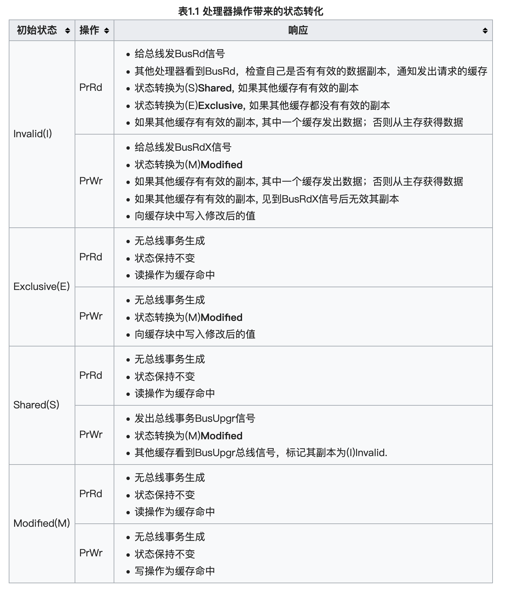
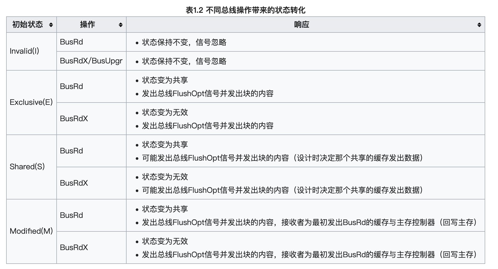
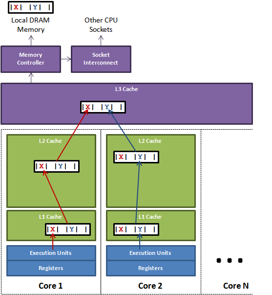
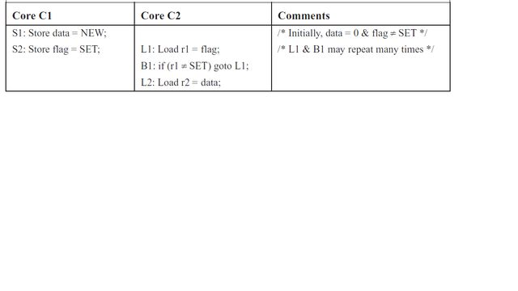
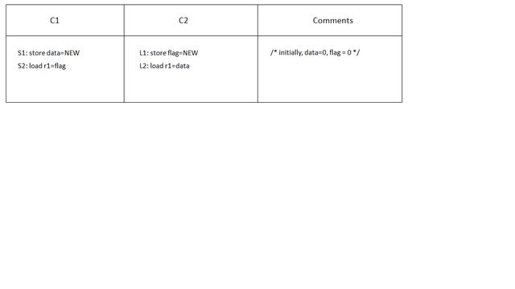
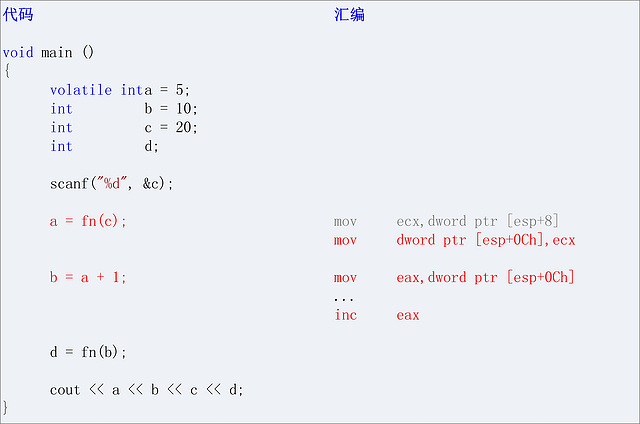
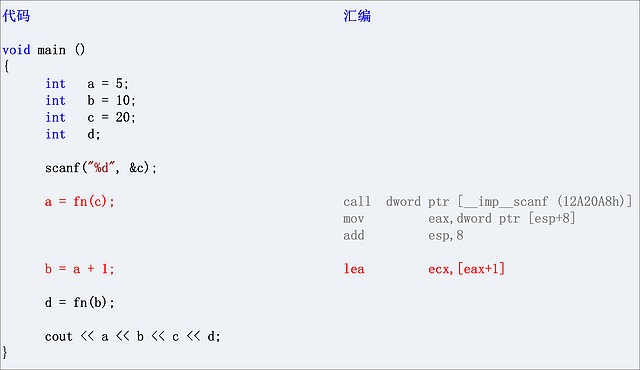
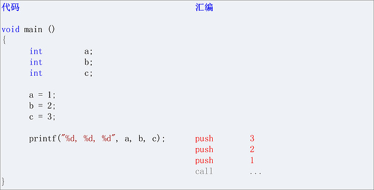
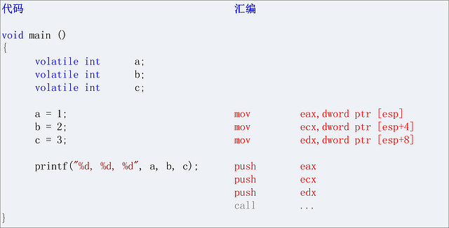
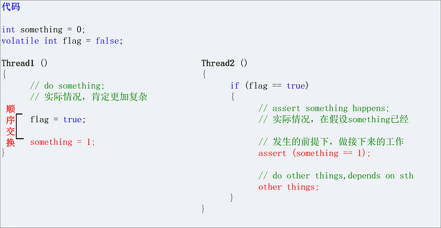

# Go 内存一致性模型

[TOC]

## MESI 与 Cache Coherence

### CPU 的多级缓存

计算机硬件的一些延迟。主要关注两个，L1 cache，0.5ns；内存，100ns。可见，平时我们认为的很快的内存，其实在CPU面前，还是非常慢的。想想一下，执行一条加法指令只要一个周期，但是我们这个加法的执行结果写到内存，却要等100个周期。这样的速度显然无法接受。

因此，我们有了Cache，并且是多级的Cache，现在的Intel CPU通常有3级cache，例如我自己的电脑上，L1 data cache 有32K，L1 instruction cache 是32K，L2和L3分别是256K和6144K。不同的架构中，Cache会有所区别，比如超线程的CPU中，L1Cache是独占的，L2是Core共享的。

anyway，cache其实缓解了内存访问的延迟问题。不过它也带来了另一个问题：一致性。

一个变量（一个内存位置）其实可以被多个Cache所共享。那么，当我们需要修改这个变量的时候，Cache要如何保持一致呢？

理想情况下，原子地修改多个Cache，但多个CPU之间往往通过总线进行通信，不可能同时修改多个；所以其实要制造一种假象，看起来是原子地修改多个Cache，也就是让Cache看起来是强一致的。

### Cache Coherence——MESI

基于总线通信去实现Cache的强一致，这个问题比较明确，目前用的比较多的应该是MESI协议，或者是一些优化的协议。基本思想是这样子的：一个Cache加载一个变量的时候，是Exclusive状态，当这个变量被第二个Cache加载，更改状态为Shared；这时候一个CPU要修改变量， 就把状态改为Modified，并且Invalidate其他的Cache，其他的Cache再去读这个变量，达到一致。MESI协议大致是这样子，但是状态转换要比这个复杂的多。

缓存行有4种不同的状态:

- 独占 Exclusive (E)：缓存行只在当前缓存中，但是干净的（clean）--缓存数据同于主存数据。当别的缓存读取它时，状态变为共享；当前写数据时，变为已修改状态。
- 共享 Shared (S)：缓存行也存在于其它缓存中且是干净的。缓存行可以在任意时刻抛弃。
无效Invalid (I)
- 已修改 Modified (M)：缓存行是脏的（dirty），与主存的值不同。如果别的CPU内核要读主存这块数据，该缓存行必须回写到主存，状态变为共享(S).
- 缓存行是无效的

### MESI 的状态转移

处理器对缓存的请求，也就是 CPU 与 cache 之间的通讯:

- PrRd: 处理器请求读一个缓存块
- PrWr: 处理器请求写一个缓存块

总线对缓存的请求，也就是 cache 之间的通讯总线:

- BusRd: 窥探器请求指出其他处理器请求 **读一个** 缓存块
- BusRdX: 窥探器请求指出其他处理器请求 **写一个** 该处理器 **不拥有** 的缓存块
- BusUpgr: 窥探器请求指出其他处理器请求 **写一个** 该处理器 **拥有** 的缓存块
- Flush: 窥探器请求指出请求回写整个缓存到主存
- FlushOpt: 窥探器请求指出整个缓存块被发到总线以发送给另外一个处理器（缓存到缓存的复制）





操作仅在缓存行是已修改或独占状态时可自由执行。如果在共享状态，其他缓存都要先把该缓存行置为无效，这种广播操作称作Request For Ownership (RFO).

个人认为，图二中缺少 shared 状态下接受到 BusUpgr 的情况，这类情况和 BusRdx 其实是一致的，都是要转化为 Invalid 状态。

### MOESI、MESIF、RMW 与 LOCK 前缀指令

MESI 还有很多扩展协议。

常见的扩展包括“O”（Owned）状态，它和 E 状态类似，也是保证缓存间一致性的手段，但它直接共享脏段的内容，而不需要先把它们回写到内存中（“脏段共享”），由此产生了 MOSEI 协议。

MESIF 是指当多个处理器同时拥有某个 S 状态的缓存段的时候，只有被指定的那个处理器（对应的缓存段为 R 或 F 状态）才能对读操作做出回应，而不是每个处理器都能这么做。这种设计可以降低总线的数据流量。

#### RMW

但是我们注意到一个问题，那就是当我们的 CPU0 cache 处于 Invalid(I) 的时候，我们想要执行 PrWr 的操作。按照协议我们会发出 BusRdX 信号，其他 CPU 会无效它们的副本。那么假如正好有一个 CPU1 的 cache 的状态是 Modified，会发生什么？

按照协议，CPU1 会回写主存，并且转化为 Invalid 状态。CPU0 读到 CPU1 发来的新的内存值，然后更改为自己的新值。

我们发现，CPU1 缓存的值被 CPU0 覆盖了。

对于 Read-Modify-Write 类型的操作影响比较大，例如两个线程都执行 i++。假如 i 的初值为 0，当 RMW 执行 Read 操作的时候，CPU0 cache 还是 Shared 状态，等到 CPU 修改了寄存器，寄存器需要写入到 cache 的时候，CPU1 已经完成写入操作，CPU0 cache 状态已经变成了 Invalid，那么这个时候 CPU0 的 i 值 1 会覆盖掉 CPU1 的自增结果，导致两个 i++ 操作之后，结果还是 1。

例如，在 Load-Store 体系中，如果对一个非原子的内存中的变量a加1，则在Load-Store体系中，可能需要:

```
lw r1, a
addi r1, r1, 1
sw a, r1

```
当一个core执行这段代码的时候，另一个core也可能在执行相同的代码。导致尽管两个core分别对a加了1，最终存回到memory中的a仍然只加了1，而没有加2.虽然任何对齐于数据结构本身的 load 和 store 一般都是原子操作，因为 core 对于这种数据结构的 load 和 store 仅需要一条指令就可以完成，其他 core 没有机会观察到中间状态。但是这三个指令结合起来却不是原子的。

对于非 Load-Store 体系，例如 X86, 上面三个指令可能只需要一条指令就可以完成，但是这一条指令实际上 core 还是需要执行载入-更改-写回三步，任何一步都可能被打断。

在单处理器系统(UniProcessor，简称 UP)中，能够在单条指令中完成的操作都可以认为是原子操作，因为单核情况下，并发只能出现在中断上下文中，但是中断只能发生在指令与指令之间。

在多处理器系统(Symmetric Multi-Processor，简称 SMP)中情况有所不同，由于系统中有多个处理器在独立的运行，存在并行的可能，即使在能单条指令中完成的操作也可能受到干扰。

这个时候，就需要一种协调各个 CPU 操作的协议，让这个 RMW 成为一个原子操作，操作期间不会受多核 CPU 的影响。

#### LOCK 前缀

在所有的 X86 CPU 上都具有锁定一个特定内存地址的能力，当这个特定内存地址被锁定后，它就可以阻止其他的系统总线读取或修改这个内存地址。这种能力是通过 LOCK 指令前缀再加上下面的汇编指令来实现的。当使用 LOCK 指令前缀时，它会使 CPU 宣告一个 LOCK# 信号，这样就能确保在多处理器系统或多线程竞争的环境下互斥地使用这个内存地址。当指令执行完毕，这个锁定动作也就会消失。

能够和 LOCK 指令前缀一起使用的指令如下所示：

> BT, BTS, BTR, BTC   (mem, reg/imm)
> 
> XCHG, XADD  (reg, mem / mem, reg)
> 
> ADD, OR, ADC, SBB   (mem, reg/imm)
> 
> AND, SUB, XOR   (mem, reg/imm)
> 
> NOT, NEG, INC, DEC  (mem)
> 

注意：XCHG 和 XADD (以及所有以 'X' 开头的指令)都能够保证在多处理器系统下的原子操作，它们总会宣告一个 "LOCK#" 信号，而不管有没有 LOCK 前缀。 

从Pentium 4，Intel Xeon及P6处理器开始，intel在原有总线锁的基础上做了一个很有意义的优化：如果要访问的内存区域（area of memory）在lock前缀指令执行期间已经在处理器内部的缓存中被锁定（即包含该内存区域的缓存行当前处于独占或以修改状态），并且该内存区域被完全包含在单个缓存行（cache line）中，那么处理器将直接执行该指令。由于在指令执行期间该缓存行会一直被锁定，其它处理器无法读/写该指令要访问的内存区域，因此能保证指令执行的原子性。这个操作过程叫做缓存锁定（cache locking），缓存锁定将大大降低lock前缀指令的执行开销，但是当多处理器之间的竞争程度很高或者指令访问的内存地址未对齐时，仍然会锁住总线。

假设两个core都持有相同地址对应cacheline,且各自cacheline 状态为S, 这时如果要想执行 LOCK 指令，成功修改内存值,就首先需要把S转为E或者M, 则需要向其它core invalidate 这个地址的cacheline,则两个core都会向ring bus 发出 invalidate这个操作, 那么在ringbus上就会根据特定的设计协议仲裁是core0,还是core1能赢得这个invalidate, 胜者完成操作, 失败者需要接受结果, invalidate自己对应的cacheline,再读取胜者修改后的值, 回到起点.

除此之外，LOCK 还有禁止该指令与之前和之后的读和写指令重排序，把写缓冲区中的所有数据刷新到内存中的功能，这两个功能我们接下来详细再说。

### false sharing / true sharing

#### true sharing

true sharing 的概念比较好理解，在对全局变量或局部变量进行多线程修改时，就是一种形式的共享，而且非常字面意思，就是 true sharing。true sharing 带来的明显的问题，例如 RWMutex scales poorly 的官方 issue，即 RWMutex 的 RLock 会对 RWMutex 这个对象的 readerCount 原子加一。本质上就是一种 true sharing。

#### false sharing

缓存系统中是以缓存行（cache line）为单位存储的。缓存行通常是 64 字节（译注：本文基于 64 字节，其他长度的如 32 字节等不适本文讨论的重点），并且它有效地引用主内存中的一块地址。一个 Java 的 long 类型是 8 字节，因此在一个缓存行中可以存 8 个 long 类型的变量。所以，如果你访问一个 long 数组，当数组中的一个值被加载到缓存中，它会额外加载另外 7 个，以致你能非常快地遍历这个数组。事实上，你可以非常快速的遍历在连续的内存块中分配的任意数据结构。而如果你在数据结构中的项在内存中不是彼此相邻的（如链表），你将得不到免费缓存加载所带来的优势，并且在这些数据结构中的每一个项都可能会出现缓存未命中。

如果存在这样的场景，有多个线程操作不同的成员变量，但是相同的缓存行，这个时候会发生什么？。没错，伪共享（False Sharing）问题就发生了！有张 Disruptor 项目的经典示例图，如下：



上图中，一个运行在处理器 core1上的线程想要更新变量 X 的值，同时另外一个运行在处理器 core2 上的线程想要更新变量 Y 的值。但是，这两个频繁改动的变量都处于同一条缓存行。两个线程就会轮番发送 RFO 消息，占得此缓存行的拥有权。当 core1 取得了拥有权开始更新 X，则 core2 对应的缓存行需要设为 I 状态。当 core2 取得了拥有权开始更新 Y，则 core1 对应的缓存行需要设为 I 状态(失效态)。轮番夺取拥有权不但带来大量的 RFO 消息，而且如果某个线程需要读此行数据时，L1 和 L2 缓存上都是失效数据，只有 L3 缓存上是同步好的数据。从前一篇我们知道，读 L3 的数据非常影响性能。更坏的情况是跨槽读取，L3 都要 miss，只能从内存上加载。

表面上 X 和 Y 都是被独立线程操作的，而且两操作之间也没有任何关系。只不过它们共享了一个缓存行，但所有竞争冲突都是来源于共享。

那么该如何做到呢？其实在我们注释的那行代码中就有答案，那就是缓存行填充（Padding） 。现在分析上面的例子，我们知道一条缓存行有 64 字节，而 Java 程序的对象头固定占 8 字节(32位系统)或 12 字节( 64 位系统默认开启压缩, 不开压缩为 16 字节)，所以我们只需要填 6 个无用的长整型补上6*8=48字节，让不同的 VolatileLong 对象处于不同的缓存行，就避免了伪共享( 64 位系统超过缓存行的 64 字节也无所谓，只要保证不同线程不操作同一缓存行就可以)。

在 Go 的 runtime 中有不少例子，特别是那些 per-P 的结构，大多都有针对 false sharing 的优化:

runtime/time.go

```
var timers [timersLen]struct {
	timersBucket

	// The padding should eliminate false sharing
	// between timersBucket values.
	pad [cpu.CacheLinePadSize - unsafe.Sizeof(timersBucket{})%cpu.CacheLinePadSize]byte
}

```

runtime/sema.go

```
var semtable [semTabSize]struct {
	root semaRoot
	pad  [cpu.CacheLinePadSize - unsafe.Sizeof(semaRoot{})]byte
}

```

## CPU 内存一致性模型

### store buffer

看起来很美好的MESI协议，其实有一些问题。比如说，修改变量的时候，要发送一些Invalidate给远程的CPU，等到远程CPU返回一个ACK，才能进行下一步。 这一过程中如果远程的CPU比较繁忙，甚至会带来更大的延迟。并且如果有内存访问，会带来几百个周期的延迟。

那么有没有优化手段，能够并行访问内存？或者对内存操作乱序执行？

这里用了一个称之为store buffer的结构，来对store操作进行优化。就Store操作来说，这结构所带来的效果就是，不需要等到Cache同步到所有CPU之后Store操作才返回，可能是写了本地的Store buffer就返回，什么时候所有 CPU 的 Invalidate 消息返回了再异步写进 cache line。显然，这个结果对于延迟的优化是十分明显的。

因而，无论什么时候 CPU 需要从 cache line 中读取，都需要先扫描它自己的 store buffer 来确认是否存在相同的 line，因为有可能当前 CPU 在这次操作之前曾经写入过 cache，但该数据还没有被刷入过 cache(之前的写操作还在 store buffer 中等待)。需要注意的是，虽然 CPU 可以读取其之前写入到 store buffer 中的值，但其它 CPU 并不能在该 CPU 将 store buffer 中的内容 flush 到 cache 之前看到这些值。即 store buffer 是不能跨核心访问的，CPU 核心看不到其它核心的 store buffer。

### Invalidate Queue

为了处理 invalidation 消息，CPU 实现了 invalidate queue，借以处理新达到的 invalidate 请求，在这些请求到达时，可以马上进行响应，但可以不马上处理。取而代之的，invalidation 消息只是会被推进一个 invalidation 队列，并在之后尽快处理(但不是马上)。因此，CPU 可能并不知道在它 cache 里的某个 cache line 是 invalid 状态的，因为 invalidation 队列包含有收到但还没有处理的 invalidation 消息，CPU 在读取数据的时候，并不像 store buffer 那样提取读取 Invalidate Queue。

### CPU 内存一致性模型

目前有多种内存一致性模型：

- 顺序存储模型（sequential consistency model）
- 完全存储定序（total store order）
- 部分存储定序（part store order）
- 宽松存储模型（relax memory order）




#### 顺序存储模型 SC

在顺序存储器模型里，MP（多核）会严格严格按照代码指令流来执行代码, 所以上面代码在主存里的访问顺序是：

> S1 S2 L1 L2

通过上面的访问顺序我们可以看出来，虽然C1与C2的指令虽然在不同的CORE上运行，但是C1发出来的访问指令是顺序的，同时C2的指令也是顺序的。虽然这两个线程跑在不同的CPU上，但是在顺序存储模型上，其访问行为与UP（单核）上是一致的。
我们最终看到r2的数据会是NEW，与期望的执行情况是一致的，所以在顺序存储模型上是不会出现内存访问乱序的情况.

#### 完全存储定序 TSO

这里我们之前所说的 store buffer 与 Invalidate Queue 开始登场，首先我们思考单核上的两条指令：

```
S1：store flag= set
S2：load r1=data
S3：store b=set
```

如果在顺序存储模型中，S1肯定会比S2先执行。但是如果在加入了store buffer之后，S1将指令放到了store buffer后会立刻返回，这个时候会立刻执行S2。S2是read指令，CPU必须等到数据读取到r1后才会继续执行。这样很可能S1的store flag=set指令还在store buffer上，而S2的load指令可能已经执行完（特别是data在cache上存在，而flag没在cache中的时候。这个时候CPU往往会先执行S2，这样可以减少等待时间）

这里就可以看出再加入了store buffer之后，内存一致性模型就发生了改变。
如果我们定义store buffer必须严格按照FIFO的次序将数据发送到主存（所谓的FIFO表示先进入store buffer的指令数据必须先于后面的指令数据写到存储器中），这样S3必须要在S1之后执行，CPU能够保证store指令的存储顺序，这种内存模型就叫做完全存储定序（TSO）。



在SC模型里，C1与C2是严格按照顺序执行的
代码可能的执行顺序如下：

```
S1 S2 L1 L2
S1 L1 S2 L2
S1 L1 L2 S2
L1 L2 S1 S2
L1 S1 S2 L2
L1 S1 L2 S2

```
由于SC会严格按照顺序进行，最终我们看到的结果是至少有一个CORE的r1值为NEW，或者都为NEW。

在TSO模型里，由于store buffer的存在，L1和S1的store指令会被先放到store buffer里面，然后CPU会继续执行后面的load指令。Store buffer中的数据可能还没有来得及往存储器中写，这个时候我们可能看到C1和C2的r1都为0的情况。
所以，我们可以看到，在store buffer被引入之后，内存一致性模型已经发生了变化（从SC模型变为了TSO模型），会出现store-load乱序的情况，这就造成了代码执行逻辑与我们预先设想不相同的情况。而且随着内存一致性模型越宽松（通过允许更多形式的乱序读写访问），这种情况会越剧烈，会给多线程编程带来很大的挑战。

这个就是所谓的 Store-Load 乱序，x86 唯一的乱序就是这个了。

#### 部分存储定序 PSO

芯片设计人员并不满足TSO带来的性能提升，于是他们在TSO模型的基础上继续放宽内存访问限制，允许CPU以非FIFO来处理store buffer缓冲区中的指令。CPU只保证地址相关指令在store buffer中才会以FIFO的形式进行处理，而其他的则可以乱序处理，所以这被称为部分存储定序（PSO）。

那我们继续分析下面的代码


S1与S2是地址无关的store指令，cpu执行的时候都会将其推到store buffer中。如果这个时候flag在C1的cahe中存在，那么CPU会优先将S2的store执行完，然后等data缓存到C1的cache之后，再执行store data=NEW指令。

这个时候可能的执行顺序：

```
S2 L1 L2 S1
```

这样在C1将data设置为NEW之前，C2已经执行完，r2最终的结果会为0，而不是我们期望的NEW，这样PSO带来的store-store乱序将会对我们的代码逻辑造成致命影响。

从这里可以看到，store-store乱序的时候就会将我们的多线程代码完全击溃。所以在PSO内存模型的架构上编程的时候，要特别注意这些问题。

#### 宽松内存模型 RMO

丧心病狂的芯片研发人员为了榨取更多的性能，在PSO的模型的基础上，更进一步的放宽了内存一致性模型，不仅允许store-load，store-store乱序。还进一步允许load-load，load-store乱序， 只要是地址无关的指令，在读写访问的时候都可以打乱所有load/store的顺序，这就是宽松内存模型（RMO）。

我们再看看上面分析过的代码


在PSO模型里，由于S2可能会比S1先执行，从而会导致C2的r2寄存器获取到的data值为0。在RMO模型里，不仅会出现PSO的store-store乱序，C2本身执行指令的时候，由于L1与L2是地址无关的，所以L2可能先比L1执行，这样即使C1没有出现store-store乱序，C2本身的load-load乱序也会导致我们看到的r2为0。从上面的分析可以看出，RMO内存模型里乱序出现的可能性会非常大，这是一种乱序随可见的内存一致性模型。


### 内存屏障

芯片设计人员为了尽可能的榨取CPU的性能，引入了乱序的内存一致性模型，这些内存模型在多线程的情况下很可能引起软件逻辑问题。为了解决在有些一致性模型上可能出现的内存访问乱序问题，芯片设计人员提供给了内存屏障指令，用来解决这些问题。
内存屏障的最根本的作用就是提供一个机制，要求CPU在这个时候必须以顺序存储一致性模型的方式来处理load与store指令，这样才不会出现内存访问不一致的情况。

对于TSO和PSO模型，内存屏障只需要在store-load/store-store时需要（写内存屏障），最简单的一种方式就是内存屏障指令必须保证store buffer数据全部被清空的时候才继续往后面执行，这样就能保证其与SC模型的执行顺序一致。
而对于RMO，在PSO的基础上又引入了load-load与load-store乱序。RMO的读内存屏障就要保证前面的load指令必须先于后面的load/store指令先执行，不允许将其访问提前执行。

我们继续看下面的例子：


例如C1执行S1与S2的时候，我们在S1与S2之间加上写屏障指令，要求C1按照顺序存储模型来进行store的执行，而在C2端的L1与L2之间加入读内存屏障，要求C2也按照顺序存储模型来进行load操作，这样就能够实现内存数据的一致性，从而解决乱序的问题。

#### barrier

从上面来看，barrier 有四种:

- LoadLoad	阻止不相关的 Load 操作发生重排
- LoadStore	阻止 Store 被重排到 Load 之前
- StoreLoad	阻止 Load 被重排到 Store 之前
- StoreStore	阻止 Store 被重排到 Store 之前

#### sfence/lfence/mfence/lock

Intel为此提供三种内存屏障指令：

- sfence ，实现Store Barrior 会将store buffer中缓存的修改刷入L1 cache中，使得其他cpu核可以观察到这些修改，而且之后的写操作不会被调度到之前，即sfence之前的写操作一定在sfence完成且全局可见；
- lfence ，实现Load Barrior 会将invalidate queue失效，强制读取入L1 cache中，而且lfence之后的读操作不会被调度到之前，即lfence之前的读操作一定在lfence完成（并未规定全局可见性）；
- mfence ，实现Full Barrior 同时刷新store buffer和invalidate queue，保证了mfence前后的读写操作的顺序，同时要求mfence之后写操作结果全局可见之前，mfence之前写操作结果全局可见；
- lock 用来修饰当前指令操作的内存只能由当前CPU使用，若指令不操作内存仍然由用，因为这个修饰会让指令操作本身原子化，而且自带Full Barrior效果；还有指令比如IO操作的指令、exch等原子交换的指令，任何带有lock前缀的指令以及CPUID等指令都有内存屏障的作用。

X86-64下仅支持一种指令重排：Store-Load ，即读操作可能会重排到写操作前面，同时不同线程的写操作并没有保证全局可见，要注意的是这个问题只能用mfence解决，不能靠组合sfence和lfence解决。

但是这不代表硬件实现上L/S FENCE是什么都不做. LFENCE永远会挡住时间较晚的Load不要提前完成. SFENCE挡住时间较早的Store不要滞后完成。

#### 其他乱序手段

但是，处理器领域其实还有很多的优化手段，流水线执行、乱序执行、预测执行等等，各种我们听过和没听过的优化，这个时候我们就应该使用内存屏障。

## 内存模型 与 Memory Consistency

内存模型（Memory Model），它是系统和程序员之间的规范，它规定了存储器访问的行为，并影响到了性能。并且，Memory Model有多层，处理器规定、编译器规定、高级语。对于高级语言来说， 它通常需要支持跨平台，也就是说它会基于各种不同的内存模型，但是又要提供给程序员一个统一的内存模型，可以理解为一个适配器的角色。

### Acquire 与 Release语义

因为 store-load 可以被重排，所以x86不是顺序一致。但是因为其他三种读写顺序不能被重排，所以x86是 acquire/release 语义。

- 对于Acquire来说，保证Acquire后的读写操作不会发生在Acquire动作之前, 即 load-load, load-store 不能被重排
- 对于Release来说，保证Release前的读写操作不会发生在Release动作之后, 即 load-store, store-store 不能被重排。

X86-64中Load读操作本身满足Acquire语义，Store写操作本身也是满足Release语义。但Store-Load操作间等于没有保护，因此仍需要靠 mfence 或 lock 等指令才可以满足到Synchronizes-with规则。

简单的说，就是 acquire 只禁止后面的代码不能够重排，但是 acquire 语句自己可以向前面走。release 语句只禁止前面的代码不能重排，因此 release 可以向后走。只有 mfence 才能阻止 acquire 与 release 语句的重排。

### synchronizes-with 与 happens-before

```
void write_x_then_y()
{
    x.store(true,std::memory_order_relaxed);
    y.store(true,std::memory_order_release);
}
void read_y_then_x()
{
    while(!y.load(std::memory_order_acquire));
    if(x.load(std::memory_order_relaxed)){
        ++z;
     }
}

```

write_x_then_y()中的 y.store(true,std::memory_order_release);与read_y_then_x()的while(!y.load(std::memory_order_acquire));是一种synchronizes-with关系， 

y.store(true,std::memory_order_release);与x.load(std::memory_order_relaxed)是一种happens-before关系。

### C++ 六种 memory order

对应于 CPU 的四种内存模型，语言层面 C++ 也定义了 6 中内存模型：

#### Relaxed ordering

Relaxed ordering: 在单个线程内，所有原子操作是顺序进行的。按照什么顺序？基本上就是代码顺序（sequenced-before）。这就是唯一的限制了！两个来自不同线程的原子操作是什么顺序？两个字：任意。

#### Release -- acquire

Release -- acquire: 来自不同线程的两个原子操作顺序不一定？那怎么能限制一下它们的顺序？这就需要两个线程进行一下同步（synchronize-with）。同步什么呢？同步对一个变量的读写操作。线程 A 原子性地把值写入 x (release), 然后线程 B 原子性地读取 x 的值（acquire）. 这样线程 B 保证读取到 x 的最新值。注意 release -- acquire 有个副作用：线程 A 中所有发生在 release x 之前的写操作，对在线程 B acquire x 之后的任何读操作都可见！本来 A, B 间读写操作顺序不定。这么一同步，在 x 这个点前后， A, B 线程之间有了个顺序关系，称作 inter-thread happens-before.

```
// write_x_then_y和read_y_then_x各自执行在一个线程中
// x原子变量采用的是relaxed order， y原子变量采用的是acquire-release order
// 两个线程中的y原子存在synchronizes-with的关系，read_y_then_x的load与
// write_x_then_y的y.store存在一种happens-before的关系
// write_x_then_y的y.store执行后能保证read_y_then_x的x.load读到的x一定是true。
// 虽然relaxed并不保证happens-before关系，但是在同一线程里，release会保证在其之前的原子
// store操作都能被看见， acquire能保证通线程中的后续的load都能读到最新指。
// 所以当y.load为true的时候，x肯定可以读到最新值。所以即使这里x用的是relaxed操作，所以其也能
// 达到acquire-release的作用。
// 具体为什么会这样，后续单独讲解
void write_x_then_y()
{
    x.store(true,std::memory_order_relaxed);
    y.store(true,std::memory_order_release);
}
void read_y_then_x()
{
    while(!y.load(std::memory_order_acquire));
    if(x.load(std::memory_order_relaxed)){
        ++z;
     }
}

```

#### Release -- consume

Release -- consume: 我只想同步一个 x 的读写操作，结果把 release 之前的写操作都顺带同步了？如果我想避免这个额外开销怎么办？用 release -- consume 呗。同步还是一样的同步，这回副作用弱了点：在线程 B acquire x 之后的读操作中，有一些是依赖于 x 的值的读操作。管这些依赖于 x 的读操作叫 赖B读. 同理在线程 A 里面, release x 也有一些它所依赖的其他写操作，这些写操作自然发生在 release x 之前了。管这些写操作叫 赖A写. 现在这个副作用就是，只有 赖B读 能看见 赖A写.

什么叫数据依赖（carries dependency）

```
S1. c = a + b;
S2. e = c + d;

```
S2 数据依赖于 S1，因为它需要 c 的值。

#### Sequential consistency

Sequential consistency: 理解了前面的几个，顺序一致性就最好理解了。在前面 Release -- acquire 类似于 CPU 的 TSO 模型，它还是允许 Store-Load 这种重排的，但是对于顺序一致性模型，这种重排也是不允许的：

```
x = 0,y = 0;

void write_x_then_read_y()
{
    x.store(true, std::memory_order_relaxed);
    
    if (! y.load(std::memory_order_acquire)) {
        ++z;
    };
}

void write_y_then_read_x()
{
    y.store(true, std::memory_order_release);
    
    if (! x.load(std::memory_order_relaxed)){
        ++z;
     }
}
```
这种代码默认了两个函数只能自增一次 z，不会同时进入 if 条件。但是对于 Store-Load 这种，很可能 store 操作被重排到 load 之后，那么临界区的 if 条件就会失效。

还有一种极端情况如下，它可以保证 x 与 y 在所有的线程中，显现的顺序是一致的。也就是说 x 与 y 一定是 (0，0)、(1，0)、（0，1）的一种，不可能在线程1中是 (1,0)，而在线程2中是 (0,1), 其他的内存模型无法保证。

ps: Release -- acquire 的定义的确是不会保证，但是这个也不涉及 Store-load 重排。猜测可能与具体的 Release -- acquire 实现有关，不同的变量 x 与 y 同时被更新，即使没有发生 load-load 的指令重排，传递到各个 CPU 的顺序也会不同。

```
std::atomic<bool> x = {false};
std::atomic<bool> y = {false};
std::atomic<int> z = {0};
 
void write_x()
{
    x.store(true, std::memory_order_seq_cst);
}
 
void write_y()
{
    y.store(true, std::memory_order_seq_cst);
}
 
void read_x_then_y()
{
    while (!x.load(std::memory_order_seq_cst))
        ;
    if (y.load(std::memory_order_seq_cst)) {
        ++z;
    }
}
 
void read_y_then_x()
{
    while (!y.load(std::memory_order_seq_cst))
        ;
    if (x.load(std::memory_order_seq_cst)) {
        ++z;
    }
}
 
int main()
{
    std::thread a(write_x);
    std::thread b(write_y);
    std::thread c(read_x_then_y);
    std::thread d(read_y_then_x);
    a.join(); b.join(); c.join(); d.join();
    assert(z.load() != 0);  // will never happen
}

```

### Volatile 关键字

#### 易变性

- 非Volatile变量



b = a + 1;这条语句，对应的汇编指令是：lea ecx, [eax + 1]。由于变量a，在前一条语句a = fn(c)执行时，被缓存在了寄存器eax中，因此b = a + 1；语句，可以直接使用仍旧在寄存器eax中的a，来进行计算，对应的也就是汇编：[eax + 1]。

- Volatile变量



与测试用例一唯一的不同之处，是变量a被设置为volatile属性，一个小小的变化，带来的是汇编代码上很大的变化。a = fn(c)执行后，寄存器ecx中的a，被写回内存：mov dword ptr [esp+0Ch], ecx。然后，在执行b = a + 1；语句时，变量a有重新被从内存中读取出来：mov eax, dword ptr [esp + 0Ch]，而不再直接使用寄存器ecx中的内容。

#### 不可优化性



在这个用例中，非volatile变量a，b，c全部被编译器优化掉了 (optimize out)，因为编译器通过分析，发觉a，b，c三个变量是无用的，可以进行常量替换。最后的汇编代码相当简介，高效率。



测试用例四，与测试用例三类似，不同之处在于，a，b，c三个变量，都是volatile变量。这个区别，反映到汇编语言中，就是三个变量仍旧存在，需要将三个变量从内存读入到寄存器之中，然后再调用printf()函数。

#### 编译顺序性

个线程(Thread1)在完成一些操作后，会修改这个变量。而另外一个线程(Thread2)，则不断读取这个flag变量，由于flag变量被声明了volatile属性，因此编译器在编译时，并不会每次都从寄存器中读取此变量，同时也不会通过各种激进的优化，直接将if (flag == true)改写为if (false == true)。只要flag变量在Thread1中被修改，Thread2中就会读取到这个变化，进入if条件判断，然后进入if内部进行处理。在if条件的内部，由于flag == true，那么假设Thread1中的something操作一定已经完成了，在基于这个假设的基础上，继续进行下面的other things操作。

通过将flag变量声明为volatile属性，很好的利用了本文前面提到的C/C++ Volatile的两个特性：”易变”性；”不可优化”性。按理说，这是一个对于volatile关键词的很好应用，而且看到这里的朋友，也可以去检查检查自己的代码，我相信肯定会有这样的使用存在。

但是，这个多线程下看似对于C/C++ Volatile关键词完美的应用，实际上却是有大问题的。问题的关键，就在于前面标红的文字：

由于flag = true，那么假设Thread1中的something操作一定已经完成了。flag == true，为什么能够推断出Thread1中的something一定完成了？其实既然我把这作为一个错误的用例，答案是一目了然的：这个推断不能成立，你不能假设看到flag == true后，flag = true;这条语句前面的something一定已经执行完成了。这就引出了C/C++ Volatile关键词的第三个特性：顺序性。

简单的说，Volatile 并不具备内存屏障的作用，没有 happens-before 的语义。



虽然 Volatile 并不具备内存屏障的作用，但是它的确在编译期阻止了 Volatile 变量与 Volatile 的编译乱序，具体到 CPU 的内存模型上，是否还会乱序那就不是 Volatile 关键字可以控制的了。

### Volatile：Java增强

与C/C++的Volatile关键词类似，Java的Volatile也有这三个特性，但最大的不同在于：第三个特性，”顺序性”，Java的Volatile有很极大的增强，Java Volatile变量的操作，附带了Acquire与Release语义。

- 对于Java Volatile变量的写操作，带有Release语义，所有Volatile变量写操作之前的针对其他任何变量的读写操作，都不会被编译器、CPU优化后，乱序到Volatile变量的写操作之后执行。

- 对于Java Volatile变量的读操作，带有Acquire语义，所有Volatile变量读操作之后的针对其他任何变量的读写操作，都不会被编译器、CPU优化后，乱序到Volatile变量的读操作之前进行。

## Golang 内存模型

### 同步

#### 初始化

如果在一个goroutine所在的源码包p里面通过import命令导入了包q,那么q包里面go文件的初始化方法的执行会happens before 于包p里面的初始化方法执行

#### 创建goroutine

go语句启动一个新的goroutine的动作 happen before 该新goroutine的运行

```
package main

import (
    "fmt"
    "sync"
)

var a string
var wg sync.WaitGroup

func f() {
    fmt.Print(a)
    wg.Done()
}

func hello() {
    a = "hello, world"
    go f()
}
func main() {
    wg.Add(1)
    
    hello()
    wg.Wait()
    
}
```

如上代码调用hello方法后肯定会输出"hello,world",可能等hello方法执行完毕后才输出（由于调度的原因）。

#### 销毁goroutine

一个goroutine的销毁操作并不能确保 happen before 程序中的任何事件，比如下面例子

```
var a string

func hello() {
    go func() { a = "hello" }()
    print(a)
}

```

如上代码 goroutine内对变量a的赋值并没有加任何同步措施，所以并能不保证hello函数所在的goroutine对变量a的赋值可见。如果要确保一个goroutine对变量的修改对其他goroutine可见，必须使用一定的同步机制，比如锁、通道来建立对同一个变量读写的偏序关系。

#### 有缓冲 channel 

在有缓冲的通道时候向通道写入一个数据总是 happen before 这个数据被从通道中读取完成，如下例子：

```
package main

import (
    "fmt"
)

var c = make(chan int, 10)
var a string

func f() {
    a = "hello, world" //1
    c <- 0             //2
}

func main() {
    go f()   //3
    <-c      //4
    fmt.Print(a) //5
}

```

如上代码运行后可以确保输出"hello, world",这里对变量a的写操作（1） happen before 向通道写入数据的操作（2），而向通道写入数据的操作（2）happen before 从通道读取数据完成的操作（4）,而步骤（4）happen before 步骤（5）的打印输出。

另外关闭通道的操作 happen before 从通道接受0值（关闭通道后会向通道发送一个0值），修改上面代码（2）如下：

```
package main

import (
    "fmt"
)

var c = make(chan int, 10)
var a string

func f() {
    a = "hello, world" //1
    close(c)            //2
}

func main() {
    go f()   //3
    <-c      //4
    fmt.Print(a) //5
}
```
在有缓冲通道中通过向通道写入一个数据总是 happen before 这个数据被从通道中读取完成，这个happen before规则使多个goroutine中对共享变量的并发访问变成了可预见的串行化操作。

#### 无缓冲 channel

对应无缓冲的通道来说从通道接受（获取叫做读取）元素 happen before 向通道发送（写入）数据完成，看下下面代码：

```
package main

import (
    "fmt"
)

var c = make(chan int)
var a string

func f() {
    a = "hello, world" //1
    <-c                //2
}

func main() {
    go f()       //3
    c <- 0       //4
    fmt.Print(a) //5
}

```

如上代码运行也可保证输出"hello, world"，注意改程序相比上一个片段，通道改为了无缓冲，并向通道发送数据与读取数据的步骤（2）（4）调换了位置。

在这里写入变量a的操作（1）happen before 从通道读取数据完毕的操作（2），而从通道读取数据的操作 happen before 向通道写入数据完毕的操作（4），而步骤（4） happen before 打印输出步骤（5）。

注：在无缓冲通道中从通道读取数据的操作 happen before 向通道写入数据完毕的操作，这个happen before规则使多个goroutine中对共享变量的并发访问变成了可预见的串行化操作。

如上代码如果换成有缓冲的通道，比如c = make(chan int, 1)则就不能保证一定会输出"hello, world"。

#### channel 规则抽象

从容量为C的通道接受第K个元素 happen before 向通道第k+C次写入完成，比如从容量为1的通道接受第3个元素 happen before 向通道第3+1次写入完成。

这个规则对有缓冲通道和无缓冲通道的情况都适用，有缓冲的通道可以实现信号量计数的功能，比如通道的容量可以认为是最大信号量的个数，通道内当前元素个数可以认为是剩余的信号量个数，向通道写入（发送）一个元素可以认为是获取一个信号量，从通道读取（接受）一个元素可以认为是释放一个信号量，所以有缓冲的通道可以作为限制并发数的一个通用手段：

```
package main

import (
    "fmt"
    "time"
)

var limit = make(chan int, 3)
 
func sayHello(index int){
    fmt.Println(index )
}

var work []func(int)
func main() {
    
    work := append(work,sayHello,sayHello,sayHello,sayHello,sayHello,sayHello)
    
    for i, w := range work {
        go func(w func(int),index int) {
            limit <- 1
            w(index)
            <-limit
        }(w,i)
    }
    
    time.Sleep(time.Second * 10)
}

```

如上代码main goroutine里面为work列表里面的每个方法的执行开启了一个单独的goroutine，这里有6个方法，正常情况下这7个goroutine可以并发运行，但是本程序使用缓存大小为3的通道来做并发控制，导致同时只有3个goroutine可以并发运行。

### 锁（locks）

sync包实现了两个锁类型，分别为 sync.Mutex（互斥锁）和 sync.RWMutex（读写锁）。

对应任何sync.Mutex or sync.RWMutex类型的遍历I来说调用n次 l.Unlock() 操作 happen before 调用m次l.Lock()操作返回，其中n<m，我们看下面程序：

```
package main

import (
    "fmt"
    "sync"
)

var l sync.Mutex
var a string

func f() {
    a = "hello, world" //1
    l.Unlock()         //2
}

func main() {
    l.Lock()     //3
    go f()       //4
    l.Lock()     //5
    fmt.Print(a) //6
}

```

运行上面代码可以确保输出"hello, world"，其中对变量a的赋值操作（1） happen before 步骤（2），第一次调用 l.Unlock()的操作（2） happen before 第二次调用l.Lock()的操作（5），操作（5） happen before 打印输出操作（6）

如上代码 （1）对a的赋值 happen before 代码（2），而对l.RLock() （代码7） 的调用happen after对l.Unlock()（代码2）的第1次调用，所以代码（8）输出unlock。

而对代码（7）l.RLock() 的调用happen after对l.Unlock()（代码2） 的第1次调用，相应的有对l.RUnlock() （代码4）的调用happen before 第2次对l.Lock()（代码4）的调用，所以代码（11）输出runlock

也就是这里对任何一个sync.RWMutex类型的变量l来说，存在一个次数1,调用 l.RLock操作happens after 调用1次 l. Unlock（释放写锁）并且相应的 l.RUnlock happen before 调用2次 l.Lock（写锁）

### 一次执行（Once）

sync包提供了在多个goroutine存在的情况下进行安全初始化的一种机制，这个机制也就是提供的Once类型。多（goroutine）下多个goroutine可以同时执行once.Do(f)方法，其中f是一个函数，但是同时只有一个goroutine可以真正运行传递的f函数，其他的goroutine则会阻塞直到运行f的goroutine运行f完毕。

多goroutine下同时调用once.Do(f)时候，真正执行f()函数的goroutine， happen before 任何其他由于调用once.Do(f)而被阻塞的goroutine返回：

```
package main

import (
    "fmt"
    "sync"
    "time"
)

var a string
var once sync.Once
var wg sync.WaitGroup

func setup() {
    time.Sleep(time.Second * 2) //1
    a = "hello, world"
    fmt.Println("setup over") //2
}

func doprint() {
    once.Do(setup) //3
    fmt.Println(a) //4
    wg.Done()
}

func twoprint() {
    go doprint()
    go doprint()
}

func main() {
    wg.Add(2)
    twoprint()
    
    wg.Wait()
}

```

如上代码运行会输出：

```
setup over
hello, world
hello, world
```

上面代码使用wg sync.WaitGroup等待两个goroutine运行完毕，由于 setup over只输出一次，所以setup方法只运行了一次
由于输出了两次hello, world说明当一个goroutine在执行setup方法时候，另外一个在阻塞。

### 不正确的同步

#### 不正确的同步案例（一）

需要注意的是虽然一个goroutine对一个变量的读取操作r,可以观察到另外一个goroutine的写操作w对变量的修改，但是这不意味着happening after 读操作r的读操作可以看到 happen before写操作w的写操作对变量的修改（需要注意这里的先后指的是代码里面声明的操作的先后顺序，而不是实际执行时候的）：

```
var a, b int

func f() {
    a = 1//1
    b = 2//2
}

func g() {
    print(b)//3
    print(a)//4
}

func main() {
    go f()//5
    g()//6
}

```

- 比如上面代码一个可能的输出为先打印2，然后打印0
- 由于代码（1）（2）没有有任何同步措施，所以经过重排序后可能先执行代码（2），然后执行代码（1）。
- 另外由于步骤（5）开启了一个新goroutine来执行f函数，所以f函数和g函数是并发运行，并且两个goroutine没做任何同步。
- 假设f函数先执行，并且由于重排序限制性了步骤（2），然后g函数执行了步骤（3）则这时候会打印出2，然后执行步骤（4）则打印出0，然后执行步骤（1）给变量a赋值。

也就是说这里即使假设步骤（3）的读取操作r 对步骤（2）的写操作w的内容可见，但是还没不能保证步骤（3）的读取操作后面的读取操作步骤（4）可以看到 先于代码中声明的在步骤（2）前面的代码（1）对变量a赋值的内容。

#### 不正确的同步案例（二）

```
var a string
var done bool

func setup() {
    a = "hello, world"
    done = true
}

func doprint() {
    if !done {
        once.Do(setup)
    }
    print(a)
}

func twoprint() {
    go doprint()
    go doprint()
}

```

如上代码并不能保证一定输出hello, world，而可能输出空字符串，这是因为在doPrint函数内即使可以能够看到setup中对done变量的写操作，也不能保证在doPrint里面看到对变量a的写操作。

#### 	不正确的同步案例（三）

```
var a string
var done bool

func setup() {
    a = "hello, world"
    done = true
}

func main() {
    go setup()
    for !done {
    }
    print(a)
}

```

该案例同理，并不能确保在main函数内即使可以看到对变量done的写操作，也可以看到对变量a的操作，所以main函数还是可能会输出空串。更糟糕的是由于两个goroutine没有对变量done做同步措施，main函数所在goroutine可能看不到对done的写操作，从而导致main函数所在goroutine一直运行在for循环出。

## atomic

Golang 中的 atomic 是 SC 最强语义的，不允许存在任何的重排。

### atomic·Load

在 amd64 架构下，load 函数从源码来看并未做任何同步的操作，存疑。

```
func Load(ptr *uint32) uint32 {
	return *ptr
}

```

### atomic·Store

```
TEXT runtime∕internal∕atomic·Store(SB), NOSPLIT, $0-12
	MOVQ	ptr+0(FP), BX
	MOVL	val+8(FP), AX
	XCHGL	AX, 0(BX)
	RET

```

XCHG指令，双操作数指令，用于交换src和dest操作数的内容。其中，src和dest可以是两个通用寄存器，也可以是一个寄存器和一个memory位置。在XCHG执行期间，memory操作数被引用时，处理器自动实现locking protocol，不依赖LOCK prefix或IOPL字段（I/O privilege level field，EFR寄存器中的IOPL字段）的值。

XCHGL 使得赋值操作成为一个原子操作，不管是否使用 LOCK 前缀。

### atomic·Xadd

```
// uint32 Xadd(uint32 volatile *val, int32 delta)
// Atomically:
//	*val += delta;
//	return *val;
TEXT runtime∕internal∕atomic·Xadd(SB), NOSPLIT, $0-20
	MOVQ	ptr+0(FP), BX
	MOVL	delta+8(FP), AX
	MOVL	AX, CX
	LOCK
	XADDL	AX, 0(BX)
	ADDL	CX, AX
	MOVL	AX, ret+16(FP)
	RET

```

XADDL 指令交换两个操作数的值，并且将他们的和存到目标操作数上，可用 LOCK 前缀。

### atomic·Cas

```
// bool Cas(int32 *val, int32 old, int32 new)
// Atomically:
//	if(*val == old){
//		*val = new;
//		return 1;
//	} else
//		return 0;
TEXT runtime∕internal∕atomic·Cas(SB),NOSPLIT,$0-17
	MOVQ	ptr+0(FP), BX
	MOVL	old+8(FP), AX
	MOVL	new+12(FP), CX
	LOCK
	CMPXCHGL	CX, 0(BX)
	SETEQ	ret+16(FP)
	RET


```

CMPXCHGL 将累加器 AX 中的值与目的操作数比较，如果相等，源操作数的值装载到首操作数，zf置1;如果不等，首操作数的值装载到 AX，zf 置 0. CMPXCHGL 可用 LOCK 结合成为原子操作。

最后我们用 SETE 指令来判断ZF位，是否等于 1 来判断操作时候成功。

### atomic·And8

```
// void	runtime∕internal∕atomic·And8(byte volatile*, byte);
TEXT runtime∕internal∕atomic·And8(SB), NOSPLIT, $0-9
	MOVQ	ptr+0(FP), AX
	MOVB	val+8(FP), BX
	LOCK
	ANDB	BX, (AX)
	RET

```

### atomic·Or8

```
// void	runtime∕internal∕atomic·Or8(byte volatile*, byte);
TEXT runtime∕internal∕atomic·Or8(SB), NOSPLIT, $0-9
	MOVQ	ptr+0(FP), AX
	MOVB	val+8(FP), BX
	LOCK
	ORB	BX, (AX)
	RET

```