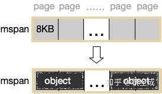

# Go 内存管理

## Go的内存分配核心思想

Go的内存分配器采用了跟tcmalloc库相同的实现，是一个带内存池的分配器，底层直接调用操作系统的mmap等函数。

Go是一个支持goroutine这种多线程的语言，所以它的内存管理系统必须也要考虑在多线程下的稳定 性和效率问题。在多线程方面，很自然的做法就是每条线程都有自己的本地的内存，然后有一个全局的分配链，当某个线程中内存不足后就向全局分配链中申请内存。这样就避免了多线程同时访问共享变量时的加锁。 

分配器的数据结构包括:

- FixAlloc: 固定大小(128kB)的对象的空闲链分配器,被分配器用于管理存储 MHeap: 分配堆,按页的粒度进行管理(4kB)
- MSpan: 一些由MHeap管理的页
- MCentral: 对于给定尺寸类别的共享的free list
- MCache: 用于小对象的每M一个的cache


> 按照其用途，span 面向内部管理，object 面向对象分配。
> 

## arenas


在旧的Go版本中，Go程序是采用预先保留连续的虚拟地址的方案，在64位的系统上，会预先保留512G的虚拟内存空间，但是不可增长，而当前版本中，虚拟内存的地址长度被设置为了48位，理论上可以支持2^48字节的内存使用。

在go1.12源码里, mheap_.arenas是一个二维数组[L1][L2]heapArena（heapArena存的是对应arena的元数据），维度以及arena本身的大小和寻址bit位数相关，每个arena的起始地址按对应大小对齐。申请的内存空间会放在一个heapArena数组里，用于应用程序内存分配。

Go的虚拟内存是由一组arena组成的，这一组arena组成我们所说的堆(mheap.arenas)。初始情况下mheap会映射一个arena，也就是64MB(不同系统的arena大小不同)。所以我们的程序的当前内存会按照需要小增量进行映射，并且每次以一个arena为单位。也就是说 heap 裡有許多個 arena，數量會隨著需求而慢慢增加或減少。

#### spans

spans 数组是一个用于将内存地址映射成 MSpan 结构体的表，每个内存页都会对应到 spans 中的一个 MSpan 指针，通过 spans 就能够将地址映射到相应的 MSpan。具体做法，给定一个地址，可以通过(地址-基地址)/页大小得到页号，再通过spans[页号] 就得到了相应的 MSpan 结构体。前面说过，MSpan 就是若干连续的页。那么，一个多页的 MSpan 会占用 spans 数组中的多项，有多少页就会占用多少项。比如，可能 spans[502] 到 spans[505] 都指向同一个 MSpan，这个 MSpan 的 PageId 为502，npages 为4。

每个指针对应一页，所以spans区域的大小就是512GB/8KB*8B=512MB。除以8KB是计算arena区域的页数，而最后乘以8是计算spans区域所有指针的大小。

回收过程: 回收一个 MSpan 时，首先会查找它相邻的页的址址，再通过 spans 映射得到该页对应的 MSpan，如果 MSpan 的 state 是未使用，则可以将两者进行合并。最后会将这页或者合并后的页归还到 free[] 分配池或者是 large 中。


#### bitmap

bitmap区域标识arena区域哪些地址保存了对象，并且用4bit标志位表示对象是否包含指针、GC标记信息。bitmap中一个byte大小的内存对应arena区域中4个指针大小（指针大小为 8B ）的内存，所以bitmap区域的大小是512GB/(4*8B)=16GB。


从上图其实还可以看到bitmap的高地址部分指向arena区域的低地址部分，也就是说bitmap的地址是由高地址向低地址增长的。

## MSpan

### Size Class

Go中内存管理的基本单元，是由一片连续的8KB的页组成的大块内存。注意，这里的页和操作系统本身的页并不是一回事，它一般是操作系统页大小的几倍。

每个mspan按照它自身的属性Size Class的大小分割成若干个object，属性Size Class决定object大小，其实也间接决定了 mspan 所占用的 page 页数，mspan 的规格大小。

mspan 只会分配给和 object 尺寸大小接近的对象，当然，对象的大小要小于 object 大小。还有一个概念：Span Class，它和Size Class的含义差不多

```
Size_Class = Span_Class / 2

```

这是因为其实每个 Size Class有两个mspan，也就是有两个Span Class。其中一个分配给含有指针的对象，另一个分配给不含有指针的对象。这会给垃圾回收机制带来利好。



Go1.9.2里 mspan 的Size Class共有67种，每种mspan分割的object大小是 8*2 的倍数，这个是写死在代码里的：

```
const _NumSizeClasses = 67

var class_to_size = [_NumSizeClasses]uint16{0, 8, 16, 32, 48, 64, 80, 96, 112, 128, 144, 160, 176, 192, 208, 224, 240, 256, 288, 320, 352, 384, 416, 448, 480, 512, 576, 640, 704, 768, 896, 1024, 1152, 1280, 1408, 1536,1792, 2048, 2304, 2688, 3072, 3200, 3456, 4096, 4864, 5376, 6144, 6528, 6784, 6912, 8192, 9472, 9728, 10240, 10880, 12288, 13568, 14336, 16384, 18432, 19072, 20480, 21760, 24576, 27264, 28672, 32768}

```
根据mspan的Size Class可以得到它划分的object大小。 比如Size Class等于3，object大小就是32B。 32B大小的object可以存储对象大小范围在17B~32B的对象。而对于微小对象（小于16B），分配器会将其进行合并，将几个对象分配到同一个object中。

数组里最大的数是32768，也就是32KB，超过此大小就是大对象了，它会被特别对待，这个稍后会再介绍。顺便提一句，类型Size Class为0表示大对象，它实际上直接由堆内存分配，而小对象都要通过mspan来分配。

对于mspan来说，它的Size Class会决定它所能分到的页数，这也是写死在代码里的：

```
const _NumSizeClasses = 67

var class_to_allocnpages = [_NumSizeClasses]uint8{0, 1, 1, 1, 1, 1, 1, 1, 1, 1, 1, 1, 1, 1, 1, 1, 1, 1, 1, 1, 1, 1, 1, 1, 1, 1, 1, 1, 1, 1, 1, 1, 1, 1, 2, 1, 2, 1, 2, 1, 3, 2, 3, 1, 3, 2, 3, 4, 5, 6, 1, 7, 6, 5, 4, 3, 5, 7, 2, 9, 7, 5, 8, 3, 10, 7, 4}

```

比如当我们要申请一个object大小为32B的mspan的时候，在class_to_size里对应的索引是3，而索引3在class_to_allocnpages数组里对应的页数就是1。


### mspan 数据结构

```
type mspan struct {
    // 該 mspan 的 span class
	spanclass   spanClass  // size class and noscan (uint8)
  
    next *mspan     // next span in list, or nil if none
    prev *mspan     // previous span in list, or nil if none
	
	startAddr uintptr // 該 mspan 第一個 byte 的起始位址，即是在 arena 的起始位址
	npages    uintptr // 該 mspan 擁有多少 page
	
	// freeindex 用來指出該 mspan 要從何處開始掃描找出下一個可用的 object，其 index 為 0 至 nelems
	// 每次 allocation 時，會從 freeindex 開始掃描，遇到 0 代表該 object 是可用的
	// freeindex 會被調整到該位置，這樣下次掃描便會從此次分配的 object 的後面開始掃描
	// 若 freeindex 等於 nelem，則代表該 mspan 已經沒有可用的 objects 了
	// freeindex 前的 object 都是已分配的，freeindex 之後的 object 可能分配了，也可能還未分配
	freeindex uintptr
	nelems uintptr // 該 mspan 擁有多少 object
	
	//分配位图，每一位代表一个块是否已分配
    allocBits *gcBits 
    // 已分配块的个数
    allocCount uint16 
    
    
    // sweep generation:
	// if sweepgen == h->sweepgen - 2, the span needs sweeping
	// if sweepgen == h->sweepgen - 1, the span is currently being swept
	// if sweepgen == h->sweepgen, the span is swept and ready to use
	// if sweepgen == h->sweepgen + 1, the span was cached before sweep began and is still cached, and needs sweeping
	// if sweepgen == h->sweepgen + 3, the span was swept and then cached and is still cached
	// h->sweepgen is incremented by 2 after every GC
	sweepgen    uint32
	
	elemsize    uintptr    // computed from sizeclass or from npages
}

```

当span内的所有内存块都被占用时，没有剩余空间继续分配对象，mcache会向mcentral申请1个span，mcache拿到span后继续分配对象。


假设最左边第一个mspan的Size Class等于10，根据前面的class_to_size数组，得出这个msapn分割的object大小是144B，算出可分配的对象个数是8KB/144B=56.89个，取整56个，所以会有一些内存浪费掉了，Go的源码里有所有Size Class的mspan浪费的内存的大小；再根据class_to_allocnpages数组，得到这个mspan只由1个page组成；假设这个mspan是分配给无指针对象的，那么spanClass等于20。


### mspan 方法

从 mspan 中获取下一个空闲对象方法：

```
func (c *mcache) nextFree(spc spanClass) (v gclinkptr, s *mspan, shouldhelpgc bool) {
	s = c.alloc[spc]
	shouldhelpgc = false
	freeIndex := s.nextFreeIndex()
	if freeIndex == s.nelems {
		// The span is full.
		if uintptr(s.allocCount) != s.nelems {
			println("runtime: s.allocCount=", s.allocCount, "s.nelems=", s.nelems)
			throw("s.allocCount != s.nelems && freeIndex == s.nelems")
		}
		c.refill(spc)
		shouldhelpgc = true
		s = c.alloc[spc]

		freeIndex = s.nextFreeIndex()
	}

	if freeIndex >= s.nelems {
		throw("freeIndex is not valid")
	}

	v = gclinkptr(freeIndex*s.elemsize + s.base())
	s.allocCount++
	if uintptr(s.allocCount) > s.nelems {
		println("s.allocCount=", s.allocCount, "s.nelems=", s.nelems)
		throw("s.allocCount > s.nelems")
	}
	return
}

func (s *mspan) base() uintptr {
	return s.startAddr
}

```

## MHeap

MHeap层次用于直接分配较大(>32kB)的内存空间，以及给MCentral和MCache等下层提供空间。它管理的基本单位是 MSpan。

```
type mheap struct {
    free      mTreap // free spans
    freelarge mTreap  // free treap of length >= _MaxMHeapList
    
    arenas [1 << arenaL1Bits]*[1 << arenaL2Bits]*heapArena
    
    central [numSpanClasses]struct {
		mcentral mcentral
		pad      [sys.CacheLineSize - unsafe.Sizeof(mcentral{})%sys.CacheLineSize]byte
	}
	
	spanalloc             fixalloc // allocator for span*
	cachealloc            fixalloc // allocator for mcache*
	treapalloc            fixalloc // allocator for treapNodes*
	arenaHintAlloc        fixalloc // allocator for arenaHints
	...
}	

type heapArena struct {
	bitmap [heapArenaBitmapBytes]byte

	spans [pagesPerArena]*mspan
}

type mSpanList struct {
	first *mspan // first span in list, or nil if none
	last  *mspan // last span in list, or nil if none
}
```

- `free [_MaxMHeapList]mSpanList`: 这是一个 SpanList 数组，每个 SpanList 里面的 mspan 由 1 ~ 127 (_MaxMHeapList - 1) 个 page 组成。比如 free[3] 是由包含 3 个 page 的 mspan 组成的链表。free 表示的是 free list，也就是未分配的。对应的还有 busy list。
- freelarge mSpanList: mspan 组成的链表，每个元素（也就是 mspan）的 page 个数大于 127。对应的还有 busylarge。
- central [_NumSizeClasses]…: 这个就是 mcentral ，每种大小的块对应一个 mcentral。pad 可以认为是一个字节填充，为了避免伪共享（false sharing）问题的。
- arenas: arena 是 Golang 中用于分配内存的连续虚拟地址区域。由 mheap 管理，堆上申请的所有内存都来自 arena。那么如何标志内存可用呢？操作系统的常见做法用两种：一种是用链表将所有的可用内存都串起来；另一种是使用位图来标志内存块是否可用。spans 记录 arena 区域页号（page number）和 mspan 的映射关系。
- 下面几个 fixalloc 分别是各种固定数据结构的分配器，go 语言会事先创建一个链表，保存对应的数据结构，例如 mspan、treap 等等数据结构，等到 go runtime 需要创建对应对象的时候，可以立刻返回对象。

mheap中含有所有规格的mcentral，所以，当一个mcache从mcentral申请mspan时，只需要在独立的mcentral中使用锁，并不会影响申请其他规格的mspan。

分配过程: 如果能从free[]的分配池中分配，则从其中分配。如果发生切割则将剩余部分放回free[]中。比如要分配2页大小的 空间，从图上2号槽位开始寻找，直到4号槽位有可用的MSpan，则拿一个出来，切出两页，剩余的部分再放回2号槽位中。 否则从large链表中去分配，按BestFit算法去找一块可用空间。


### treap 结构

treap 本身是一棵二叉搜索树，用来快速查找含有 npages 的 mspan 对象，但在其中一般会有一个额外字段来保证二叉搜索树的结构同时满足小顶堆的性质。treap 是利用随机 priority 来解决二叉搜索树不平衡的问题，同时也为了解决 AVL 树过于复杂的问题，类似的结构还有跳表。

```
//go:notinheap
type mTreap struct {
	treap           *treapNode
	unscavHugePages uintptr // number of unscavenged huge pages in the treap
}

//go:notinheap
type treapNode struct {
	right    *treapNode      // all treapNodes > this treap node
	left     *treapNode      // all treapNodes < this treap node
	parent   *treapNode      // direct parent of this node, nil if root
	key      uintptr         // base address of the span, used as primary sort key
	span     *mspan          // span at base address key
	maxPages uintptr         // the maximum size of any span in this subtree, including the root
	priority uint32          // random number used by treap algorithm to keep tree probabilistically balanced
	types    treapIterFilter // the types of spans available in this subtree
}

```

几个字段的含义都比较简单:

- right/left/parent 表示当前节点和树中其它节点的关系
- npagesKey 表示该 mspan 中含有的内存页数，作为二叉搜索树的排序依据
- spanKey 是 mspan 指针，其地址的值作为二叉搜索树的第二个排序依据，即页数相同的情况下，spanKey 大的会在当前节点的右边
- priority 是随机生成的权重值，该权重值会被作为小顶堆的排序依据

早期的 mheap 的 free 属性是链表构成的，freelarge 才是用 treap，在 go 1.12 版本 free 转化为 treap 来存储，去掉了 freelarge。

## MCentral

MCentral 层次是作为MCache和MHeap的连接。对上，它从MHeap中申请MSpan;对下，它将MSpan划分成各种小尺寸对 象，提供给MCache使用。

每个central保存一种特定大小的全局mspan列表，包括已分配出去的和未分配出去的。 每个mcentral对应一种mspan，而mspan的种类导致它分割的object大小不同。当工作线程的mcache中没有合适（也就是特定大小的）的mspan时就会从mcentral获取。

mcentral被所有的工作线程共同享有，存在多个Goroutine竞争的情况，因此会消耗锁资源。结构体定义：

```
type mcentral struct {
	lock      mutex
	spanclass spanClass
	nonempty  mSpanList // list of spans with a free object, ie a nonempty free list
	empty     mSpanList // list of spans with no free objects (or cached in an mcache)

	nmalloc uint64
}

```

nmalloc 代表着 mcentral 中所有的 mspan 中对象的个数。

注意，每个MSpan只会分割成同种大小的对象。每个MCentral也是只含同种大小的对象。MCentral结构中，有一个 nonempty的MSpan链和一个empty的MSpan链，分别表示还有空间的MSpan和装满了对象的MSpan。

回收比分配复杂，因为涉及到合并。这里的合并是通过引用计数实现的。从MSpan中每划出 一个对象，则引用计数加一，每回收一个对象，则引用计数减一。如果减完之后引用计数为零了，则说明这整块的MSpan已 经没被使用了，可以将它归还给MHeap。

## MCache

MCache层次跟MHeap层次非常像，也是一个分配池，对每个尺寸的类别都有一个空闲对象的单链表。

mcache与TCMalloc中的ThreadCache类似，mcache保存的是各种大小的Span，并按Span class分类，小对象直接从mcache分配内存，它起到了缓存的作用，并且可以无锁访问。但是mcache与ThreadCache也有不同点，TCMalloc中是每个线程1个ThreadCache，Go中是每个P拥有1个mcache。因为在Go程序中，当前最多有GOMAXPROCS个线程在运行，所以最多需要GOMAXPROCS个mcache就可以保证各线程对mcache的无锁访问，线程的运行又是与P绑定的，把mcache交给P刚刚好。

```
type mcache struct {
	next_sample uintptr // trigger heap sample after allocating this many bytes
	local_scan  uintptr // bytes of scannable heap allocated

   
	tiny             uintptr
	tinyoffset       uintptr
	local_tinyallocs uintptr // number of tiny allocs not counted in other stats

	// The rest is not accessed on every malloc.

	alloc [numSpanClasses]*mspan // spans to allocate from, indexed by spanClass

	flushGen uint32
}

```

mcache用Span Classes作为索引管理多个用于分配的mspan，它包含所有规格的mspan。它是_NumSizeClasses的2倍，也就是67*2=134，为什么有一个两倍的关系，前面我们提到过：为了加速之后内存回收的速度，数组里一半的mspan中分配的对象不包含指针，另一半则包含指针。对于无指针对象的mspan在进行垃圾回收的时候无需进一步扫描它是否引用了其他活跃的对象。

tiny 是用于 tiny 对象的分配，tiny 指针指向当前 cache 中正在负责分配 tiny 对象的 mspan 首地址，tinyoffset 是当前在 mspan 中已占用的大小，local_tinyallocs 是已分配的 tiny 对象个数。

## 平台相关函数

### sysAlloc

sysAlloc 从操作系统获取一大块已清零的内存，一般是 100 KB 或 1MB

sysAlloc 返回 OS 对齐的内存，但是对于堆分配器来说可能需要以更大的单位进行对齐。
因此 caller 需要小心地将 sysAlloc 获取到的内存重新进行对齐。

```
func sysAlloc(n uintptr, sysStat *uint64) unsafe.Pointer {
	p, err := mmap(nil, n, _PROT_READ|_PROT_WRITE, _MAP_ANON|_MAP_PRIVATE, -1, 0)
	if err != 0 {
		if err == _EACCES {
			print("runtime: mmap: access denied\n")
			exit(2)
		}
		if err == _EAGAIN {
			print("runtime: mmap: too much locked memory (check 'ulimit -l').\n")
			exit(2)
		}
		return nil
	}
	mSysStatInc(sysStat, n)
	return p
}

```

### sysUnused

sysUnused 通知操作系统内存区域的内容已经没用了，可以移作它用。

```
func sysUnused(v unsafe.Pointer, n uintptr) {
	if physHugePageSize != 0 {
		// If it's a large allocation, we want to leave huge
		// pages enabled. Hence, we only adjust the huge page
		// flag on the huge pages containing v and v+n-1, and
		// only if those aren't aligned.
		var head, tail uintptr
		if uintptr(v)&(physHugePageSize-1) != 0 {
			// Compute huge page containing v.
			head = uintptr(v) &^ (physHugePageSize - 1)
		}
		if (uintptr(v)+n)&(physHugePageSize-1) != 0 {
			// Compute huge page containing v+n-1.
			tail = (uintptr(v) + n - 1) &^ (physHugePageSize - 1)
		}

		// Note that madvise will return EINVAL if the flag is
		// already set, which is quite likely. We ignore
		// errors.
		if head != 0 && head+physHugePageSize == tail {
			// head and tail are different but adjacent,
			// so do this in one call.
			madvise(unsafe.Pointer(head), 2*physHugePageSize, _MADV_NOHUGEPAGE)
		} else {
			// Advise the huge pages containing v and v+n-1.
			if head != 0 {
				madvise(unsafe.Pointer(head), physHugePageSize, _MADV_NOHUGEPAGE)
			}
			if tail != 0 && tail != head {
				madvise(unsafe.Pointer(tail), physHugePageSize, _MADV_NOHUGEPAGE)
			}
		}
	}

	if uintptr(v)&(physPageSize-1) != 0 || n&(physPageSize-1) != 0 {
		// madvise will round this to any physical page
		// *covered* by this range, so an unaligned madvise
		// will release more memory than intended.
		throw("unaligned sysUnused")
	}

	var advise uint32
	if debug.madvdontneed != 0 {
		advise = _MADV_DONTNEED
	} else {
		advise = atomic.Load(&adviseUnused)
	}
	if errno := madvise(v, n, int32(advise)); advise == _MADV_FREE && errno != 0 {
		// MADV_FREE was added in Linux 4.5. Fall back to MADV_DONTNEED if it is
		// not supported.
		atomic.Store(&adviseUnused, _MADV_DONTNEED)
		madvise(v, n, _MADV_DONTNEED)
	}
}
```

#### 透明大页

该函数用大部分是解决 linux 透明分页的 bug。

>透明大页：
>
HugePages是通过使用大页内存来取代传统的4kb内存页面，使得管理虚拟地址数变少，加快了从虚拟地址到物理地址的映射以及通过摒弃内存页面的换入换出以提高内存的整体性能。
> 
hugepage 优点是减轻TLB的压力，也就是降低了cpu cache可缓存的地址映射压力。由于使用了huge page，相同的内存大小情况下，管理的虚拟地址数量变少。TLB entry可以包含更多的地址空间，cpu的寻址能力相应的得到了增强。
> 
除此之外还可以降低page table负载，消除page table查找负载，减少缺页异常从而提高内存的整体性能。
    
Linux 的透明大页支持会将 pages 合并到大页，常规的页分配的物理内存可以通过 khugepaged 进程自动迁往透明大页内存。内核进程 khugepaged的作用是，扫描正在运行的进程，然后试图将使用的常规内存页转换到使用大页。在某些情况下，系统范围使用大页面，会导致应用分配更多的内存资源。例如应用程序MMAP了一大块内存，但是只涉及1个字节，在这种情况下，2M页面代替4K页的分配没有任何好处，这就是为什么禁用全系统大页面，而只针对MADV_HUGEPAGE区使用的原因。在 amd64 平台上，khugepaged 会将一个 4KB 的单页变成 2MB，从而将进程的 RSS 爆炸式地增长 512 倍。

在我们的这个函数中也会出现类似的现象，透明大页会把我们 DONTNEED 的效果也消除掉，内存即使被回收，也会因为透明大页的原因，被回收的区域重新被附近的透明大页填充，导致内存回涨。

所以为了规避这个问题，我们在释放堆上页时，会显式地禁用透明大页。

但是禁用透明大页之后又会造成另一个问题，linux 会将禁用透明大页的区域划分为一个单独的 VMA，假设我们有一个区域 100M，本来是一个整体 VMA 区域，这时候我们禁用其中 40k 透明大页，那么 VMA 区域会被分割为 3 部分。如果禁用的区域过多，很快就会达到 linux 的 VMAS 的上线 65530。

因此 go 进行了优化，每次禁用透明大页不会仅仅禁用 40k，而是直接禁用一整块透明大页 2M，这样就会大大减少了 VMA 碎片。

#### MADV_FREE 与 MADV_DONTNEED

如果应用程序对一块内存后续不想使用，它可以使用MADV_DONTNEED标志告知内核，后续内核可以释放与之关联的资源。同时发生后续访问，也会成功，但会导致从底层映射文件重新加载内存内容，或者在没有底层文件的情况下从零填充页面进行映射。但是有一些应用程序（特别是内存分配器）会在短时间重用该内存范围，并且MADV_DONTNEED强制它们引发缺页中断，页面分配，页面清零等。

为了避免这种开销，其他操作系统如BSD支持MADV_FREE，它只是在需要时将页面标记为可用，并不会立即释放它们，从而可以重用内存而不会再次产生缺页错误的成本。此版本增加了对此标志的支持。

### sysUsed

sysUsed 通知操作系统内存区域的内容又需要用了。

```
func sysUsed(v unsafe.Pointer, n uintptr) {
	sysHugePage(v, n)
}

func sysHugePage(v unsafe.Pointer, n uintptr) {
	if physHugePageSize != 0 {
		// Round v up to a huge page boundary.
		beg := (uintptr(v) + (physHugePageSize - 1)) &^ (physHugePageSize - 1)
		// Round v+n down to a huge page boundary.
		end := (uintptr(v) + n) &^ (physHugePageSize - 1)

		if beg < end {
			madvise(unsafe.Pointer(beg), end-beg, _MADV_HUGEPAGE)
		}
	}
}

```

### sysFree

sysFree 无条件返回内存；只有当分配内存途中发生了 out-of-memory 错误时才会使用。

```
func sysFree(v unsafe.Pointer, n uintptr, sysStat *uint64) {
	mSysStatDec(sysStat, n)
	munmap(v, n)
}

```

### sysReserve

sysReserve 会在不分配内存的情况下，保留一段地址空间。如果传给它的指针是非 nil，意思是 caller 想保留这段地址，但这种情况下，如果该段地址不可用时，sysReserve 依然可以选择另外的地址。在一些操作系统的某些 case 下，sysReserve 化合简单地检查这段地址空间是否可用同时并不会真地保留它。sysReserve 返回非空指针时，如果地址空间保留成功了会将 *reserved 设置为 true，只是检查而未保留的话会设置为 false。

NOTE: sysReserve 返回 系统对齐的内存，没有按堆分配器的更大对齐单位进行对齐，所以 caller 需要将通过 sysAlloc 获取到的内存进行重对齐。

```
func sysReserve(v unsafe.Pointer, n uintptr) unsafe.Pointer {
	p, err := mmap(v, n, _PROT_NONE, _MAP_ANON|_MAP_PRIVATE, -1, 0)
	if err != 0 {
		return nil
	}
	return p
}

```

### sysMap

sysMap 将之前保留的地址空间映射好以进行使用。

```
func sysMap(v unsafe.Pointer, n uintptr, sysStat *uint64) {
	mSysStatInc(sysStat, n)

	p, err := mmap(v, n, _PROT_READ|_PROT_WRITE, _MAP_ANON|_MAP_FIXED|_MAP_PRIVATE, -1, 0)
	if err == _ENOMEM {
		throw("runtime: out of memory")
	}
	if p != v || err != 0 {
		throw("runtime: cannot map pages in arena address space")
	}
}

```

## 内存分配器初始化

### schedinit

系统启动的流程为：

- call osinit
- call schedinit
- make & queue new G
- call runtime·mstart

其中内存的初始化就在 schedinit 中：

```
func schedinit() {
	...
	
	mallocinit()
	mcommoninit(_g_.m)
	
	...

	procs := ncpu
	if n, ok := atoi32(gogetenv("GOMAXPROCS")); ok && n > 0 {
		procs = n
	}
	if procresize(procs) != nil {
		throw("unknown runnable goroutine during bootstrap")
	}
	
	...
}

```


### mallocinit

```
func mallocinit() {
	...
	
	// Initialize the heap.
	mheap_.init()
	_g_ := getg()
	_g_.m.mcache = allocmcache()

	// Create initial arena growth hints.
	if sys.PtrSize == 8 {
		
		for i := 0x7f; i >= 0; i-- {
			var p uintptr
			switch {
			case GOARCH == "arm64" && GOOS == "darwin":
				p = uintptr(i)<<40 | uintptrMask&(0x0013<<28)
			case GOARCH == "arm64":
				p = uintptr(i)<<40 | uintptrMask&(0x0040<<32)
			case GOOS == "aix":
				if i == 0 {
					// We don't use addresses directly after 0x0A00000000000000
					// to avoid collisions with others mmaps done by non-go programs.
					continue
				}
				p = uintptr(i)<<40 | uintptrMask&(0xa0<<52)
			case raceenabled:
				// The TSAN runtime requires the heap
				// to be in the range [0x00c000000000,
				// 0x00e000000000).
				p = uintptr(i)<<32 | uintptrMask&(0x00c0<<32)
				if p >= uintptrMask&0x00e000000000 {
					continue
				}
			default:
				p = uintptr(i)<<40 | uintptrMask&(0x00c0<<32)
			}
			hint := (*arenaHint)(mheap_.arenaHintAlloc.alloc())
			hint.addr = p
			hint.next, mheap_.arenaHints = mheap_.arenaHints, hint
		}
	} 
	
	...
}

```

该函数主要用于初始化 mheap_.arenaHints 变量，为以后 arena 区域内存分配定下虚拟内存起始地址.

### mheap_.init

`mheap_.init()` 函数主要是初始化 fixalloc 分配器，和初始化 central 属性：

```
func (h *mheap) init() {
	h.treapalloc.init(unsafe.Sizeof(treapNode{}), nil, nil, &memstats.other_sys)
	h.spanalloc.init(unsafe.Sizeof(mspan{}), recordspan, unsafe.Pointer(h), &memstats.mspan_sys)
	h.cachealloc.init(unsafe.Sizeof(mcache{}), nil, nil, &memstats.mcache_sys)
	h.specialfinalizeralloc.init(unsafe.Sizeof(specialfinalizer{}), nil, nil, &memstats.other_sys)
	h.specialprofilealloc.init(unsafe.Sizeof(specialprofile{}), nil, nil, &memstats.other_sys)
	h.arenaHintAlloc.init(unsafe.Sizeof(arenaHint{}), nil, nil, &memstats.other_sys)

	h.spanalloc.zero = false

	// h->mapcache needs no init

	for i := range h.central {
		h.central[i].mcentral.init(spanClass(i))
	}
}

```

### allocmcache

allocmcache() 用于给当前协程分配 mcache，但是 mcache 中并未分配任何 mspan，只是给了一个 dummy mspan

```
var emptymspan mspan

func allocmcache() *mcache {
	var c *mcache
	systemstack(func() {
		lock(&mheap_.lock)
		c = (*mcache)(mheap_.cachealloc.alloc())
		c.flushGen = mheap_.sweepgen
		unlock(&mheap_.lock)
	})
	for i := range c.alloc {
		c.alloc[i] = &emptymspan
	}
	c.next_sample = nextSample()
	return c
}

```

### procresize

mcache 是个 per-P 结构，在程序启动时，会初始化化 p，并且分配对应的 mcache。

```
func procresize(nprocs int32) *p
	...

	// initialize new P's
	for i := old; i < nprocs; i++ {
		pp := allp[i]
		if pp == nil {
			pp = new(p)
		}
		pp.init(i)
		atomicstorep(unsafe.Pointer(&allp[i]), unsafe.Pointer(pp))
	}
	...
}

func (pp *p) init(id int32) {
	pp.id = id
	pp.status = _Pgcstop
	pp.sudogcache = pp.sudogbuf[:0]
	for i := range pp.deferpool {
		pp.deferpool[i] = pp.deferpoolbuf[i][:0]
	}
	pp.wbBuf.reset()
	if pp.mcache == nil {
		if id == 0 {
			if getg().m.mcache == nil {
				throw("missing mcache?")
			}
			pp.mcache = getg().m.mcache // bootstrap
		} else {
			pp.mcache = allocmcache()
		}
	}
}
```


## 内存分配流程

### mallocgc

### tiny 对象分配

对于小于 16k 的对象，go 将会把这些 tiny 都嵌入到一个 16k 的对象中去。

分配的第一步是进行位对齐，如果 size 是 7bit，那么首先在 tinyoffset 的基础上向 8bit 对齐，然后才是放置当前对象的首地址。

如果放置当前对象之后，已经大于 16k，那么就要从 cache 的 mspan 中拿出下一个 16k 的对象，当然如果当前 mspan 的空闲内存不足了，cache 会通过 nextFreeFast 函数从 mcentral 中获取 mspan。


如果没有足够空间，则申请新的，若必要修正tiny及tinyoffset的值


```
// new(type) 会被翻译为 newobject，但是也不一定，要看逃逸分析的结果
// 编译前端和 SSA 后端都知道该函数的签名
func newobject(typ *_type) unsafe.Pointer {
    return mallocgc(typ.size, typ, true)
}

func mallocgc(size uintptr, typ *_type, needzero bool) unsafe.Pointer {
	...

	shouldhelpgc := false
	dataSize := size
	c := gomcache()
	var x unsafe.Pointer
	noscan := typ == nil || typ.ptrdata == 0
	if size <= maxSmallSize {
		if noscan && size < maxTinySize {
			off := c.tinyoffset
			// Align tiny pointer for required (conservative) alignment.
			if size&7 == 0 {
				off = round(off, 8)
			} else if size&3 == 0 {
				off = round(off, 4)
			} else if size&1 == 0 {
				off = round(off, 2)
			}
			if off+size <= maxTinySize && c.tiny != 0 {
				// The object fits into existing tiny block.
				x = unsafe.Pointer(c.tiny + off)
				c.tinyoffset = off + size
				c.local_tinyallocs++
				mp.mallocing = 0
				releasem(mp)
				return x
			}
			// Allocate a new maxTinySize block.
			span := c.alloc[tinySpanClass]
			v := nextFreeFast(span)
			if v == 0 {
				v, _, shouldhelpgc = c.nextFree(tinySpanClass)
			}
			x = unsafe.Pointer(v)
			(*[2]uint64)(x)[0] = 0
			(*[2]uint64)(x)[1] = 0
			// See if we need to replace the existing tiny block with the new one
			// based on amount of remaining free space.
			if size < c.tinyoffset || c.tiny == 0 {
				c.tiny = uintptr(x)
				c.tinyoffset = size
			}
			size = maxTinySize
		} 
```		

### 正常对象分配

对于正常的对象，首先要从 size 转化为 sizeclass

然后从 cache 中获取对应的 sizeclass 的 mspan 对象。
		
	
```		
		else {
			var sizeclass uint8
			if size <= smallSizeMax-8 {
				sizeclass = size_to_class8[(size+smallSizeDiv-1)/smallSizeDiv]
			} else {
				sizeclass = size_to_class128[(size-smallSizeMax+largeSizeDiv-1)/largeSizeDiv]
			}
			size = uintptr(class_to_size[sizeclass])
			spc := makeSpanClass(sizeclass, noscan)
			span := c.alloc[spc]
			v := nextFreeFast(span)
			if v == 0 {
				v, span, shouldhelpgc = c.nextFree(spc)
			}
			x = unsafe.Pointer(v)
			if needzero && span.needzero != 0 {
				memclrNoHeapPointers(unsafe.Pointer(v), size)
			}
		}
	} 
```	

#### nextFreeFast

span.allocCache 为一个64位的数值，每一个bit表示该对象块是否空闲，相当于一个位图，ctz64表示第一个出现1的位数，比如0x1280 返回的就是6，因为第一个出现1的bit为bit6。

freeindex 是 mspan 中已分配的对象个数，而 allocCache 是 freeindex 后面的 64 个对象的空闲状态。

如果 allocCache 没有空闲对象，那么返回 0：

```
func nextFreeFast(s *mspan) gclinkptr {
	theBit := sys.Ctz64(s.allocCache) // Is there a free object in the allocCache?
	if theBit < 64 {
		result := s.freeindex + uintptr(theBit)
		if result < s.nelems {
			freeidx := result + 1
			if freeidx%64 == 0 && freeidx != s.nelems {
				return 0
			}
			s.allocCache >>= uint(theBit + 1)
			s.freeindex = freeidx
			s.allocCount++
			return gclinkptr(result*s.elemsize + s.base())
		}
	}
	return 0
}

func (s *mspan) base() uintptr {
	return s.startAddr
}

```

#### mcache.nextFree

该函数首先通过 nextFreeIndex 函数来获取下一个空闲的对象，如果当前 mspan 已满，那么通过 c.refill 重新获取 mspan：


```
func (c *mcache) nextFree(spc spanClass) (v gclinkptr, s *mspan, shouldhelpgc bool) {
	s = c.alloc[spc]
	shouldhelpgc = false
	freeIndex := s.nextFreeIndex()
	if freeIndex == s.nelems {
		// The span is full.
		if uintptr(s.allocCount) != s.nelems {
			println("runtime: s.allocCount=", s.allocCount, "s.nelems=", s.nelems)
			throw("s.allocCount != s.nelems && freeIndex == s.nelems")
		}
		c.refill(spc)
		shouldhelpgc = true
		s = c.alloc[spc]

		freeIndex = s.nextFreeIndex()
	}

	v = gclinkptr(freeIndex*s.elemsize + s.base())
	s.allocCount++

	return
}

```

#### mspan.nextFreeIndex

>
allocBits是一个bitmap，标记是否使用，通过allocBits已经可以达到O(1)的分配速度，但是go为了极限性能，对其做了一个缓存，allocCache，从freeindex开始，长度是64。
>
初始状态，freeindex是0,allocCache全是1，allocBit是0。
>
第一次分配，theBit是0，freeindex为1，allocCache为01111...。
>
第二次分配，theBit还是0，freeinde是2，allocCache为001111...。
>
...
>
在一个span清扫之后，情况会又些复杂。 freeindex会为0，不妨假设allocBit为1010....1010。全是1和0交替。
>
第一次分配，theBit是1，freeindex是2,allocCache是001010...10。
>
第二次分配，theBit是1，freeindex是4,allocCache是00001010..10。 ...


因此，当 s.allocCache 已经满位 64 的时候，需要通过 s.refillAllocCache 函数从 allocBits 中获取对象的空闲状态，首先将 sfreeindex 取整到 64 倍数，然后将地址传给 allocBits，并填充 allocCache 的位数。

```
func (s *mspan) nextFreeIndex() uintptr {
	sfreeindex := s.freeindex
	snelems := s.nelems
	if sfreeindex == snelems {
		return sfreeindex
	}
	if sfreeindex > snelems {
		throw("s.freeindex > s.nelems")
	}

	aCache := s.allocCache

	bitIndex := sys.Ctz64(aCache)
	for bitIndex == 64 {
		// 找到下一个缓存的地址。这个是吧sfreeindex取向上64的倍数
		sfreeindex = (sfreeindex + 64) &^ (64 - 1)
		if sfreeindex >= snelems {
			s.freeindex = snelems
			return snelems
		}
		whichByte := sfreeindex / 8
		// Refill s.allocCache with the next 64 alloc bits.
		s.refillAllocCache(whichByte)
		aCache = s.allocCache
		bitIndex = sys.Ctz64(aCache)
		// nothing available in cached bits
		// grab the next 8 bytes and try again.
	}
	result := sfreeindex + uintptr(bitIndex)
	if result >= snelems {
		s.freeindex = snelems
		return snelems
	}

	s.allocCache >>= uint(bitIndex + 1)
	sfreeindex = result + 1

	if sfreeindex%64 == 0 && sfreeindex != snelems {
		whichByte := sfreeindex / 8
		s.refillAllocCache(whichByte)
	}
	s.freeindex = sfreeindex
	return result
}

func (s *mspan) refillAllocCache(whichByte uintptr) {
	bytes := (*[8]uint8)(unsafe.Pointer(s.allocBits.bytep(whichByte)))
	aCache := uint64(0)
	aCache |= uint64(bytes[0])
	aCache |= uint64(bytes[1]) << (1 * 8)
	aCache |= uint64(bytes[2]) << (2 * 8)
	aCache |= uint64(bytes[3]) << (3 * 8)
	aCache |= uint64(bytes[4]) << (4 * 8)
	aCache |= uint64(bytes[5]) << (5 * 8)
	aCache |= uint64(bytes[6]) << (6 * 8)
	aCache |= uint64(bytes[7]) << (7 * 8)
	s.allocCache = ^aCache
}

```

#### mcache.refill

该函数首先改变了 mspan 的 sweepgen，然后通过 cacheSpan 函数从 central 获取一个 mspan：

```
func (c *mcache) refill(spc spanClass) {
	// Return the current cached span to the central lists.
	s := c.alloc[spc]

	if uintptr(s.allocCount) != s.nelems {
		throw("refill of span with free space remaining")
	}
	if s != &emptymspan {
		// Mark this span as no longer cached.
		if s.sweepgen != mheap_.sweepgen+3 {
			throw("bad sweepgen in refill")
		}
		atomic.Store(&s.sweepgen, mheap_.sweepgen)
	}

	// Get a new cached span from the central lists.
	s = mheap_.central[spc].mcentral.cacheSpan()
	if s == nil {
		throw("out of memory")
	}

	if uintptr(s.allocCount) == s.nelems {
		throw("span has no free space")
	}

	// Indicate that this span is cached and prevent asynchronous
	// sweeping in the next sweep phase.
	s.sweepgen = mheap_.sweepgen + 3

	c.alloc[spc] = s
}

```

#### mcentral.cacheSpan

cacheSpan 首先扫描 nonempty 链表，再扫描 empty 链表，如果都无法获取 mspan，那么将会进行 c.grow() 从 mheap 获取 mspan。

mheap_.sweepgen 是 heap 的 gc 周期，每次 gc，其 sweepgen 会加 2，

那么 `s.sweepgen == sg-2` 代表相对于 heap 需要 gc 但是还未开始的 mspan，此时我们手动执行 sweep 进行 gc。

`s.sweepgen == sg-1` 是正在 gc 的 mspan，我们需要跳过。

否则，那就是不需要 sweep 的 mspan，直接拿出来用就可以了。

获取到 mspan 之后，需要更新 c.nmalloc， 重新计算 allocCache	

```
func (c *mcentral) cacheSpan() *mspan {
	...
	sg := mheap_.sweepgen
retry:
	var s *mspan
	for s = c.nonempty.first; s != nil; s = s.next {
		if s.sweepgen == sg-2 && atomic.Cas(&s.sweepgen, sg-2, sg-1) {
			c.nonempty.remove(s)
			c.empty.insertBack(s)
			unlock(&c.lock)
			s.sweep(true)
			goto havespan
		}
		if s.sweepgen == sg-1 {
			// the span is being swept by background sweeper, skip
			continue
		}
		// we have a nonempty span that does not require sweeping, allocate from it
		c.nonempty.remove(s)
		c.empty.insertBack(s)
		unlock(&c.lock)
		goto havespan
	}

	for s = c.empty.first; s != nil; s = s.next {
		if s.sweepgen == sg-2 && atomic.Cas(&s.sweepgen, sg-2, sg-1) {
			// we have an empty span that requires sweeping,
			// sweep it and see if we can free some space in it
			c.empty.remove(s)
			// swept spans are at the end of the list
			c.empty.insertBack(s)
			unlock(&c.lock)
			s.sweep(true)
			freeIndex := s.nextFreeIndex()
			if freeIndex != s.nelems {
				s.freeindex = freeIndex
				goto havespan
			}
			lock(&c.lock)
			// the span is still empty after sweep
			// it is already in the empty list, so just retry
			goto retry
		}
		if s.sweepgen == sg-1 {
			// the span is being swept by background sweeper, skip
			continue
		}
		// already swept empty span,
		// all subsequent ones must also be either swept or in process of sweeping
		break
	}

	unlock(&c.lock)

	// Replenish central list if empty.
	s = c.grow()
	if s == nil {
		return nil
	}
	lock(&c.lock)
	c.empty.insertBack(s)
	unlock(&c.lock)

havespan:
	n := int(s.nelems) - int(s.allocCount)

	atomic.Xadd64(&c.nmalloc, int64(n))
	usedBytes := uintptr(s.allocCount) * s.elemsize
	atomic.Xadd64(&memstats.heap_live, int64(spanBytes)-int64(usedBytes))

	if gcBlackenEnabled != 0 {
		// heap_live changed.
		gcController.revise()
	}
	freeByteBase := s.freeindex &^ (64 - 1)
	whichByte := freeByteBase / 8
	// Init alloc bits cache.
	s.refillAllocCache(whichByte)

	// Adjust the allocCache so that s.freeindex corresponds to the low bit in
	// s.allocCache.
	s.allocCache >>= s.freeindex % 64

	return s
}

```

#### mcentral.grow

grow 函数主要计算 sizeclass 对应的 pages，然后向 mheap 申请 mspan：

```
func (c *mcentral) grow() *mspan {
	npages := uintptr(class_to_allocnpages[c.spanclass.sizeclass()])
	size := uintptr(class_to_size[c.spanclass.sizeclass()])

	s := mheap_.alloc(npages, c.spanclass, false, true)
	if s == nil {
		return nil
	}

	// Use division by multiplication and shifts to quickly compute:
	// n := (npages << _PageShift) / size
	n := (npages << _PageShift) >> s.divShift * uintptr(s.divMul) >> s.divShift2
	s.limit = s.base() + size*n
	heapBitsForAddr(s.base()).initSpan(s)
	return s
}

```

### mheap.alloc

该函数主要调用 allocSpanLocked 用于从 mheap 获取 mspan

拿到 mspan 之后，需要在对应的 arena 设置对应的 pageInUse 数组。

```
func (h *mheap) alloc(npage uintptr, spanclass spanClass, large bool, needzero bool) *mspan {
	// Don't do any operations that lock the heap on the G stack.
	// It might trigger stack growth, and the stack growth code needs
	// to be able to allocate heap.
	var s *mspan
	systemstack(func() {
		s = h.alloc_m(npage, spanclass, large)
	})

	if s != nil {
		if needzero && s.needzero != 0 {
			memclrNoHeapPointers(unsafe.Pointer(s.base()), s.npages<<_PageShift)
		}
		s.needzero = 0
	}
	return s
}

func (h *mheap) alloc_m(npage uintptr, spanclass spanClass, large bool) *mspan {
	_g_ := getg()

	// 为了防止过度的 heap 增长，在分配 n 页之前，需要 sweep 并取回至少 n 个页
	if h.sweepdone == 0 {
		h.reclaim(npage)
	}

	lock(&h.lock)
	
	s := h.allocSpanLocked(npage, &memstats.heap_inuse)
	if s != nil {
		// Record span info, because gc needs to be
		// able to map interior pointer to containing span.
		atomic.Store(&s.sweepgen, h.sweepgen)
		h.sweepSpans[h.sweepgen/2%2].push(s) // Add to swept in-use list.
		s.state = mSpanInUse
		s.allocCount = 0
		s.spanclass = spanclass
		if sizeclass := spanclass.sizeclass(); sizeclass == 0 {
			s.elemsize = s.npages << _PageShift
			s.divShift = 0
			s.divMul = 0
			s.divShift2 = 0
			s.baseMask = 0
		} else {
			s.elemsize = uintptr(class_to_size[sizeclass])
			m := &class_to_divmagic[sizeclass]
			s.divShift = m.shift
			s.divMul = m.mul
			s.divShift2 = m.shift2
			s.baseMask = m.baseMask
		}

		// Mark in-use span in arena page bitmap.
		arena, pageIdx, pageMask := pageIndexOf(s.base())
		arena.pageInUse[pageIdx] |= pageMask

		// update stats, sweep lists
		h.pagesInUse += uint64(npage)
		if large {
			memstats.heap_objects++
			mheap_.largealloc += uint64(s.elemsize)
			mheap_.nlargealloc++
			atomic.Xadd64(&memstats.heap_live, int64(npage<<_PageShift))
		}
	}
	
	unlock(&h.lock)
	return s
}

```

#### mheap.allocSpanLocked

allocSpanLocked 先会去 free 中寻找适当的 mspan

如果寻找不到，那么会调用 grow 来从操作系统申请至少 64M 内存，再次尝试从 free 中获取 mspan

如果拿到的 page 过大，还需要进行拆分

```
func (h *mheap) allocSpanLocked(npage uintptr, stat *uint64) *mspan {
	t := h.free.find(npage)
	if t.valid() {
		goto HaveSpan
	}
	if !h.grow(npage) {
		return nil
	}
	t = h.free.find(npage)
	if t.valid() {
		goto HaveSpan
	}
	throw("grew heap, but no adequate free span found")

HaveSpan:
	s := t.span()
	if s.state != mSpanFree {
		throw("candidate mspan for allocation is not free")
	}

	// First, subtract any memory that was released back to
	// the OS from s. We will add back what's left if necessary.
	memstats.heap_released -= uint64(s.released())

	if s.npages == npage {
		h.free.erase(t)
	} else if s.npages > npage {
		// Trim off the lower bits and make that our new span.
		// Do this in-place since this operation does not
		// affect the original span's location in the treap.
		n := (*mspan)(h.spanalloc.alloc())
		h.free.mutate(t, func(s *mspan) {
			n.init(s.base(), npage)
			s.npages -= npage
			s.startAddr = s.base() + npage*pageSize
			h.setSpan(s.base()-1, n)
			h.setSpan(s.base(), s)
			h.setSpan(n.base(), n)
			n.needzero = s.needzero
			// n may not be big enough to actually be scavenged, but that's fine.
			// We still want it to appear to be scavenged so that we can do the
			// right bookkeeping later on in this function (i.e. sysUsed).
			n.scavenged = s.scavenged
			// Check if s is still scavenged.
			if s.scavenged {
				start, end := s.physPageBounds()
				if start < end {
					memstats.heap_released += uint64(end - start)
				} else {
					s.scavenged = false
				}
			}
		})
		s = n
	} else {
		throw("candidate mspan for allocation is too small")
	}
	// "Unscavenge" s only AFTER splitting so that
	// we only sysUsed whatever we actually need.
	if s.scavenged {
		sysUsed(unsafe.Pointer(s.base()), s.npages<<_PageShift)
		s.scavenged = false

		s.state = mSpanManual
		h.scavengeIfNeededLocked(s.npages * pageSize)
		s.state = mSpanFree
	}

	h.setSpans(s.base(), npage, s)

	*stat += uint64(npage << _PageShift)
	memstats.heap_idle -= uint64(npage << _PageShift)

	if s.inList() {
		throw("still in list")
	}
	return s
}

```

#### mheap.grow

当 free 内 mspan 不足的时候，就需要申请内存，建立新的 arena

grow 函数对于新的 arena，初始化其 span 数组

值得注意的是，sysAlloc 函数返回的 size 是 heapArenaBytes 的整数倍，在 linux 中也就是 64M 的整数倍，相当于将新的 arena 的 size 返回。

而在下面新建的 s 变量，也是以这个 size 大小作为其 mspan 的大小，这样当它插入到 h.free 中后，整个 arena 的内存就都在 free 这个 treap 树当中了。

```
func (h *mheap) grow(npage uintptr) bool {
	ask := npage << _PageShift
	v, size := h.sysAlloc(ask)
	if v == nil {
		print("runtime: out of memory: cannot allocate ", ask, "-byte block (", memstats.heap_sys, " in use)\n")
		return false
	}

	// Create a fake "in use" span and free it, so that the
	// right accounting and coalescing happens.
	s := (*mspan)(h.spanalloc.alloc())
	s.init(uintptr(v), size/pageSize)
	h.setSpans(s.base(), s.npages, s)
	s.state = mSpanFree
	memstats.heap_idle += uint64(size)
	// (*mheap).sysAlloc returns untouched/uncommitted memory.
	s.scavenged = true
	// s is always aligned to the heap arena size which is always > physPageSize,
	// so its totally safe to just add directly to heap_released. Coalescing,
	// if possible, will also always be correct in terms of accounting, because
	// s.base() must be a physical page boundary.
	memstats.heap_released += uint64(size)
	h.coalesce(s)
	h.free.insert(s)
	return true
}

```

#### mheap.sysAlloc

heapArenaBytes 在 linux 中就是 64M

对于 32 位系统，会首先从 h.arena 中获取内存

调用 sysReserve 获取新的一段内存

初始化 heapArena 各个参数，并更新 h.allArenas 数组

```
func (h *mheap) sysAlloc(n uintptr) (v unsafe.Pointer, size uintptr) {
	n = round(n, heapArenaBytes)

	// First, try the arena pre-reservation.
	v = h.arena.alloc(n, heapArenaBytes, &memstats.heap_sys)
	if v != nil {
		size = n
		goto mapped
	}

	// Try to grow the heap at a hint address.
	for h.arenaHints != nil {
		hint := h.arenaHints
		p := hint.addr
		if hint.down {
			p -= n
		}
		if p+n < p {
			// We can't use this, so don't ask.
			v = nil
		} else if arenaIndex(p+n-1) >= 1<<arenaBits {
			// Outside addressable heap. Can't use.
			v = nil
		} else {
			v = sysReserve(unsafe.Pointer(p), n)
		}
		if p == uintptr(v) {
			// Success. Update the hint.
			if !hint.down {
				p += n
			}
			hint.addr = p
			size = n
			break
		}
		
	}

	...

	// Transition from Reserved to Prepared.
	sysMap(v, size, &memstats.heap_sys)

mapped:
	// Create arena metadata.
	for ri := arenaIndex(uintptr(v)); ri <= arenaIndex(uintptr(v)+size-1); ri++ {
		l2 := h.arenas[ri.l1()]
		if l2 == nil {
			// Allocate an L2 arena map.
			l2 = (*[1 << arenaL2Bits]*heapArena)(persistentalloc(unsafe.Sizeof(*l2), sys.PtrSize, nil))
			if l2 == nil {
				throw("out of memory allocating heap arena map")
			}
			atomic.StorepNoWB(unsafe.Pointer(&h.arenas[ri.l1()]), unsafe.Pointer(l2))
		}

		if l2[ri.l2()] != nil {
			throw("arena already initialized")
		}
		var r *heapArena
		r = (*heapArena)(h.heapArenaAlloc.alloc(unsafe.Sizeof(*r), sys.PtrSize, &memstats.gc_sys))
		if r == nil {
			r = (*heapArena)(persistentalloc(unsafe.Sizeof(*r), sys.PtrSize, &memstats.gc_sys))
			if r == nil {
				throw("out of memory allocating heap arena metadata")
			}
		}

		// Add the arena to the arenas list.
		if len(h.allArenas) == cap(h.allArenas) {
			size := 2 * uintptr(cap(h.allArenas)) * sys.PtrSize
			if size == 0 {
				size = physPageSize
			}
			newArray := (*notInHeap)(persistentalloc(size, sys.PtrSize, &memstats.gc_sys))
			if newArray == nil {
				throw("out of memory allocating allArenas")
			}
			oldSlice := h.allArenas
			*(*notInHeapSlice)(unsafe.Pointer(&h.allArenas)) = notInHeapSlice{newArray, len(h.allArenas), int(size / sys.PtrSize)}
			copy(h.allArenas, oldSlice)
			// Do not free the old backing array because
			// there may be concurrent readers. Since we
			// double the array each time, this can lead
			// to at most 2x waste.
		}
		h.allArenas = h.allArenas[:len(h.allArenas)+1]
		h.allArenas[len(h.allArenas)-1] = ri

		// Store atomically just in case an object from the
		// new heap arena becomes visible before the heap lock
		// is released (which shouldn't happen, but there's
		// little downside to this).
		atomic.StorepNoWB(unsafe.Pointer(&l2[ri.l2()]), unsafe.Pointer(r))
	}

	// Tell the race detector about the new heap memory.
	if raceenabled {
		racemapshadow(v, size)
	}

	return
}

```

### 大对象分配
	
对于大对象，直接调用 largeAlloc
	
```	
	else {
		var s *mspan
		shouldhelpgc = true
		systemstack(func() {
			s = largeAlloc(size, needzero, noscan)
		})
		s.freeindex = 1
		s.allocCount = 1
		x = unsafe.Pointer(s.base())
		size = s.elemsize
	}

	var scanSize uintptr
	if !noscan {
		// If allocating a defer+arg block, now that we've picked a malloc size
		// large enough to hold everything, cut the "asked for" size down to
		// just the defer header, so that the GC bitmap will record the arg block
		// as containing nothing at all (as if it were unused space at the end of
		// a malloc block caused by size rounding).
		// The defer arg areas are scanned as part of scanstack.
		if typ == deferType {
			dataSize = unsafe.Sizeof(_defer{})
		}
		heapBitsSetType(uintptr(x), size, dataSize, typ)
		if dataSize > typ.size {
			// Array allocation. If there are any
			// pointers, GC has to scan to the last
			// element.
			if typ.ptrdata != 0 {
				scanSize = dataSize - typ.size + typ.ptrdata
			}
		} else {
			scanSize = typ.ptrdata
		}
		c.local_scan += scanSize
	}

	// Ensure that the stores above that initialize x to
	// type-safe memory and set the heap bits occur before
	// the caller can make x observable to the garbage
	// collector. Otherwise, on weakly ordered machines,
	// the garbage collector could follow a pointer to x,
	// but see uninitialized memory or stale heap bits.
	publicationBarrier()

	// Allocate black during GC.
	// All slots hold nil so no scanning is needed.
	// This may be racing with GC so do it atomically if there can be
	// a race marking the bit.
	if gcphase != _GCoff {
		gcmarknewobject(uintptr(x), size, scanSize)
	}

	return x
}


func largeAlloc(size uintptr, needzero bool, noscan bool) *mspan {
	// print("largeAlloc size=", size, "\n")

	if size+_PageSize < size {
		throw("out of memory")
	}
	npages := size >> _PageShift
	if size&_PageMask != 0 {
		npages++
	}

	// Deduct credit for this span allocation and sweep if
	// necessary. mHeap_Alloc will also sweep npages, so this only
	// pays the debt down to npage pages.
	deductSweepCredit(npages*_PageSize, npages)

	s := mheap_.alloc(npages, makeSpanClass(0, noscan), true, needzero)
	if s == nil {
		throw("out of memory")
	}
	s.limit = s.base() + size
	heapBitsForAddr(s.base()).initSpan(s)
	return s
}
```


## Golang的协程栈管理

### 分段栈

Golang的协程栈是动态增长的，避免了栈溢出的问题。下面我们就来说明下它是如何增长的。

我们都知道协程的创建是很廉价的，每个协程创建的时候给的协程栈大小初始值是8KB。那么问题是协程是如何发现自己的栈资源不够用了呢？ golang在每个函数入口处都会嵌入一段检测代码（注意，一个协程可能会执行多个函数的喔），当代码检测到栈资源不够用的时候，就会调用morestack函数进行扩容。

那么来到我们最关注的话题了，golang的协程栈是如何扩容的呢？ 在golang1.5之前，golang的栈扩容策略一直都是分段栈的方式，在1.5的时候连续栈代替了分段站的方式，我们一一道来，这其实是两种不同的解决问题的思想，值得我们借鉴。 分段栈： 当调用morestack的时候，函数为协程分配一段新的内存栈，然后把协程栈的信息写入新栈的栈底的struct中，并且还包括了老栈的地址，这样就把两个栈联系到一起了，然后我们重启goroutine，从导致栈空间用光的那个函数开始执行。 以上的过程大概就是“分段栈”的思想。

我们来看看这里有几个问题：

- 首先要明确一点，新旧栈的空间是不连续的，通过新栈的栈底的struct来跟老栈连接在一起。

- 新栈会一直用吗？不会的，在新栈的底部，golang插入了一个函数lessstack，这个函数是什么时候会执行呢？当我们执行完那个导致我们老栈用光的函数后，会回调这个lessstack函数，这个函数的作用就是查找新栈底部的那个struct，然后找到老栈的地址，使得我们的协程返回到老栈，然后再释放新栈，继续执行我们的协程即可。

- 在第二步中，看起来我们的分段栈的思想是，给协程栈一个可以伸缩的能力，需要的时候扩一下，用完即释放。这样看起来不浪费内存，很完美的样子，但是实际上在应用的过程中出现了“hot split”的问题。其实在我们分段栈中，新栈的释放会是一个高昂的代价，那么当你的一个循环体中，正好命中了栈分裂，那么就会出现以下的情况，每次进入循环体中，就会造成栈使用光，然后申请新栈，执行完循环体再释放栈，如此代价太大了。

### 连续栈

为了解决热分裂的问题，golang团队采用了另外一种思想，当要申请新栈的时候，直接把老栈释放掉，直接全部使用新栈即可，不用在释放掉新栈了。这个时候需要把老栈的所有内容都copy到新栈中去，所以我们叫它“栈拷贝”，又叫连续栈，因为我们的栈不再是两个不连续的栈连接的，而是一次申请一个新栈，直接把老栈释放掉。 

我们这里说几个问题：

- 我们看起来栈拷贝完全解决了分段栈的热分裂问题，那么新栈的大小是多少呢？新栈的大小是老栈的2倍，当你原先的栈不够用，我直接给你换个两倍大的，而且以后你使用的空间大小又变回原来的大小时，我也不再给你释放了，你还是用这个大的即可。这样带来的一个小问题就是可能会造成空间的浪费，但是带来的性能是可观的。

- 栈拷贝真的是那么容易吗？其实不然，我们知道Golang的栈上会存储变量，那么如果程序中有些指针指向了这些变量，会出现什么问题，我们把栈都换掉了，上面的那些变量的地址肯定也变了，这样那些指针岂不是无效了。

- 对于2遇到的问题，我们该如何解决呢?好在，只有栈上的指针才能指向栈上的变量，这一点很重要。那么我们需要知道栈上的哪些变量被指针指向了，在垃圾回收中，这些指针我们是可以获取到的，等到说垃圾回收的我们细说，ok，我们知道了这些指针，当我们要进行栈拷贝的时候，直接修改这些指针指向的位置即可。

- 很不幸，有些情况下我们是无法使用栈拷贝的，因为有些Go的运行时代码用的是C写的，所以我们无法获取到这些指针的位置，所以后来Go把很多runtime进行Golang化了。当函数是用C写的时候，只能继续使用分段栈的方式。
