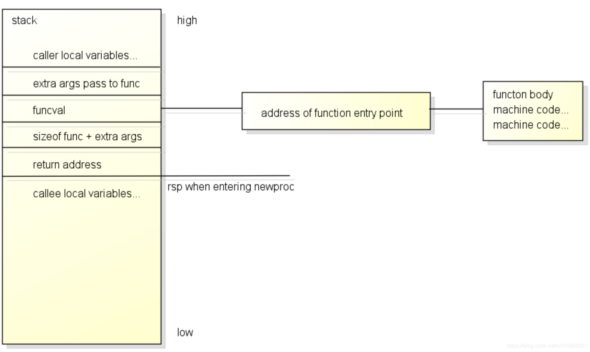
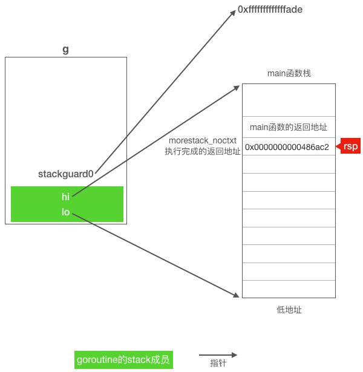
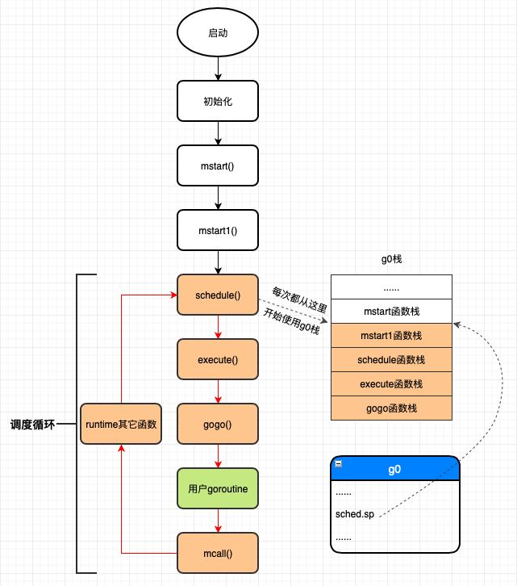

# Go 协程调度——PMG 调度细节分析

[TOC]

## PMG 状态转移原理索引

由于 Golang 中的调度循环稍微有些复杂，各种状态转移眼花缭乱，有些函数会不止一次被调用，调用的作用还不相同，因此我们在开始的时候，制作一个索引图谱，更容易理解调度之间的关系。

### 程序初始化阶段

这个阶段很简单，现在仅仅只有 m0 这一个物理线程，也仅仅只有 g0 这一个负责上下文转换的协程。

- 程序第一步，开始调用 `runtime·newproc` 创建第一个真正的 `main Goroutine`：[main Goroutine 的起始](#toc_8)
- 第二步，`runtime·newproc` 的实际工作者 `newproc1` 利用 `malg` 函数新建一个 G 结构，并利用传来的参数初始化了 G 的上下文信息： [Goroutine 的创建 Null => _Gidle](#toc_9)、[Goroutine 转为可运行 _Gidle => _Grunnable](#toc_12)
- 第三步，`runtime·mstart` 物理线程进行初始化，最重要的就是 save 函数保存 g0 的 SP 地址：[m0 初始化阶段 idle](#toc_45)
- 第四步，`runtime·mstart` 调用 `schedule` 开始调度：[M 的调度 idle => spinning](#toc_48)
- 第五步，因为是在初始化阶段，所以 `schedule` 调度一定能够找到第二步放入队列的 G：[M 获取 G 成功开始执行 spinning => running](#toc_54)
- 第六步，那就开始进行 G 的状态转移：[G 的运行 _Grunnable => _Grunning](#toc_16)
- 第七步，现在真正的 main Goroutine 开始执行 m0 的入口函数 `runtime·main`: [m0 主线程的执行 running](#toc_64)
- 第八步，`runtime·main` 函数中最为关键的就是后台监控程序 `sysmon`, 这个时候 Golang 会 clone 一个独立物理线程脱离 PMG 来执行：[sysmon 后台线程的执行 running => syscall](#toc_68)
- 第九步，`runtime·main` 函数开始执行用户的代码 `main.main` 函数

至此，`Golang` 的程序初始化已完毕，m0 正在执行者用户写的 `main` 函数，还有一个独立的线程在执行着后台的监控程序 `sysmon`，`main Goroutine` 正在处于 `_Grunning` 状态中。

那么接下来，我们就要讨论运行用户代码的过程中，我们会遇到哪些情形，会因此触发哪些调度程序的运行。

### 程序运行中新建 Goroutine

在 Golang 的程序里面，当然不可能只有一个 `main Goroutine` 在跑，那么当第一次新建一个非 `main Goroutine` 协程 G 的时候，runtime 是如何处理的呢？

- 第一步，其实和初始化阶段相同，还是调用 `runtime·newproc`，创建一个新的 G 结构：[Goroutine 的创建 Null => _Gidle](#toc_9)、[Goroutine 转为可运行 _Gidle => _Grunnable](#toc_12)
- 第二步，这一步就和初始化阶段不同了，`newproc1` 函数调用 `wakeup` 函数使用 `newm` 创建一个新的物理线程来运行这个 G：[M 新建与唤醒 null/sleeping => spinninig](#toc_60)，这个时候 `main Goroutine` 返回继续执行 `main` 函数代码，而这个线程 clone 建立之后，第一个运行的函数仍然是初始化函数 mstart: [mstart](#toc_46)
- 第三步，与初始化阶段相同，`mstart` 调用 `schedule` 开始调度：[M 的调度 idle => spinning](#toc_48)
- 第四步，与初始化阶段相同，`schedule` 调度一定能够找到放入队列的 G：[M 获取 G 成功开始执行 spinning => running](#toc_54)
- 第五步，与初始化阶段相同，开始在新的物理线程 M 中进行 G 的状态转移，开始执行用户的函数代码：[G 的运行 _Grunnable => _Grunning](#toc_16)
- 第六步，这里和初始化阶段不同。由于 m0 执行的是用户的 main 函数，因此它退出的时候就是 Go 程序结束的时刻。但是普通 m 物理线程中执行的协程代码 G 只是程序的一部分功能，它终将会结束。这时候，会调用 `runtime·goexit` 函数进行状态转移：[G 的退出 _Grunning => _Gidle](#toc_19)
- 第七步，M 物理线程的一个调度循环已经结束：[协程调度循环 cycle](#toc_67)
- 第八步，按照调度循环，物理线程 M 接下来会重新回到调度函数 `schedule`：[M 的调度 idle => spinning](#toc_48)
- 第九步，如果在第一步到第八步过程中，`main` 函数或者协程函数中，又创建了多个新的协程 G，那么 `schedule` 就可能会抢到一个可运行的 G：[M 获取 G 成功开始执行 spinning => running](#toc_54)
- 第十步，如果不幸没能够抢到可运行的 G，那么就会陷入睡眠，等待着 wakeup：[M 获取 G 失败 spinning => sleeping](#toc_56)

至此，第一个非 `main Goroutine` 的协程生命周期和 M 状态转移已经结束。我们下面再谈谈对于正在运行中的 Golang 程序，新建一个协程会是什么流程？

- 第一步，和上面步骤一相同。
- 第二步，还是会调用 wakeup 函数：[M 新建与唤醒 null/sleeping => spinninig](#toc_60)。但是这里调用的结果已经不同。之前因为在初始阶段，因此 G 总是可以很快的被运行。但是随着时间的持续，创建的 G 越来愈多，这时候 wakeup 函数就会判断当前并发度 P 是否已经跑满，如果已经没有空闲的 P，那么就不会尝试唤醒或者新建 M。
- 如果运气比较好，这时候恰好有空闲的 P，那么就尝试从空闲列表中取出一个已经陷入睡眠的 M，该 M 的来源是 [M 获取 G 失败 spinning => sleeping](#toc_56) 。如果空闲列表中没有 M，那么仍然使用 newm 创建一个新的物理线程 M。
- 接下来的步骤相同。

### Goroutine 被动阻塞与唤醒、主动调度

Golang 的协程之所以可以并发十万百万，最关键的就是当遇到 network 或者 channel 的时候，runtime 会自动阻塞 Goroutine，调度其他的 G 来占据当前的物理线程 M。

Goroutine 的阻塞是通过 `gopark` 调用 `mcall`、`schedule` 来实现的：[协程 G 被动阻塞 _Grunning => _Gwaiting](#toc_24)

当对应的 channel 数据可发送，或者有数据送达；或者当 network 数据发送完毕或者有数据可送达被 sysmon 监控到之后，runtime 自动将 G 恢复 G 的可运行状态：[协程 G 阻塞唤醒 _Gwaiting => _Grunnable](#toc_29)

有时候，用户可以直接进行主动调度，让出自己的资源给其他的 G：[G 的主动调度 _Grunning => _Grunnable](#toc_33)

### Goroutine 使用系统调用被阻塞

Goroutine 使用系统调用与被动阻塞是完全不同的，被动阻塞是由 runtime 控制的 G 上下文转换，本质上是多路复用来实现数据往来的监控，当数据未准备好的时候，先把 G 的上下文保存，然后执行其他的 G；当数据已经准备好的时候，runtime 再把 G 恢复回来。整个过程物理线程都是活跃的，代码都是向前不断的走的。

而系统调用不同，整个物理线程 M 已经沉入内核在执行系统调用。对于很多系统调用，例如读取文件等等，常常会使进程从 `TASK_RUNNING` 状态由于等待某些信号而转为 `TASK_INTERRUPTIBLE` 状态，这个物理线程会被内核调度程序调离 CPU。

此时，很有可能就出现了一个空闲的 CPU，如果什么都不做，内核可能会调度一些不太重要的任务，造成我们 Golang 的应用程序并发度不足，这个时候 runtime 就会创建了一个新的物理线程或者唤醒一个已经陷入沉睡的线程，试图让内核调度这个物理线程到这个空闲的 CPU 上，来执行 runnable 的 G 任务。

我们之前所说的，由 `runtime.main` 函数启动的，脱离 PMG 体系的物理线程 `sysmon` 开始起作用，它会监控 Golang 代码所有的系统调用，发现超时之后，会自动执行 P 与 M1 的剥离，设置 G 的状态为 `_Gsyscall` 并尝试新建或者唤醒其他 M2：[sysmon 后台线程的执行 running => syscall](#toc_68)

当系统调用结束之后，M1 被操作系统内核重新调度回来执行，但是此时它已经被 runtime 剥夺了 P，这个时候它只能睡眠，G 被恢复为 `_Grunnable` 状态，剥离 G 与 M 的关系，并将 G 扔到全局队列中去。这个 M1 等待着其他线程的唤醒。[系统调用返回 syscall => running/sleeping](#toc_72)

### Goroutine 运行时间过长被抢占

`sysmon` 函数不仅监控着系统调用，同时也在监控着所有的正在运行的 Goroutine，它会每隔一段时间就遍历所有的 P，查看当前在 P 上运行的 G 已运行的时间：[sysmon 后台线程的执行 running => syscall/_Grunnable](#toc_68)

如果认为当前的 G 运行已经超时，runtime 会尝试设置抢占标志，在 G 调用函数的时候，会自动检测抢占标志，让出自己的控制权。[G 运行时间长被抢占 _Grunning => _Grunnable](#toc_36)

这个功能也被用于 GC 过程中的 STW，G 让出自己的控制权之后，实际接下来执行的还是 `schedule` 调度函数，当调度函数发现 `gcwaiting` 为 true 的时候，会自动让当前的线程沉入睡眠。

至此，所有的 Golang 协程调度基本流程已经梳理完毕。


## Goroutine 的状态转移

我们之前说过，G的各种状态如下：

- Gidle：G被创建但还未完全被初始化。
- Grunnable：当前G为可运行的，正在等待被运行。
- Grunning：当前G正在被运行。
- Gsyscall：当前G正在被系统调用
- Gwaiting：当前G正在因某个原因而等待
- Gdead：当前G完成了运行

我们接下来就按照上面几个的状态转移来了解 Goroutine 的原理。

### main Goroutine 的起始

第一个 goroutine 就是用于执行用户 main 函数代码的 main Goroutine。

schedinit 完成调度系统初始化后，返回到 rt0_go 函数中开始调用 newproc() 创建一个新的 goroutine 用于执行mainPC 所对应的 runtime·main 函数, runtime.main 最终会调用我们写的 main.main 函数:

```
    MOVQ	$runtime·mainPC(SB), AX		// entry，mainPC是runtime.main
	PUSHQ	AX                        // newproc的第二个参数入栈，也就是新的goroutine需要执行的函数
	PUSHQ	$0			                // newproc的第一个参数入栈，该参数表示runtime.main函数需要的参数大小，因为runtime.main没有参数，所以这里是0
	
	CALL	runtime·newproc(SB)       // 创建main goroutine
	POPQ	AX
	POPQ	AX

	// start this M
	CALL	runtime·mstart(SB)       // 主线程进入调度循环，运行刚刚创建的goroutine
    CALL  runtime·abort(SB)// mstart should never return    // # 上面的mstart永远不应该返回的，如果返回了，一定是代码逻辑有问题，直接abort
    RET

    DATA  runtime·mainPC+0(SB)/8,$runtime·main(SB)
    GLOBL	runtime·mainPC(SB),RODATA,$8
```

我们的重点就是 newproc 这个函数。


### Goroutine 的创建 `Null => _Gidle`

#### newproc

newproc函数用于创建新的goroutine，它有两个参数，先说第二个参数fn，新创建出来的goroutine将从fn这个函数开始执行，而这个fn函数可能也会有参数，newproc的第一个参数正是fn函数的参数以字节为单位的大小。比如有如下go代码片段：

```
func start(a, b, c int64) {
    ......
}

func main() {
    go start(1, 2, 3)
}

```
编译器在编译上面的go语句时，就会把其替换为对newproc函数的调用，编译后的代码逻辑上等同于下面的伪代码

```
func main() {
    push 0x3
    push 0x2
    push 0x1
    runtime.newproc(24, start)
}

```
那为什么需要传递fn函数的参数大小给 newproc 函数呢？原因就在于 newproc 函数将创建一个新的 goroutine 来执行 fn函数，而这个新创建的 goroutine 与当前这个 goroutine 会使用不同的栈，因此就需要在创建 goroutine 的时候把 fn 需要用到的参数先从当前 goroutine 的栈上拷贝到新的 goroutine 的栈上之后才能让其开始执行，而 newproc 函数本身并不知道需要拷贝多少数据到新创建的 goroutine 的栈上去，所以需要用参数的方式指定拷贝多少数据。

了解完这些背景知识之后，下面我们开始分析 newproc 的代码。newproc 函数是对 newproc1 的一个包装，这里最重要的准备工作有两个，一个是获取fn函数第一个参数的地址（代码中的argp），另一个是使用systemstack函数切换到g0栈，当然，对于我们这个初始化场景来说现在本来就在g0栈，所以不需要切换，然而这个函数是通用的，在用户的goroutine中也会创建goroutine，这时就需要进行栈的切换。

堆栈的结构如下：



newproc 干的事情也比较简单:

- 计算参数的地址 argp
- 获取调用端的地址(返回地址) pc
- 使用 systemstack 调用 newproc1 函数，也就是用 g0 的栈创建 g 对象

>
>getcallerpc 返回的是调用函数之后的那条程序指令的地址，即调用者 go func() {} 之后的那条指令的地址。这个变量仅仅用于调试追踪使用，因为 go func() {} 结束之后，也不会像函数那样还可以直接返回到调用的地方，而是会指向 goexit 的地址。

```
func newproc(siz int32, fn *funcval) {
    // add 是一个指针运算，跳过函数指针
    //函数调用参数入栈顺序是从右向左，而且栈是从高地址向低地址增长的
    //注意：argp指向fn函数的第一个参数，而不是newproc函数的参数
    //参数fn在栈上的地址+8的位置存放的是fn函数的第一个参数
    argp := add(unsafe.Pointer(&fn), sys.PtrSize)
    gp := getg()
    
    // getcallerpc()返回一个地址，也就是调用newproc时由call指令压栈的函数返回地址，
    // 对于我们现在这个场景来说，pc就是CALLruntime·newproc(SB)指令后面的
    // 就是上图中那个 return address 的地址。
    // 该 PC 仅仅用于调试，因为 G 并不会像是函数一样还要回去执行下面的代码
    pc := getcallerpc()
    
    // systemstack的作用是切换到g0栈执行作为参数的函数
    systemstack(func() {
       newproc1(fn, (*uint8)(argp), siz, gp, pc)
    })
}

// funcval 是一个变长结构，第一个成员是函数指针
// 所以上面的 add 是跳过这个 fn
type funcval struct {
    fn uintptr
    // variable-size, fn-specific data here
}

func newproc1(fn *funcval, argp *uint8, narg int32, callergp *g, callerpc uintptr) {
    ...
    
    newg := gfget(_p_)                    // 从p的本地缓冲里获取一个没有使用的g，初始化时没有，返回 nil
	if newg == nil {
	                                       //new一个g结构体对象，然后从堆上为其分配栈，并设置g的stack成员和两个stackgard成员
		newg = malg(_StackMin)
		casgstatus(newg, _Gidle, _Gdead)   //初始化g的状态为_Gdead
		allgadd(newg)                      //放入全局变量allgs切片中
	}
	
	...
}

```

代码走到了 `newproc1` 之后，就要新建一个状态为 `_Gidle` 的初始 G 结构了，这部分主要由 `malg` 函数执行。

#### malg 创建一个初始 G 结构

`malg` 函数专门用于创建新的 G 结构体，其关键步骤在于为 G 分配栈，也就是  stack.lo 和 stack.hi

stackalloc 会优先从 mcache 中的 stackcache 中分配，或者从 stackpool 内存池分配，如果内存不足就调用 mheap_.allocManual 函数填充。

如果申请的栈空间比较大，那么就直接从 mheap_.allocManual 函数分配内存。

```
func malg(stacksize int32) *g {
	newg := new(g)
	if stacksize >= 0 {
		stacksize = round2(_StackSystem + stacksize)
		systemstack(func() {
			newg.stack = stackalloc(uint32(stacksize))
		})
		newg.stackguard0 = newg.stack.lo + _StackGuard
		newg.stackguard1 = ^uintptr(0)
	}
	return newg
}

func stackalloc(n uint32) stack {
	var v unsafe.Pointer
	if n < _FixedStack<<_NumStackOrders && n < _StackCacheSize {
		order := uint8(0)
		n2 := n
		for n2 > _FixedStack {
			order++
			n2 >>= 1
		}
		var x gclinkptr
		c := thisg.m.mcache
		if stackNoCache != 0 || c == nil || thisg.m.preemptoff != "" {
			lock(&stackpoolmu)
			x = stackpoolalloc(order)
			unlock(&stackpoolmu)
		} else {
			x = c.stackcache[order].list
			if x.ptr() == nil {
				stackcacherefill(c, order)
				x = c.stackcache[order].list
			}
			c.stackcache[order].list = x.ptr().next
			c.stackcache[order].size -= uintptr(n)
		}
		v = unsafe.Pointer(x)
	} else {
		var s *mspan
		npage := uintptr(n) >> _PageShift
		log2npage := stacklog2(npage)

		// Try to get a stack from the large stack cache.
		lock(&stackLarge.lock)
		if !stackLarge.free[log2npage].isEmpty() {
			s = stackLarge.free[log2npage].first
			stackLarge.free[log2npage].remove(s)
		}
		unlock(&stackLarge.lock)

		if s == nil {
			// Allocate a new stack from the heap.
			s = mheap_.allocManual(npage, &memstats.stacks_inuse)
			if s == nil {
				throw("out of memory")
			}
			osStackAlloc(s)
			s.elemsize = uintptr(n)
		}
		v = unsafe.Pointer(s.base())
	}
	
	return stack{uintptr(v), uintptr(v) + uintptr(n)}
}
```


### Goroutine 转为可运行 `_Gidle => _Grunnable`

一个空白的 G 结构是无法运行的，至少要把 `go func()` 的 `func` 函数地址、参数地址传给它，这个过程就是 G.shed 属性的赋值过程。

#### newproc1 进行 G 结构的赋值

newproc1的第二个参数argp是fn函数的第一个参数的地址，第三个参数是fn函数的参数以字节为单位的大小。

newproc1 的工作流程主要是初始化 newg.sched、newg.gopc、newg.startpc

sched 是 gobuf 类型的属性，用于保存当前协程的栈上下文。

- 调用getg(汇编实现)获取当前的g
- 新建一个g策略：
	- 调用 gfget函数，这里是复用优先策略
		- 首先从p的gfree获取回收的g，如果p.gfree链表为空，就从全局调度器sched里面的gfree链表里面steal 32个free的g给p.gfree。
		- 将p.gfree链表的head元素获取返回。
		- 如果获取不到freeg时调用malg()函数新建一个g, 初始的栈空间大小是2K。
- 把参数复制到g的栈上
- 把返回地址复制到g的栈上, 这里的返回地址是goexit, 表示调用完目标函数后会调用goexit
- 设置g的调度数据(sched)
    - 设置sched.sp等于参数+返回地址后的rsp地址
    - 设置sched.pc等于目标函数的地址, 查看gostartcallfn和gostartcall
    - 设置sched.g等于g
- 设置g的状态为待运行(_Grunnable)
- 调用runqput函数把g放到运行队列
- 如果当前有空闲的P，但是没有自旋的M(nmspinning等于0)，并且主函数已执行，则唤醒或新建一个M来调度一个P执行
    - 唤醒或新建一个M会通过调用wakep函数


在 gostartcall 中把 newproc1 时设置到 buf.pc 中的 goexit 的函数地址放到了 goroutine 的栈顶，然后重新设置 buf.pc 为 goroutine 函数的位置。这样做的目的是为了在执行完任何 goroutine 的函数时，通过 RET 指令，都能从栈顶把 sp 保存的 goexit 的指令 pop 到 pc 寄存器，效果相当于任何 goroutine 执行函数执行完之后，都会去执行 runtime.goexit，完成一些清理工作后再进入 schedule。


```
func newproc1(fn *funcval, argp *uint8, narg int32, callergp *g, callerpc uintptr) {
	
	...
	
	totalSize := 4*sys.RegSize + uintptr(siz) + sys.MinFrameSize // extra space in case of reads slightly beyond frame
	totalSize += -totalSize & (sys.SpAlign - 1)                  // align to spAlign
	sp := newg.stack.hi - totalSize                              // 调整 g 的栈顶置针
	
	spArg := sp
	if narg > 0 {
		memmove(unsafe.Pointer(spArg), unsafe.Pointer(argp), uintptr(narg)) //把参数从执行newproc函数的栈（初始化时是g0栈）拷贝到新g的栈
	
	...
	
	// 把newg.sched结构体成员的所有成员设置为0
	memclrNoHeapPointers(unsafe.Pointer(&newg.sched), unsafe.Sizeof(newg.sched))
	newg.sched.sp = sp                  // 设置newg的sched成员，调度器需要依靠这些字段才能把goroutine调度到CPU上运行。
	newg.stktopsp = sp
	
	 //newg.sched.pc表示当newg被调度起来运行时从这个地址开始执行指令
    //把pc设置成了goexit这个函数偏移1（sys.PCQuantum等于1）的位置，
    //至于为什么要这么做需要等到分析完gostartcallfn函数才知道                  
	newg.sched.pc = funcPC(goexit) + sys.PCQuantum 
	
	newg.sched.g = guintptr(unsafe.Pointer(newg))
	gostartcallfn(&newg.sched, fn)     //调整sched成员和newg的栈
	
	newg.gopc = callerpc               //主要用于traceback
	newg.ancestors = saveAncestors(callergp)
	newg.startpc = fn.fn               //设置newg的startpc为fn.fn，该成员主要用于函数调用栈的traceback和栈收缩;newg真正从哪里开始执行并不依赖于这个成员，而是sched.pc
	
	...
	 //设置g的状态为_Grunnable，表示这个g代表的goroutine可以运行了
    casgstatus(newg, _Gdead, _Grunnable)
    
    //把newg放入_p_的运行队列，初始化的时候一定是p的本地运行队列，其它时候可能因为本地队列满了而放入全局队列
	runqput(_p_, newg, true)

	if atomic.Load(&sched.npidle) != 0 && atomic.Load(&sched.nmspinning) == 0 && mainStarted {
		wakep()
	}
	...
}

func gostartcallfn(gobuf *gobuf, fv *funcval) {
	var fn unsafe.Pointer
	if fv != nil {
		fn = unsafe.Pointer(fv.fn)
	} else {
		fn = unsafe.Pointer(funcPC(nilfunc))
	}
	gostartcall(gobuf, fn, unsafe.Pointer(fv))
}

func gostartcall(buf *gobuf, fn, ctxt unsafe.Pointer) {
	sp := buf.sp                           // newg的栈顶，目前newg栈上只有fn函数的参数，sp指向的是fn的第一参数
	if sys.RegSize > sys.PtrSize {
		sp -= sys.PtrSize
		*(*uintptr)(unsafe.Pointer(sp)) = 0
	}
	
	// 现将 SP 向下生长，留下空间
	sp -= sys.PtrSize
	
	//在栈上放入goexit+1的地址
	//这里在伪装fn是被goexit函数调用的，使得fn执行完后返回到goexit继续执行，从而完成清理工作
	*(*uintptr)(unsafe.Pointer(sp)) = buf.pc
	
	buf.sp = sp                //重新设置newg的栈顶寄存器
	
	 //这里才真正让newg的ip寄存器指向fn函数，注意，这里只是在设置newg的一些信息，newg还未执行，
    //等到newg被调度起来运行时，调度器会把buf.pc放入cpu的IP寄存器，
    //从而使newg得以在cpu上真正的运行起来
	buf.pc = uintptr(fn)
	buf.ctxt = ctxt
}

```

#### runqput

因为是放 runq 而不是直接执行，因而什么时候开始执行并不是用户代码能决定得了的。

- 首先随机把g放到p.runnext, 如果放到runnext则入队原来在runnext的g；
- 然后尝试把g放到P的local queue；
- 如果local queue（256 capacity）满了则调用runqputslow函数把g放到"全局运行队列"（操作全局 sched 时，需要获取全局 sched.lock 锁，全局锁争抢的开销较大，所以才称之为 slow
    - runqputslow会把本地运行队列中一半的g放到全局运行队列, 这样下次就可以快速使用local queue.

```
func runqput(_p_ *p, gp *g, next bool) {
    if randomizeScheduler && next && fastrand()%2 == 0 {
        next = false
    }

    if next {
     //把gp放在_p_.runnext成员里，
     //runnext成员中的goroutine会被优先调度起来运行
    retryNext:
        oldnext := _p_.runnext
        if !_p_.runnext.cas(oldnext, guintptr(unsafe.Pointer(gp))) {
            // 有其它线程在操作runnext成员，需要重试
            goto retryNext
        }
        if oldnext == 0 {//原本runnext为nil，所以没任何事情可做了，直接返回
            return
        }
        // 把之前的 runnext 踢到正常的 runq 中
        gp = oldnext.ptr()
    }

retry:
    //可能有其它线程正在并发修改runqhead成员，所以需要跟其它线程同步
    h := atomic.Load(&_p_.runqhead) 
    t := _p_.runqtail
    
    if t-h < uint32(len(_p_.runq)) {                // 判断队列是否满了
        //队列还没有满，可以放入
        _p_.runq[t%uint32(len(_p_.runq))].set(gp)
        
        //虽然没有其它线程并发修改这个runqtail，但其它线程会并发读取该值以及p的runq成员
        //这里使用StoreRel是为了：
        //1，原子写入runqtail
        //2，防止编译器和CPU乱序，保证上一行代码对runq的修改发生在修改runqtail之前
        //3，可见行屏障，保证当前线程对运行队列的修改对其它线程立马可见
        atomic.Store(&_p_.runqtail, t+1) 
        return
    }
    
     //p的本地运行队列已满，需要放入全局运行队列
    if runqputslow(_p_, gp, h, t) {
        return
    }
    
    // 队列没有满的话，上面的 put 操作会成功
    goto retry
}

```

#### runqputslow

```
// 因为 slow，所以会一次性把本地队列里的多个 g (包含当前的这个) 放到全局队列
// 只会被 g 的 owner P 执行
func runqputslow(_p_ *p, gp *g, h, t uint32) bool {
    var batch [len(_p_.runq)/2 + 1]*g

    // 先从本地队列抓一批 g
    n := t - h
    n = n / 2
    if n != uint32(len(_p_.runq)/2) {
        throw("runqputslow: queue is not full")
    }
    for i := uint32(0); i < n; i++ {
        batch[i] = _p_.runq[(h+i)%uint32(len(_p_.runq))].ptr()
    }
    if !atomic.Cas(&_p_.runqhead, h, h+n) { // cas-release, commits consume
        //如果cas操作失败，说明已经有其它工作线程从_p_的本地运行队列偷走了一些goroutine，所以直接返回
        return false
    }
    batch[n] = gp

    if randomizeScheduler {
        for i := uint32(1); i <= n; i++ {
            j := fastrandn(i + 1)
            batch[i], batch[j] = batch[j], batch[i]
        }
    }

    //全局运行队列是一个链表，这里首先把所有需要放入全局运行队列的g链接起来，
    //减少后面对全局链表的锁住时间，从而降低锁冲突
    for i := uint32(0); i < n; i++ {
        batch[i].schedlink.set(batch[i+1])
    }
    
    var q gQueue
	 q.head.set(batch[0])
	 q.tail.set(batch[n])

    // 将链表放到全局队列中
    lock(&sched.lock)
	 globrunqputbatch(&q, int32(n+1))
	 unlock(&sched.lock)
    
    return true
}

func globrunqputbatch(batch *gQueue, n int32) {
	sched.runq.pushBackAll(*batch)
	sched.runqsize += n
	*batch = gQueue{}
}

```

值的一提的是runqputslow函数并没有一开始就把全局运行队列锁住，而是等所有的准备工作做完之后才锁住全局运行队列，这是并发编程加锁的基本原则，需要尽量减小锁的粒度，降低锁冲突的概率。

之后，Goroutine 的创建就结束了

- 对于系统初始化阶段，G 里面的 func 是 runtime.main 函数，主线程 m0 接下来就执行 mstart 函数执行调度函数。详情可以看 M 的 mstart 函数。调度函数会把各个创建的 G 从队列中取出来，然后恢复 G 的上下文，执行 runtime.main 函数。
- 对于普通的 `go func(){}`, systemstack 会从 g0 切换回当前的 G，当前的 G 就可以继续运行下面的代码了。

初始化过程中，Goroutine 的创建结束后，M 就会继续走 rt0_go 函数，下一个函数就是 mstart

### G 的运行 `_Grunnable => _Grunning`

当 M 被创建之后，或者执行结束一个 Goroutine 执行 mcall 切到 g0 后，就会执行 schedule 函数，获取一个可运行状态的 G，进而调用 execute 通过 gogo 转为普通 g 来执行一个 Goroutine。

#### execute

比较简单，绑定 g 和 m，然后 gogo 执行绑定的 g 中的函数。

- 调用 getg 获取当前的g；
- 把 G(gp) 的状态由待运行(`_Grunnable`)改为运行中(`_Grunning`)；
- 设置 G 的 `stackguard`, 栈空间不足时可以扩张；
- 增加P中记录的调度次数(对应上面的每61次优先获取一次全局运行队列)；
- 设置 `g.m.curg = g`；设置 `gp.m = g.m`；
- 调用 `gogo` 函数


```
func execute(gp *g, inheritTime bool) {
	_g_ := getg()

	casgstatus(gp, _Grunnable, _Grunning)
	gp.waitsince = 0
	gp.preempt = false
	gp.stackguard0 = gp.stack.lo + _StackGuard
	if !inheritTime {
		_g_.m.p.ptr().schedtick++
	}
	_g_.m.curg = gp
	gp.m = _g_.m

	gogo(&gp.sched)
}

```

#### gogo

gogo 的汇编代码我们在前面已经详细说过了，就是从 g0 切换到 g 栈空间，并执行 g 的用户代码。

### G 的退出 `_Grunning => _Gidle`

#### runtime·goexit

对于主进程 m0 来说，是永远不会走到这一步的，因为 m0 只执行用户的 main.main，用户的代码全部完成后，m0 即可直接退出，整个 Go 程序也就结束了。 

对于一个普通的 M 而言，当 M 执行完一个 G 任务之后，会进入到 Goexit 中来，等待重新调度

```
TEXT runtime·goexit(SB),NOSPLIT|NOFRAME|TOPFRAME,$0-0
	MOVD	R0, R0	// NOP
	BL	runtime·goexit1(SB)	// does not return


func goexit1() {
	mcall(goexit0)
}

```

mcall 函数专门用于切换到 m->g0 的栈上，然后调用 fn (g)函数。goexit0 用于重置 G，然后给 P 重复利用。从goexit调用的mcall的保存状态其实是多余的, 因为G已经结束了，其实并不需要保存 G 的上下文状态。

#### mcall(goexit0)

goexit0函数调用时已经回到了g0的栈空间, 处理如下:

- 把G的状态由运行中(`_Grunning`)改为已中止(`_Gdead`)
- 清空G的成员
- 调用dropg函数解除M和G之间的关联
- 调用gfput函数把G放到P的自由列表中, 下次创建G时可以复用
- 调用 schedule 函数继续调度


```
func goexit0(gp *g) {
	_g_ := getg()

	casgstatus(gp, _Grunning, _Gdead)
	if isSystemGoroutine(gp, false) {
		atomic.Xadd(&sched.ngsys, -1)
	}
	
	//清空g保存的一些信息
	gp.m = nil
	locked := gp.lockedm != 0
	gp.lockedm = 0
	_g_.m.lockedg = 0
	gp.paniconfault = false
	gp._defer = nil // should be true already but just in case.
	gp._panic = nil // non-nil for Goexit during panic. points at stack-allocated data.
	gp.writebuf = nil
	gp.waitreason = 0
	gp.param = nil
	gp.labels = nil
	gp.timer = nil
	
	//g->m = nil, m->currg = nil 解绑g和m之关系
   dropg()

	gfput(_g_.m.p.ptr(), gp)     //g放入p的freeg队列，方便下次重用，免得再去申请内存，提高效率
	
	schedule()
}

```

到这里，一个简单的 Goroutine 的生命周期就结束了，但是 M 物理线程还不会结束，它会再次执行 schedule 进入下一个调度循环。

在这个 Goroutine 里面没有新建新的 G，也没有执行网络调用等等非阻塞，也没有执行读取文件之类的系统调用。接下来我们就要重点详细的了解遇到这些情况 golang 是如何处理的。

#### schedule 

可以执行 M 的调度函数了。

### `_Grunning` 过程中新建协程 G

新建协程 G 和初始化过程基本相似，过程：

- 利用 sysstack 函数切换到g0栈；
- 分配g结构体对象；
- 初始化g对应的栈信息，并把参数拷贝到新g的栈上；
- 设置好g的sched成员，该成员包括调度g时所必须pc, sp, bp等调度信息；
- 调用runqput函数把g放入运行队列；
- 尝试唤醒或新建一个 M 来执行
- 返回

这里就可以看出来，和初始化阶段最大的不同就是可以唤醒一个 M 来执行，初始化阶段因为要求只能在 m0 线程执行，mainStarted 为 false，所以这个 if 条件无法执行，到了这里，终于可以执行 wakeup：

```
func newproc1(fn *funcval, argp *uint8, narg int32, callergp *g, callerpc uintptr) {
	
	...
	
	if atomic.Load(&sched.npidle) != 0 && atomic.Load(&sched.nmspinning) == 0 && mainStarted {
		wakep()
	}
	...
}

```

### 协程 G 被动阻塞 `_Grunning => _Gwaiting`

我们以 channel 阻塞为例，讲述协程 G 被动阻塞的流程。

读取channel是通过调用runtime.chanrecv1函数来完成的，我们就从它开始分析，不过在分析过程中我们不会把精力放在对channel的操作上，而是分析这个过程中跟调度有关的细节。

```
func chanrecv1(c *hchan, elem unsafe.Pointer) {
    chanrecv(c, elem, true)
}

// runtime/chan.go : 415
func chanrecv(c *hchan, ep unsafe.Pointer, block bool) (selected, received bool) {
    ......
    //省略部分的代码逻辑主要在判断读取操作是否可以立即完成，如果不能立即完成
    //就需要把g挂在channel c的读取队列上，然后调用goparkunlock函数阻塞此goroutine
    goparkunlock(&c.lock, waitReasonChanReceive, traceEvGoBlockRecv, 3)
    ......
}

```

chanrecv1直接调用chanrecv函数实现读取操作，chanrecv首先会判断channel是否有数据可读，如果有数据则直接读取并返回，但如果没有数据，则需要把当前goroutine挂入channel的读取队列之中并调用goparkunlock函数阻塞该goroutine.

#### gopark

```
func goparkunlock(lock *mutex, reason waitReason, traceEv byte, traceskip int) {
    gopark(parkunlock_c, unsafe.Pointer(lock), reason, traceEv, traceskip)
}

func gopark(unlockf func(*g, unsafe.Pointer) bool, lock unsafe.Pointer, reason     waitReason, traceEv byte, traceskip int) {
    ......
    // can't do anything that might move the G between Ms here.
    mcall(park_m) //切换到g0栈执行park_m函数
}
```

goparkunlock函数直接调用gopark函数，gopark则调用mcall从当前main goroutine切换到g0去执行park_m函数

#### mcall(park_m) 函数

```
func park_m(gp *g) {
    _g_ := getg()

    casgstatus(gp, _Grunning, _Gwaiting)
    dropg()  //解除g和m之间的关系

    ......
   
    schedule()
}

```

park_m首先把当前goroutine的状态设置为_Gwaiting（因为它正在等待其它goroutine往channel里面写数据），然后调用dropg函数解除g和m之间的关系，最后通过调用schedule函数进入调度循环.

由此看来，park_m 的功能及其简单，仅仅把 G 设置为 _Gwaiting 即可。这个 G 会事先存放到 channel 的 sodoge 结构体中，等待着唤醒。

#### dropg

这个函数专门用于将 M 与 G 的关系剥离：

```
func dropg() {
	_g_ := getg()

	setMNoWB(&_g_.m.curg.m, nil)
	setGNoWB(&_g_.m.curg, nil)
}

```

#### schedule

仍然去执行 M 的调度函数。

### 协程 G 阻塞唤醒 `_Gwaiting =>  _Grunnable`

当 G 需要等待的数据已经返回后，runtime 会通过 sysmon 或者其他途径调用 goready 来设置 G 的 runnable 状态，并尝试唤醒其他的 P 来执行。

可以看到，编译器把对channel的发送操作翻译成了对runtime.chansend1函数的调用

```
func chansend1(c *hchan, elem unsafe.Pointer) {
    chansend(c, elem, true, getcallerpc())
}

// runtime/chan.go : 142
func chansend(c *hchan, ep unsafe.Pointer, block bool, callerpc uintptr) bool {
    ......
    if sg := c.recvq.dequeue(); sg != nil {
        //可以直接发送数据给sg
        send(c, sg, ep, func() { unlock(&c.lock) }, 3)
        return true
    }
    ......
}

// runtime/chan.go : 269
func send(c *hchan, sg *sudog, ep unsafe.Pointer, unlockf func(), skip int) {
    ......
    goready(gp, skip+1)
}
```

channel发送和读取的流程类似，如果能够立即发送则立即发送并返回，如果不能立即发送则需要阻塞，在我们这个场景中，因为main goroutine此时此刻正挂在channel的读取队列上等待数据，所以这里直接调用send函数发送给main goroutine，send函数则调用goready函数切换到g0栈并调用ready函数来唤醒sg对应的goroutine，即正在等待读channel的main goroutine。

#### systemstack(ready)

```
func goready(gp *g, traceskip int) {
	systemstack(func() {
		ready(gp, traceskip, true)
	})
}

func ready(gp *g, traceskip int, next bool) {
	status := readgstatus(gp)

	_g_ := getg()
	mp := acquirem() // disable preemption because it can be holding p in a local var
	if status&^_Gscan != _Gwaiting {
		dumpgstatus(gp)
		throw("bad g->status in ready")
	}


	casgstatus(gp, _Gwaiting, _Grunnable)
	runqput(_g_.m.p.ptr(), gp, next)
	if atomic.Load(&sched.npidle) != 0 && atomic.Load(&sched.nmspinning) == 0 {
	    //有空闲的p而且没有正在偷取goroutine的工作线程，则需要唤醒p出来工作
		wakep()
	}
	releasem(mp)
}

```

ready函数首先把需要唤醒的goroutine的状态设置为_Grunnable，然后把其放入运行队列之中等待调度器的调度。

如果条件适当，还可以唤醒或者新建 M。

#### injectglist

除此之外，如果 `sysmon` 物理线程后台监控通过 `netpoll` 函数发现网络数据已经准备好之后，还会通过 `injectglist` 批量设置可运行状态：

```
func injectglist(glist *gList) {
	if glist.empty() {
		return
	}

	lock(&sched.lock)
	var n int
	for n = 0; !glist.empty(); n++ {
		gp := glist.pop()
		casgstatus(gp, _Gwaiting, _Grunnable)
		globrunqput(gp)
	}
	unlock(&sched.lock)
	for ; n != 0 && sched.npidle != 0; n-- {
		startm(nil, false)
	}
	*glist = gList{}
}

```

#### wakeup 唤醒 M

执行 M 的唤醒工作。

### G 的主动调度 `_Grunning => _Grunnable`

#### Gosched

主动调度完全是用户代码自己控制的，首先从主动调度的入口函数Gosched()开始分析。

```
func Gosched() {
    checkTimeouts() //amd64 linux平台空函数
   
    //切换到当前m的g0栈执行gosched_m函数
    mcall(gosched_m)
    //再次被调度起来则从这里开始继续运行
}
```

#### mcall(gosched_m) => dropg/schedule

```
func gosched_m(gp *g) {
    goschedImpl(gp)  //我们这个场景：gp = g2
}

func goschedImpl(gp *g) {
    ......
    casgstatus(gp, _Grunning, _Grunnable)
    dropg() //设置当前m.curg = nil, gp.m = nil
    lock(&sched.lock)
    globrunqput(gp) //把gp放入sched的全局运行队列runq
    unlock(&sched.lock)

    schedule() //进入新一轮调度
}
```

### G 运行时间长被抢占 `_Grunning => _Grunnable`

#### preemptone

在 sysmon 后台线程的监控下，或者 GC 的 STW 影响下，G 会被 runtime 进行被动抢占。

通常的做法是调用 preemptone 函数将 g 的 stackguard0 设置为 stackPreempt，这样就可以在 G 调用函数的时候触发 morestack_noctxt 汇编检查，进而调用 newstack 实现抢占

```
func preemptone(_p_ *p) bool {
	mp := _p_.m.ptr()
	if mp == nil || mp == getg().m {
		return false
	}
	
	 //gp是被抢占的goroutine
	gp := mp.curg
	if gp == nil || gp == mp.g0 {
		return false
	}

	gp.preempt = true
	
	gp.stackguard0 = stackPreempt
	return true
}
```

#### 响应抢占请求

```
morestack_noctxt()->morestack()->newstack()

```

因为我们并不知道什么地方会对抢占标志进行处理,从源代码中morestack函数的注释可以知道，该函数会被编译器自动插入到函数序言(prologue)中。我们以下面这个程序为例来做进一步的说明。

```
package main

import "fmt"

func sum(a, b int) int {
    a2 := a * a
    b2 := b * b
    c := a2 + b2

    fmt.Println(c)

    return c
}

func main() {
    sum(1, 2)
}

```
为了看清楚编译器会把对morestack函数的调用插入到什么地方，我们用gdb来反汇编一下main函数：

```
=>   0x0000000000486a80 <+0>:   mov   %fs:0xfffffffffffffff8,%rcx
	 0x0000000000486a89 <+9>:   cmp   0x10(%rcx),%rsp
	 0x0000000000486a8d <+13>:  jbe   0x486abd <main.main+61>
	 0x0000000000486a8f <+15>:  sub   $0x20,%rsp
	 0x0000000000486a93 <+19>: mov   %rbp,0x18(%rsp)
	 0x0000000000486a98 <+24>: lea   0x18(%rsp),%rbp
	 0x0000000000486a9d <+29>: movq   $0x1,(%rsp)
	 0x0000000000486aa5 <+37>: movq   $0x2,0x8(%rsp)
	 0x0000000000486aae <+46>: callq   0x4869c0 <main.sum>
	 0x0000000000486ab3 <+51>: mov   0x18(%rsp),%rbp
	 0x0000000000486ab8 <+56>: add   $0x20,%rsp
	 0x0000000000486abc <+60>: retq   
	 0x0000000000486abd <+61>: callq  0x44ece0 <runtime.morestack_noctxt>
	 0x0000000000486ac2 <+66>: jmp   0x486a80 <main.main>

```

#### runtime.morestack_noctxt

在main函数的尾部我们看到了对runtime.morestack_noctxt函数的调用，往前我们可以看到，对runtime.morestack_noctxt的调用是通过main函数的第三条jbe指令跳转过来的。

```
0x0000000000486a8d <+13>: jbe    0x486abd <main.main+61>
......
0x0000000000486abd <+61>: callq  0x44ece0 <runtime.morestack_noctxt>

```

jbe是条件跳转指令，它依靠上一条指令的执行结果来判断是否需要跳转。这里的上一条指令是main函数的第二条指令，为了看清楚这里到底在干什么，我们把main函数的前三条指令都列出来

```
0x0000000000486a80 <+0>: mov   %fs:0xfffffffffffffff8,%rcx #main函数第一条指令，rcx = g
0x0000000000486a89 <+9>: cmp   0x10(%rcx),%rsp 
0x0000000000486a8d <+13>: jbe   0x486abd <main.main+61> 

```

第二章我们已经介绍过，go语言使用fs寄存器实现系统线程的本地存储（TLS），main函数的第一条指令就是从TLS中读取当前正在运行的g的指针并放入rcx寄存器，第二条指令的源操作数是间接寻址，从内存中读取相对于g偏移16这个地址中的内容到rsp寄存器，我们来看看g偏移16的地址是放的什么东西，

```
type g struct {
    stack               stack   
    stackguard0    uintptr 
    stackguard1    uintptr 
    ......
}

type stack struct {
    lo uintptr  //8 bytes
    hi uintptr  //8 bytes
}

```

可以看到结构体g的第一个成员stack占16个字节（lo和hi各占8字节），所以g结构体变量的起始位置加偏移16就应该对应到stackguard0字段。因此main函数的第二条指令相当于在比较栈顶寄存器rsp的值是否比stackguard0的值小，如果rsp的值更小，说明当前g的栈要用完了，有溢出风险，需要扩栈，假设main goroutine被设置了抢占标志，那么rsp的值就会远远小于stackguard0，因为从上一节的分析我们知道sysmon监控线程在设置抢占标志时把需要被抢占的goroutine的stackguard0成员设置成了0xfffffffffffffade，而对于goroutine来说其rsp栈顶不可能这么大。因此stackguard0一旦被设置为抢占标记，代码将会跳转到 0x0000000000486abd 处执行call指令调用morestack_noctxt函数，该call指令会把紧跟call后面的一条指令的地址 0x0000000000486ac2 先压入堆栈，然后再跳转到morestack_noctxt函数去执行。



#### morestack——类似 mcall

morestack_noctxt函数使用JMP指令直接跳转到morestack继续执行，注意这里没有使用CALL指令调用morestack函数，所以rsp栈顶寄存器并没有发生发生变化，与上图一样还是指向存放返回地址的内存处。

morestack函数执行的流程类似于前面我们分析过的mcall函数，都是一去不复返的汇编调用。

首先保存调用morestack函数的goroutine（我们这个场景是main goroutine）的调度信息到对应的g结构的sched成员之中，然后切换到当前工作线程的g0栈继续执行newstack函数。morestack代码如下，跟mcall一样都是使用go汇编语言编写的，这些代码跟mcall和gogo的代码非常类似，所以这里就不再对其进行详细分析了，读者可以自行参考下面的注释理解 morestack 函数的实现机制。

```
TEXT runtime·morestack_noctxt(SB),NOSPLIT,$0
    MOVL  $0, DX
    JMP  runtime·morestack(SB)

TEXT runtime·morestack(SB),NOSPLIT,$0-0
    ......
    get_tls(CX)
    MOVQ  g(CX), SI  # SI = g(main goroutine对应的g结构体变量)
    ......
    #SP栈顶寄存器现在指向的是morestack_noctxt函数的返回地址，
    #所以下面这一条指令执行完成后AX = 0x0000000000486ac2
    MOVQ  0(SP), AX 

    #下面两条指令给g.sched.PC和g.sched.g赋值，我们这个例子g.sched.PC被赋值为0x0000000000486ac2，
    #也就是执行完morestack_noctxt函数之后应该返回去继续执行指令的地址。
    MOVQ  AX, (g_sched+gobuf_pc)(SI) #g.sched.pc = 0x0000000000486ac2
    MOVQ  SI, (g_sched+gobuf_g)(SI) #g.sched.g = g

    LEAQ  8(SP), AX  #main函数在调用morestack_noctxt之前的rsp寄存器

    #下面三条指令给g.sched.sp，g.sched.bp和g.sched.ctxt赋值
    MOVQ  AX, (g_sched+gobuf_sp)(SI)
    MOVQ  BP, (g_sched+gobuf_bp)(SI)
    MOVQ  DX, (g_sched+gobuf_ctxt)(SI)
    #上面几条指令把g的现场保存了起来，下面开始切换到g0运行

    #切换到g0栈，并设置tls的g为g0
    #Call newstack on m->g0's stack.
    MOVQ  m_g0(BX), BX
    MOVQ  BX, g(CX)  #设置TLS中的g为g0
    #把g0栈的栈顶寄存器的值恢复到CPU的寄存器，达到切换栈的目的，下面这一条指令执行之前，
    #CPU还是使用的调用此函数的g的栈，执行之后CPU就开始使用g0的栈了
    MOVQ  (g_sched+gobuf_sp)(BX), SP
    CALL  runtime·newstack(SB)
    CALL  runtime·abort(SB)// crash if newstack returns
    RET
```

在切换到g0运行之前，当前goroutine的现场信息被保存到了对应的g结构体变量的sched成员之中.这样我们这个场景中的main goroutine下次被调度起来运行时，调度器就可以把g.sched.sp恢复到CPU的rsp寄存器完成栈的切换，然后把g.sched.PC恢复到rip寄存器，于是CPU继续执行callq morestack_noctxt 后面的 

```
0x0000000000486ac2 <+66>: jmp   0x486a80 <main.main>

```

#### newstack

接下来我们继续看newstack函数，该函数主要有两个职责，一个是扩栈，另一个是响应sysmon提出的抢占请求.

```
func newstack() {
    thisg := getg() // thisg = g0
    ......
    // 这行代码获取g0.m.curg，也就是需要扩栈或响应抢占的goroutine
    // 对于我们这个例子gp = main goroutine
    gp := thisg.m.curg
    ......

    //检查g.stackguard0是否被设置为stackPreempt
    preempt := atomic.Loaduintptr(&gp.stackguard0) == stackPreempt

    if preempt {
        //检查被抢占goroutine的状态
        if thisg.m.locks != 0 || thisg.m.mallocing != 0 || thisg.m.preemptoff != "" ||  thisg.m.p.ptr().status != _Prunning {
        
            //还原stackguard0为正常值，表示我们已经处理过抢占请求了
            gp.stackguard0 = gp.stack.lo + _StackGuard
           
            //不抢占，调用gogo继续运行当前这个g，不需要调用schedule函数去挑选另一个goroutine
            gogo(&gp.sched) // never return
        }
    }

    //省略的代码做了些其它检查所以这里才有两个同样的判断

    if preempt {
        if gp == thisg.m.g0 {
            throw("runtime: preempt g0")
        }
        if thisg.m.p == 0 && thisg.m.locks == 0 {
            throw("runtime: g is running but p is not")
        }
        ......
        //下面开始响应抢占请求
        // Act like goroutine called runtime.Gosched.
        //设置gp的状态，省略的代码在处理gc时把gp的状态修改成了_Gwaiting
        casgstatus(gp, _Gwaiting, _Grunning)
       
        //调用gopreempt_m把gp切换出去
        gopreempt_m(gp) // never return
    }
    ......
    
    casgstatus(gp, _Grunning, _Gcopystack)

	copystack(gp, newsize, true)

	casgstatus(gp, _Gcopystack, _Grunning)
	gogo(&gp.sched)
}

```

newstack函数首先检查g.stackguard0是否被设置为stackPreempt，如果是则表示sysmon已经发现我们运行得太久了并对我们发起了抢占请求。在做了一些基本的检查后如果当前goroutine可以被抢占则调用gopreempt_m函数完成调度。

```
func gopreempt_m(gp *g) {
    goschedImpl(gp)
}

```

#### 抢占——goschedImpl

gopreempt_m通过调用goschedImpl函数完成实际的调度切换工作，我们在前面主动调度一节已经详细分析过goschedImpl函数，该函数首先把gp的状态从_Grunning设置成_Grunnable，并通过dropg函数解除当前工作线程m和gp之间的关系，然后把gp放入全局队列等待被调度器调度，最后调用schedule()函数进入新一轮调度。

#### 无需抢占——gogo

如果不需要抢占，那么利用 gogo 函数回到之前的函数，之前的函数就是执行callq morestack_noctxt 后面的 

```
0x0000000000486ac2 <+66>: jmp   0x486a80 <main.main>

```

函数完毕。

## M 的状态转移

M 的状态可以总结为下面几种：

- 初始化阶段(idle)
- 自旋中(spinning): M正在从运行队列获取G, 这时候M会拥有一个P；
- 执行go代码中(running): M正在执行go代码, 这时候 M 会拥有一个P；
- 执行原生代码中(syscall): M正在执行原生代码或者阻塞的syscall, 这时M并不拥有P；
- 休眠中(sleeping): M发现无待运行的G时或者进行 STW GC 的时候会进入休眠，并添加到空闲 M 链表中, 这时M并不拥有P。

### m0 初始化阶段 `idle`

m0 在执行 schedinit、newproc 之后，就开始执行 mstart 函数进行调度，试图执行 newproc 创建的 G 中的函数 runtime·main。

#### mstart

mstart 是物理线程的入口函数：

```
func mstart() {
	_g_ := getg() // 系统启动阶段这个时候仍然还是 g0
	
	 //对于启动过程来说，g0的stack.lo早已完成初始化，所以onStack = false
    osStack := _g_.stack.lo == 0
    if osStack {
        size := _g_.stack.hi
        if size == 0 {
            size = 8192 * sys.StackGuardMultiplier
        }
        _g_.stack.hi = uintptr(noescape(unsafe.Pointer(&size)))
        _g_.stack.lo = _g_.stack.hi - size + 1024
    }
	
	_g_.stackguard0 = _g_.stack.lo + _StackGuard
	_g_.stackguard1 = _g_.stackguard0
	
	mstart1() // 由于调用 schedule 不会返回，所以下面的 mexit 在程序运行的时候不会执行。

	...
	
	mexit(osStack)
}

func mstart1() {
	_g_ := getg()
	
	if _g_ != _g_.m.g0 {
        throw("bad runtime·mstart")
    }
    
    //getcallerpc()获取mstart1执行完的返回地址
    //getcallersp()获取调用mstart1时的栈顶地址
	save(getcallerpc(), getcallersp())
	asminit()                            // 在AMD64 Linux平台中，这个函数什么也没做，是个空函数
	minit()                              // 与信号相关的初始化，目前不需要关心

	if _g_.m == &m0 {                    //  启动时_g_.m是m0，所以会执行下面的mstartm0函数
		mstartm0()                        // 也是信号相关的初始化，现在我们不关注
	}

	if fn := _g_.m.mstartfn; fn != nil { // 初始化过程中fn == nil
		fn()
	}

	if _g_.m != &m0 {                    // m0已经绑定了allp[0]，不是m0的话还没有p，所以需要获取一个p
		acquirep(_g_.m.nextp.ptr())
		_g_.m.nextp = 0
	}
	schedule()                           // schedule函数永远不会返回
}

```

mstart1首先调用save函数来保存g0的调度信息，save这一行代码非常重要，是我们理解调度循环的关键点之一。这里首先需要注意的是代码中的getcallerpc()返回的是mstart调用mstart1时被call指令压栈的返回地址，getcallersp()函数返回的是调用mstart1函数之前mstart函数的栈顶地址，其次需要看看save函数到底做了哪些重要工作。

#### save 函数保存上下文

```
func save(pc, sp uintptr) {
	_g_ := getg()

	_g_.sched.pc = pc
	_g_.sched.sp = sp
	_g_.sched.lr = 0
	_g_.sched.ret = 0
	_g_.sched.g = guintptr(unsafe.Pointer(_g_))
}

```

save函数保存了调度相关的所有信息，包括最为重要的当前正在运行的g的下一条指令的地址和栈顶地址，不管是对g0还是其它goroutine来说这些信息在调度过程中都是必不可少的。

为什么g0已经执行到mstart1这个函数了而且还会继续调用其它函数，但g0的调度信息中的pc和sp却要设置在mstart函数中？这是因为 g0 的 SP 就在这个时候被固定了，以后 mcall 或者 sysstack 函数跳转到 g0 运行时，都要从这个 SP 栈空间地址开始。

继续分析代码，save函数执行完成后，返回到mstart1继续其它跟m相关的一些初始化，完成这些初始化后则调用调度系统的核心函数schedule()完成goroutine的调度，之所以说它是核心，原因在于每次调度goroutine都是从schedule函数开始的。


### M 的调度 `idle => spinning`

#### schedule

调度器调度一轮要执行的函数: 寻找一个 runnable 状态的 goroutine，并 execute 它。

大体逻辑如下：

- 调用 runqget 函数来从 P 自己的 runnable G队列中得到一个可以执行的G；
- 如果1）失败，则调用 findrunnable 函数去寻找一个可以执行的G；
- 如果2）也没有得到可以执行的G，那么结束调度，从上次的现场继续执行。
- 注意）//偶尔会先检查一次全局可运行队列，以确保公平性。否则，两个goroutine可以完全占用本地runqueue。 通过 schedtick计数 %61来保证

详细步骤如下：

- 获取当前调度的g
- 如果当前的 m 已经被绑定到了一个阻塞的 G 上，那么就阻塞当前的 M，直到 G 可以运行。
- 如果当前GC需要停止整个世界（STW), 那么必定会抢占所有正在运行的 G，因此会触发调度函数 schedule，这时候需要调用 gcstopm 休眠当前的 M
- 如果 M 拥有的 P 中指定了需要在安全点运行的函数(P.runSafePointFn), 则运行它；
    
    > 所谓的安全点运行的函数是 STW 过程中调用 forEachP 传入的闭包函数，正在运行的 P 代码需要执行这个安全点函数；对于那些 idle 状态的 P，forEachP 会立刻调用检查点函数；对于 syscall 状态的 P，立刻剥离 M，并且立刻执行检查点函数。

- 快速获取待运行的 G, 以下处理如果有一个获取成功后面就不会继续获取：
	- 如果当前 GC 正在标记阶段, 则查找有没有待运行的 GC Worker, GC Worker也是一个G；
	- 为了公平起见, 每61次调度从全局运行队列获取一次G, (一直从本地获取可能导致全局运行队列中的G不被运行)；
	- 从P的本地运行队列中获取G, 调用 runqget 函数。
- 快速获取失败时, 调用 findrunnable 函数获取待运行的G, 会阻塞到获取成功为止：
- 成功获取到一个待运行的G；
- 如果 M 处于自旋状态, 调用 resetspinning：取消当前 M 的自旋状态，并且如果当前还有空闲的P, 但是无自旋的M(nmspinning等于0), 则唤醒或新建一个 M 来保障并发度；
- 如果抢到的 G 是用于 GC 工作的，如果这时候有空闲的 P，那么尝试唤醒 M 或新建 M 保障并发度。
- 如果G要求回到指定的M，调用 startlockedm 函数把G和P交给该M, 自己进入休眠；从休眠唤醒后跳到 schedule 的顶部重试
- 调用 execute 函数在当前M上执行G。


```
func schedule() {
	_g_ := getg()
	
	if _g_.m.lockedg != 0 {
		stoplockedm()
		execute(_g_.m.lockedg.ptr(), false) // Never returns.
	}

	...

top:
    if sched.gcwaiting != 0 {
		gcstopm()
		goto top
	}
	
	var gp *g
	...
	
	tryWakeP := false
	if gp == nil && gcBlackenEnabled != 0 {
		gp = gcController.findRunnableGCWorker(_g_.m.p.ptr())
		tryWakeP = tryWakeP || gp != nil
	}
	
	if gp == nil {
		// 每调度几次就检查一下全局的 runq 来确保公平
        // 否则两个 goroutine 就可以通过互相调用
        // 完全占用本地的 runq 了
		if _g_.m.p.ptr().schedtick%61 == 0 && sched.runqsize > 0 {
			lock(&sched.lock)
			gp = globrunqget(_g_.m.p.ptr(), 1)
			unlock(&sched.lock)
		}
	}
	
	if gp == nil {
		gp, inheritTime = runqget(_g_.m.p.ptr())
		if gp != nil && _g_.m.spinning {
			throw("schedule: spinning with local work")
		}
	}
	
	if gp == nil {
		gp, inheritTime = findrunnable() // blocks until work is available
	}

	// 当前线程将要执行 goroutine，并且不会再进入 spinning 状态
    // 所以如果它被标记为 spinning，我们需要 reset 这个状态
    // 可能会重启一个新的 spinning 状态的 M
	if _g_.m.spinning {
		resetspinning()
	}
	
	if tryWakeP {
		if atomic.Load(&sched.npidle) != 0 && atomic.Load(&sched.nmspinning) == 0 {
			wakep()
		}
	}
	
	if gp.lockedm != 0 {
		startlockedm(gp)
		goto top
	}

	execute(gp, inheritTime)
}

```

#### globrunqget 从全局运行队列中获取

从全局运行队列中获取可运行的goroutine是通过globrunqget函数来完成的，该函数的第一个参数是与当前工作线程绑定的p，第二个参数max表示最多可以从全局队列中拿多少个g到当前工作线程的本地运行队列中来。

```
func globrunqget(_p_ *p, max int32) *g {
    if sched.runqsize == 0 {  //全局运行队列为空
        return nil
    }

    //根据p的数量平分全局运行队列中的goroutines
    n := sched.runqsize / gomaxprocs + 1
    if n > sched.runqsize { //上面计算n的方法可能导致n大于全局运行队列中的goroutine数量
        n = sched.runqsize
    }
    if max > 0 && n > max {
        n = max   //最多取max个goroutine
    }
    if n > int32(len(_p_.runq)) / 2 {
        n = int32(len(_p_.runq)) / 2  //最多只能取本地队列容量的一半
    }

    sched.runqsize -= n

    //直接通过函数返回gp，其它的goroutines通过runqput放入本地运行队列
    gp := sched.runq.pop()  //pop从全局运行队列的队列头取
    n--
    for ; n > 0; n-- {
        gp1 := sched.runq.pop()  //从全局运行队列中取出一个goroutine
        runqput(_p_, gp1, false)  //放入本地运行队列
    }
    return gp
}
```

这段代码值得一提的是，计算应该从全局运行队列中拿走多少个goroutine时根据p的数量（gomaxprocs）做了负载均衡。

#### runqget 从工作线程本地运行队列中获取

工作线程的本地运行队列其实分为两个部分，一部分是由p的runq、runqhead和runqtail这三个成员组成的一个无锁循环队列，该队列最多可包含256个goroutine；另一部分是p的runnext成员，它是一个指向g结构体对象的指针，它最多只包含一个goroutine。

这里首先需要注意的是不管是从runnext还是从循环队列中拿取goroutine都使用了cas操作，这里的cas操作是必需的，因为可能有其他工作线程此时此刻也正在访问这两个成员，从这里偷取可运行的goroutine。

其次，代码中对runqhead的操作使用了atomic.LoadAcq和atomic.CasRel，它们分别提供了load-acquire和cas-release语义。


```
func runqget(_p_ *p) (gp *g, inheritTime bool) {
    // If there's a runnext, it's the next G to run.
    //从runnext成员中获取goroutine
    for {
        //查看runnext成员是否为空，不为空则返回该goroutine
        next := _p_.runnext   
        if next == 0 {
            break
        }
        if _p_.runnext.cas(next, 0) {
            return next.ptr(), true
        }
    }

    //从循环队列中获取goroutine
    for {
        h := atomic.LoadAcq(&_p_.runqhead) // load-acquire, synchronize with other consumers
        t := _p_.runqtail
        if t == h {
            return nil, false
        }
        gp := _p_.runq[h%uint32(len(_p_.runq))].ptr()
        if atomic.CasRel(&_p_.runqhead, h, h+1) { // cas-release, commits consume
            return gp, false
        }
    }
}

```

对于atomic.LoadAcq来说，其语义主要包含如下几条：

- 原子读取，也就是说不管代码运行在哪种平台，保证在读取过程中不会有其它线程对该变量进行写入；

- 位于atomic.LoadAcq之后的代码，对内存的读取和写入必须在atomic.LoadAcq读取完成后才能执行，编译器和CPU都不能打乱这个顺序；

- 当前线程执行atomic.LoadAcq时可以读取到其它线程最近一次通过atomic.CasRel对同一个变量写入的值，与此同时，位于atomic.LoadAcq之后的代码，不管读取哪个内存地址中的值，都可以读取到其它线程中位于atomic.CasRel（对同一个变量操作）之前的代码最近一次对内存的写入。

对于atomic.CasRel来说，其语义主要包含如下几条：

- 原子的执行比较并交换的操作；

- 位于atomic.CasRel之前的代码，对内存的读取和写入必须在atomic.CasRel对内存的写入之前完成，编译器和CPU都不能打乱这个顺序；

- 线程执行atomic.CasRel完成后其它线程通过atomic.LoadAcq读取同一个变量可以读到最新的值，与此同时，位于atomic.CasRel之前的代码对内存写入的值，可以被其它线程中位于atomic.LoadAcq（对同一个变量操作）之后的代码读取到。

我们可能会问，为什么读取p的runqtail成员不需要使用atomic.LoadAcq或atomic.load？因为这个无锁队列获取成员才会从 head 进行，入队列会从 tail 进行，而入队列的过程必然是当前 P 执行的，当前 P 的执行物理线程就是当前的 M，不存在并发问题，runqtail不会被其它线程修改，只会被当前工作线程修改，此时没有人修改它，所以也就不需要使用原子相关的操作。

>
>CAS操作与ABA问题
>
>比如说一个线程one从内存位置V中取出A，这时候另一个线程two也从内存中取出A，并且two进行了一些操作变成了B，然后two又将V位置的数据变成A，这时候线程one进行CAS操作发现内存中仍然是A，然后one操作成功。尽管线程one的CAS操作成功，但是不代表这个过程就是没有问题的。
>首先来看对runnext的cas操作。只有跟_p_绑定的当前工作线程才会去修改runnext为一个非0值，其它线程只会把runnext的值从一个非0值修改为0值，然而跟_p_绑定的当前工作线程正在此处执行代码，所以在当前工作线程读取到值A之后，不可能有线程修改其值为B(0)之后再修改回A。
>
>再来看对runq的cas操作。当前工作线程操作的是_p_的本地队列，只有跟_p_绑定在一起的当前工作线程才会因为往该队列里面添加goroutine而去修改runqtail，而其它工作线程不会往该队列里面添加goroutine，也就不会去修改runqtail，它们只会修改runqhead，所以，当我们这个工作线程从runqhead读取到值A之后，其它工作线程也就不可能修改runqhead的值为B之后再第二次把它修改为值A（因为runqtail在这段时间之内不可能被修改，runqhead的值也就无法越过runqtail再回绕到A值），也就是说，代码从逻辑上已经杜绝了引发ABA的条件。


#### findrunnable

找到一个可执行的 goroutine 来 execute 会尝试从其它的 P 那里偷 g，从全局队列中拿，或者 network 中 poll。

如果还是获取不到G, 就需要休眠M了,工作线程在放弃寻找可运行的goroutine而进入睡眠之前，会反复尝试从各个运行队列寻找需要运行的goroutine，可谓是尽心尽力了。

盗取过程用了两个嵌套for循环。内层循环实现了盗取逻辑，从代码可以看出盗取的实质就是遍历allp中的所有p，查看其运行队列是否有goroutine，如果有，则取其一半到当前工作线程的运行队列，然后从findrunnable返回，如果没有则继续遍历下一个p。但这里为了保证公平性，遍历allp时并不是固定的从allp[0]即第一个p开始，而是从随机位置上的p开始，而且遍历的顺序也随机化了，并不是现在访问了第i个p下一次就访问第i+1个p，而是使用了一种伪随机的方式遍历allp中的每个p，防止每次遍历时使用同样的顺序访问allp中的元素。


详细步骤：

- 再次检查当前GC是否在标记阶段, 在则查找有没有待运行的GC Worker, GC Worker也是一个G；
- 再次检查如果当前GC需要停止整个世界, 或者P指定了需要再安全点运行的函数
- 快速获取待运行的G, 以下处理如果有一个获取成功后面就不会继续获取：
	- 再次从P的本地运行队列中获取G, 调用runqget函数。
	- 再次检查全局运行队列中是否有G, 有则获取并返回；
	- 非阻塞调用 netpoll 返回 goroutine 链表，用 schedlink 连接
- 检查现有的正在自旋的 M 个数，超过一半不需要再自旋，并且直接跳到阻塞获取状态。
- 设置 M 的自旋状态为 true，增加 sched.nmspinning 数量
- 开始偷取其他 P 上的 G，成功则返回

如果上面几个步骤全都没用得到 G，那么开始进行 M 的阻塞获取状态：

- 再次检查有没有待运行的GC Worker, 有则直接返回
- 再次检查当前GC需要停止整个世界, 或者P指定了需要再安全点运行的函数，有则返回顶部重试
- 再次检查全局运行队列中是否有G, 有则获取并返回；

下面为了防止阻塞状态，开始剥离当前的 P 和 M 的关系，首先先设置 P 为空闲状态：

- 释放M拥有的P, P会变为空闲(_Pidle)状态；把P添加到"空闲P链表"中；
- 让M离开自旋状态, 减少表示当前自旋中的M的数量的全局变量nmspinning这里的处理非常重要, 因为下面的操作很有可能造成 M 的阻塞与暂停，将 M 放入空闲链表中。
- 扫描所有的 P，查看本地队列是否存在可运行的 G，由于本 P 已经放到空闲链表中，因此需要尝试绑定到空闲的 P，成功则开启自旋并返回顶部重试。
- 再次检查有没有待运行的GC Worker, 有则尝试绑定空闲 P，恢复自旋状态并返回阻塞
- 再次检查网络事件反应器是否有待运行的G, 这里对netpoll的调用会阻塞, 直到某个fd收到了事件；
- 如果最终还是获取不到G, 调用stopm休眠当前的M；
- 唤醒后跳到findrunnable的顶部重试。


```
func findrunnable() (gp *g, inheritTime bool) {
	_g_ := getg()

top:
	_p_ := _g_.m.p.ptr()
	if sched.gcwaiting != 0 {
		gcstopm()
		goto top
	}
	if _p_.runSafePointFn != 0 {
		runSafePointFn()
	}

	// 再次看一下本地运行队列是否有需要运行的goroutine
	if gp, inheritTime := runqget(_p_); gp != nil {
		return gp, inheritTime
	}

	// 再看看全局运行队列是否有需要运行的goroutine
	if sched.runqsize != 0 {
		lock(&sched.lock)
		gp := globrunqget(_p_, 0)
		unlock(&sched.lock)
		if gp != nil {
			return gp, false
		}
	}

	// Poll network.
    // netpoll 是我们执行 work-stealing 之前的一个优化
    // 如果没有任何的 netpoll 等待者，或者线程被阻塞在 netpoll 中，我们可以安全地跳过这段逻辑
    // 如果在阻塞的线程中存在任何逻辑上的竞争(e.g. 已经从 netpoll 中返回，但还没有设置 lastpoll)
    // 该线程还是会将下面的 netpoll 阻塞住
	if netpollinited() && atomic.Load(&netpollWaiters) > 0 && atomic.Load64(&sched.lastpoll) != 0 {
		if list := netpoll(false); !list.empty() { // 非阻塞
		    // netpoll 返回 goroutine 链表，用 schedlink 连接
			gp := list.pop()
			injectglist(&list)
			casgstatus(gp, _Gwaiting, _Grunnable)
			if trace.enabled {
				traceGoUnpark(gp, 0)
			}
			return gp, false
		}
	}

	procs := uint32(gomaxprocs)
	// 如果除了当前工作线程还在运行外，其它工作线程已经处于休眠中，那么也就不用去偷了，肯定没有
	if atomic.Load(&sched.npidle) == procs-1 {
		// GOMAXPROCS=1 或者除了我们其它的 p 都是 idle
        // 新的工作可能从 syscall/cgocall，网络或者定时器中来。
        // 上面这些任务都不会被放到本地的 runq，所有没有可以 stealing 的点
		goto stop
	}
	
	// 如果 正在自旋的 M 的数量 * 2 >= 忙着的 P，那么阻塞
    // 这是为了
    // 当 GOMAXPROCS 远大于 1，但程序的并行度又很低的时候
    // 防止过量的 CPU 消耗
	if !_g_.m.spinning && 2*atomic.Load(&sched.nmspinning) >= procs-atomic.Load(&sched.npidle) {
		goto stop
	}
	
	// 启动自旋
	if !_g_.m.spinning {
		_g_.m.spinning = true
		atomic.Xadd(&sched.nmspinning, 1)
	}
	
	  //从其它p的本地运行队列盗取goroutine
	for i := 0; i < 4; i++ {
		for enum := stealOrder.start(fastrand()); !enum.done(); enum.next() {
			stealRunNextG := i > 2 // first look for ready queues with more than 1 g
			if gp := runqsteal(_p_, allp[enum.position()], stealRunNextG); gp != nil {
				return gp, false
			}
		}
	}

stop:

	// 没有可以干的事情。如果我们正在 GC 的标记阶段，可以安全地扫描和加深对象的颜色，
    // 这样可以进行空闲时间的标记，而不是直接放弃 P
	if gcBlackenEnabled != 0 && _p_.gcBgMarkWorker != 0 && gcMarkWorkAvailable(_p_) {
		_p_.gcMarkWorkerMode = gcMarkWorkerIdleMode
		gp := _p_.gcBgMarkWorker.ptr()
		casgstatus(gp, _Gwaiting, _Grunnable)
		if trace.enabled {
			traceGoUnpark(gp, 0)
		}
		return gp, false
	}

	allpSnapshot := allp

	// return P and block
	lock(&sched.lock)
	if sched.gcwaiting != 0 || _p_.runSafePointFn != 0 {
		unlock(&sched.lock)
		goto top
	}

	if sched.runqsize != 0 {
		gp := globrunqget(_p_, 0)
		unlock(&sched.lock)
		return gp, false
	}

	pidleput(_p_)
	unlock(&sched.lock)
	
	wasSpinning := _g_.m.spinning
	if _g_.m.spinning {
	    //m即将睡眠，状态不再是spinning
		_g_.m.spinning = false
		if int32(atomic.Xadd(&sched.nmspinning, -1)) < 0 {
			throw("findrunnable: negative nmspinning")
		}
	}

    // // 休眠之前再看一下是否有工作要做
	// 再检查一下所有的 runq
	for _, _p_ := range allpSnapshot {
		if !runqempty(_p_) {
			lock(&sched.lock)
			_p_ = pidleget()
			unlock(&sched.lock)
			if _p_ != nil {
				acquirep(_p_)
				if wasSpinning {
					_g_.m.spinning = true
					atomic.Xadd(&sched.nmspinning, 1)
				}
				goto top
			}
			break
		}
	}

	// 再检查 gc 空闲 g
	if gcBlackenEnabled != 0 && gcMarkWorkAvailable(nil) {
		lock(&sched.lock)
		_p_ = pidleget()
		if _p_ != nil && _p_.gcBgMarkWorker == 0 {
			pidleput(_p_)
			_p_ = nil
		}
		unlock(&sched.lock)
		if _p_ != nil {
			acquirep(_p_)
			if wasSpinning {
				_g_.m.spinning = true
				atomic.Xadd(&sched.nmspinning, 1)
			}
			// Go back to idle GC check.
			goto stop
		}
	}

	// poll network
	if netpollinited() && atomic.Load(&netpollWaiters) > 0 && atomic.Xchg64(&sched.lastpoll, 0) != 0 {
		if _g_.m.p != 0 {
			throw("findrunnable: netpoll with p")
		}
		if _g_.m.spinning {
			throw("findrunnable: netpoll with spinning")
		}
		list := netpoll(true) // 阻塞到返回为止
		atomic.Store64(&sched.lastpoll, uint64(nanotime()))
		if !list.empty() {
			lock(&sched.lock)
			_p_ = pidleget()
			unlock(&sched.lock)
			if _p_ != nil {
				acquirep(_p_)
				gp := list.pop()
				injectglist(&list)
				casgstatus(gp, _Gwaiting, _Grunnable)
				
				return gp, false
			}
			injectglist(&list)
		}
	}
	stopm()
	goto top
}

```

#### runqsteal

runqsteal 函数用于在 P2 中偷取一半的 G 任务：


```
// Steal half of elements from local runnable queue of p2
// and put onto local runnable queue of p.
// Returns one of the stolen elements (or nil if failed).
func runqsteal(_p_, p2 *p, stealRunNextG bool) *g {
	t := _p_.runqtail
	n := runqgrab(p2, &_p_.runq, t, stealRunNextG)
	if n == 0 {
		return nil
	}
	n--
	gp := _p_.runq[(t+n)%uint32(len(_p_.runq))].ptr()
	if n == 0 {
		return gp
	}
	h := atomic.LoadAcq(&_p_.runqhead) // load-acquire, synchronize with consumers
	if t-h+n >= uint32(len(_p_.runq)) {
		throw("runqsteal: runq overflow")
	}
	atomic.StoreRel(&_p_.runqtail, t+n) // store-release, makes the item available for consumption
	return gp
}

func runqgrab(_p_ *p, batch *[256]guintptr, batchHead uint32, stealRunNextG bool) uint32 {
	for {
		h := atomic.LoadAcq(&_p_.runqhead) // load-acquire, synchronize with other consumers
		t := atomic.LoadAcq(&_p_.runqtail) // load-acquire, synchronize with the producer
		n := t - h
		n = n - n/2
		if n == 0 {
			...
		}
		if n > uint32(len(_p_.runq)/2) { // read inconsistent h and t
			continue
		}
		for i := uint32(0); i < n; i++ {
			g := _p_.runq[(h+i)%uint32(len(_p_.runq))]
			batch[(batchHead+i)%uint32(len(batch))] = g
		}
		if atomic.CasRel(&_p_.runqhead, h, h+n) { // cas-release, commits consume
			return n
		}
	}
}

```

从计算过程来看n应该是runq队列中goroutine数量的一半，它的最大值不会超过队列容量的一半，但为什么这里的代码却偏偏要去判断n是否大于队列容量的一半呢？这里关键点在于读取runqhead和runqtail是两个操作而非一个原子操作，当我们读取runqhead之后但还未读取runqtail之前，如果有其它线程快速的在增加（这是完全有可能的，其它偷取者从队列中偷取goroutine会增加runqhead，而队列的所有者往队列中添加goroutine会增加runqtail）这两个值，则会导致我们读取出来的runqtail已经远远大于我们之前读取出来放在局部变量h里面的runqhead了，也就是代码注释中所说的h和t已经不一致了，所以这里需要这个if判断来检测异常情况。

### M 获取 G 成功开始执行 `spinning => running`

#### execute

`execute(gp, inheritTime)` 就会执行 G 的代码。

### M 获取 G 失败 `spinning => sleeping`

#### stopm

如果工作线程经过多次努力一直找不到需要运行的goroutine则调用stopm进入睡眠状态，等待被其它工作线程唤醒。

note是go runtime实现的一次性睡眠和唤醒机制，一个线程可以通过调用notesleep(note)进入睡眠状态，而另外一个线程则可以通过notewakeup(note)把其唤醒。note的底层实现机制跟操作系统相关，不同系统使用不同的机制，比如linux下使用的futex系统调用，而mac下则是使用的pthread_cond_t条件变量，note对这些底层机制做了一个抽象和封装，这种封装给扩展性带来了很大的好处，比如当睡眠和唤醒功能需要支持新平台时，只需要在note层增加对特定平台的支持即可，不需要修改上层的任何代码。

回到stopm，当从notesleep函数返回后，需要再次绑定一个p，然后返回到findrunnable函数继续重新寻找可运行的goroutine，一旦找到可运行的goroutine就会返回到schedule函数，并把找到的goroutine调度起来运行。

```

func stopm() {
	_g_ := getg()

	lock(&sched.lock)
	mput(_g_.m)                      //把m结构体对象放入sched.midle空闲队列
	unlock(&sched.lock)
	
	notesleep(&_g_.m.park)
	
	noteclear(&_g_.m.park)
	
	acquirep(_g_.m.nextp.ptr())
	_g_.m.nextp = 0
}
```
#### notesleep 睡眠

```
func notesleep(n *note) {
    gp := getg()
    if gp != gp.m.g0 {
        throw("notesleep not on g0")
    }
    ns := int64(-1)

    //使用循环，保证不是意外被唤醒
    for atomic.Load(key32(&n.key)) == 0 {
        gp.m.blocked = true
        futexsleep(key32(&n.key), 0, ns)

        gp.m.blocked = false
    }
}
```

notesleep函数调用futexsleep进入睡眠，这里之所以需要用一个循环，是因为futexsleep有可能意外从睡眠中返回，所以从futexsleep函数返回后还需要检查note.key是否还是0，如果是0则表示并不是其它工作线程唤醒了我们，只是futexsleep意外返回了，需要再次调用futexsleep进入睡眠。

这里，futex系统调用为我们提供的功能为如果 uaddr == val 则进入睡眠，否则直接返回。顺便说一下，为什么futex系统调用需要第三个参数val，需要在内核判断 uaddr与val是否相等，而不能在用户态先判断它们是否相等，如果相等才进入内核睡眠岂不是更高效？原因在于判断 uaddr与val是否相等和进入睡眠这两个操作必须是一个原子操作，否则会存在一个竞态条件：如果不是原子操作，则当前线程在第一步判断完 uaddr与val相等之后进入睡眠之前的这一小段时间内，有另外一个线程通过唤醒操作把*uaddr的值修改了，这就会导致当前工作线程永远处于睡眠状态而无人唤醒它。而在用户态无法实现判断与进入睡眠这两步为一个原子操作，所以需要内核来为其实现原子操作。

我们知道线程一旦进入睡眠状态就停止了运行，那么如果后来又有可运行的 goroutine 需要工作线程去运行，正在睡眠的线程怎么知道有工作可做了呢？

从前面的代码我们已经看到，stopm调用notesleep时给它传递的参数是m结构体的park成员，而m又早已通过mput放入了全局的milde空闲队列，这样其它运行着的线程一旦发现有更多的goroutine需要运行时就可以通过全局的m空闲队列找到处于睡眠状态的m，然后调用notewakeup(&m.park)将其唤醒

#### futexsleep

```
func futexsleep(addr *uint32, val uint32, ns int64) {
    var ts timespec

    if ns < 0 {
        //调用futex进入睡眠
        futex(unsafe.Pointer(addr), _FUTEX_WAIT_PRIVATE, val, nil, nil, 0)
        return
    }

    if sys.PtrSize == 8 {
        ts.set_sec(ns / 1000000000)
        ts.set_nsec(int32(ns % 1000000000))
    } else {
        ts.tv_nsec = 0
        ts.set_sec(int64(timediv(ns, 1000000000, (*int32)(unsafe.Pointer(&ts.tv_nsec)))))
    }
    futex(unsafe.Pointer(addr), _FUTEX_WAIT_PRIVATE, val, unsafe.Pointer(&ts), nil, 0)
}

```

### M 新建与唤醒 `null/sleeping  => spinninig`

#### wakeup 与 startm

当新建 G 之后，或者 G 重新启动之后，会调用 wakep 函数尝试唤醒睡眠的 M：

- 首先交换nmspinning到1, 成功再继续, 多个线程同时执行wakep函数只有一个会继续
- 调用startm函数
	- 调用pidleget从"空闲P链表"获取一个空闲的P
	- 如果无法获取空闲的 p，那么直接返回，并且取消 M 的自旋状态
	- 调用mget从"空闲M链表"获取一个空闲的M
	- 如果没有空闲的M, 则调用newm新建一个M，如果设置了自旋选项，那么新建的线程的启动函数就是 mspinning
	- 如果有空闲的正在睡眠的 M，那么唤醒它。

```
func wakep() {
	// be conservative about spinning threads
	if !atomic.Cas(&sched.nmspinning, 0, 1) {
		return
	}
	startm(nil, true)
}

func startm(_p_ *p, spinning bool) {
	lock(&sched.lock)
	if _p_ == nil {               // 没有指定p的话需要从p的空闲队列中获取一个p
		_p_ = pidleget()          // 从p的空闲队列中获取空闲p
		if _p_ == nil {
			unlock(&sched.lock)
			if spinning {
				//  spinning为 true 表示进入这个函数之前已经对sched.nmspinning加了1，需要还原
				if int32(atomic.Xadd(&sched.nmspinning, -1)) < 0 {
					throw("startm: negative nmspinning")
				}
			}
			return                 // 没有空闲的p，直接返回
		}
	}
	
	mp := mget()                 // 从m空闲队列中获取正处于睡眠之中的工作线程，所有处于睡眠状态的m都在此队列中
	unlock(&sched.lock)
	if mp == nil {               // 没有处于睡眠状态的工作线程
		var fn func()
		if spinning {
			// The caller incremented nmspinning, so set m.spinning in the new M.
			fn = mspinning
		}
		newm(fn, _p_)             // 创建新的工作线程
		return
	}
	
	mp.spinning = spinning
	mp.nextp.set(_p_)
	notewakeup(&mp.park)
}
```

#### notewakeup 唤醒

```
func notewakeup(n *note) {
    old := atomic.Xchg(key32(&n.key), 1)
    
    futexwakeup(key32(&n.key), 1)
}

```

#### newm 创建一个新的 M 物理线程

传入的 p 会被赋值给 m 的 nextp 成员，在 m 执行 schedule 时，会将 nextp 拿出来，进行之后真正的绑定操作(其实就是把 nextp 赋值为 nil，并把这个 nextp 赋值给 m.p，把 m 赋值给 p.m)。

最终会走到 linux 创建线程的系统调用 clone

```
func newm(fn func(), _p_ *p) {
	mp := allocm(_p_, fn)
	mp.nextp.set(_p_)
	mp.sigmask = initSigmask
	...
	newm1(mp)
}

func newm1(mp *m) {
	...
	execLock.rlock() // Prevent process clone.
	newosproc(mp)
	execLock.runlock()
}

cloneFlags = _CLONE_VM | /* share memory */
		_CLONE_FS | /* share cwd, etc */
		_CLONE_FILES | /* share fd table */
		_CLONE_SIGHAND | /* share sig handler table */
		_CLONE_SYSVSEM | /* share SysV semaphore undo lists (see issue #20763) */
		_CLONE_THREAD /* revisit - okay for now */
		
func newosproc(mp *m) {
	stk := unsafe.Pointer(mp.g0.stack.hi)
	
	var oset sigset
	sigprocmask(_SIG_SETMASK, &sigset_all, &oset)
	ret := clone(cloneFlags, stk, unsafe.Pointer(mp), unsafe.Pointer(mp.g0), unsafe.Pointer(funcPC(mstart)))
	sigprocmask(_SIG_SETMASK, &oset, nil)
}
```

runtime·clone 系统调用汇编代码如下：

```
TEXT runtime·clone(SB),NOSPLIT,$0
    MOVL  flags+0(FP), DI //系统调用的第一个参数
    MOVQ  stk+8(FP), SI   //系统调用的第二个参数
    MOVQ  $0, DX         //第三个参数
    MOVQ  $0, R10         //第四个参数

    // Copy mp, gp, fn off parent stack for use by child.
    // Careful: Linux system call clobbers CX and R11.
    MOVQ  mp+16(FP), R8
    MOVQ  gp+24(FP), R9
    MOVQ  fn+32(FP), R12

    MOVL  $SYS_clone, AX
    SYSCALL

```

clone函数首先用了4条指令为clone系统调用准备参数，该系统调用一共需要四个参数，根据Linux系统调用约定，这四个参数需要分别放入rdi， rsi，rdx和r10寄存器中，这里最重要的是第一个参数和第二个参数，分别用来指定内核创建线程时需要的选项和新线程应该使用的栈。因为即将被创建的线程与当前线程共享同一个进程地址空间，所以这里必须为子线程指定其使用的栈，否则父子线程会共享同一个栈从而造成混乱，从上面的newosproc函数可以看出，新线程使用的栈为m.g0.stack.lo～m.g0.stack.hi这段内存，而这段内存是newm函数在创建m结构体对象时从进程的堆上分配而来的。 

准备好系统调用的参数之后，还有另外一件很重的事情需要做，那就是把clone函数的其它几个参数（mp, gp和线程入口函数）保存到寄存器中，之所以需要在系统调用之前保存这几个参数，原因在于这几个参数目前还位于父线程的栈之中，而一旦通过系统调用把子线程创建出来之后，子线程将会使用我们在clone系统调用时给它指定的栈，所以这里需要把这几个参数先保存到寄存器，等子线程从系统调用返回后直接在寄存器中获取这几个参数。这里要注意的是虽然这个几个参数值保存在了父线程的寄存器之中，但创建子线程时，操作系统内核会把父线程的所有寄存器帮我们复制一份给子线程，所以当子线程开始运行时就能拿到父线程保存在寄存器中的值，从而拿到这几个参数。这些准备工作完成之后代码调用syscall指令进入内核，由内核帮助我们创建系统线程。

回到clone函数，下面代码的第一条指令就在判断系统调用的返回值，如果是子线程则跳转到后面的代码继续执行，如果是父线程，它创建子线程的任务已经完成，所以这里把返回值保存在栈上之后就直接执行ret指令返回到newosproc函数了。

```
    // In parent, return.
    CMPQ  AX, $0  #判断clone系统调用的返回值
    JEQ  3(PC) / #跳转到子线程部分
    MOVL  AX, ret+40(FP) #父线程需要执行的指令
    RET  #父线程需要执行的指令
```

而对于子线程来说，还有很多初始化工作要做，下面是子线程需要继续执行的指令。

```
    # In child, on new stack.
    #子线程需要继续执行的指令
    MOVQ  SI, SP  #设置CPU栈顶寄存器指向子线程的栈顶，这条指令看起来是多余的？内核应该已经把SP设置好了

    # If g or m are nil, skip Go-related setup.
    CMPQ  R8, $0    # m，新创建的m结构体对象的地址，由父线程保存在R8寄存器中的值被复制到了子线程
    JEQ  nog
    CMPQ  R9, $0    # g，m.g0的地址，由父线程保存在R9寄存器中的值被复制到了子线程
    JEQ  nog

    # Initialize m->procid to Linux tid
    MOVL  $SYS_gettid, AX  #通过gettid系统调用获取线程ID（tid）
    SYSCALL
    MOVQ  AX, m_procid(R8)  #m.procid = tid

    #Set FS to point at m->tls.
    #新线程刚刚创建出来，还未设置线程本地存储，即m结构体对象还未与工作线程关联起来，
    #下面的指令负责设置新线程的TLS，把m对象和工作线程关联起来
    LEAQ  m_tls(R8), DI  #取m.tls字段的地址
    CALL  runtime·settls(SB)

    #In child, set up new stack
    get_tls(CX)
    MOVQ  R8, g_m(R9)  # g.m = m 
    MOVQ  R9, g(CX)      # tls.g = &m.g0
    CALL  runtime·stackcheck(SB)

nog:
    # Call fn
    CALL  R12  #这里调用mstart函数
    ......

```


### m0 主线程的执行 `running`

现在已经从g0切换到了gp这个goroutine，对于我们这个场景来说，gp还是第一次被调度起来运行，它的入口函数是runtime.main，所以接下来CPU就开始执行 runtime.main 函数。

runtime.main函数主要工作流程如下：

- 启动一个sysmon系统监控线程，该线程负责整个程序的gc、抢占调度以及netpoll等功能的监控，在抢占调度一章我们再继续分析sysmon是如何协助完成goroutine的抢占调度的；
- 执行runtime包的初始化；
- 执行main包以及main包import的所有包的初始化；
- 执行main.main函数；
- 从main.main函数返回后调用exit系统调用退出进程；

```
func main() {
    g := getg()  // g = main goroutine，不再是 g0 了
    
    ......
 
    if sys.PtrSize == 8 {       // 64位系统上每个goroutine的栈最大可达1G
        maxstacksize = 1000000000
    } else {
        maxstacksize = 250000000
    }
    
    // 初始化未完成的时候，我们必须让第一个 G ，也就是 runtime.main 运行在 m0 上
    // 所以 newproc1 在初始化过程中，即使有空闲的 P 也不能通过 wakeup 来创建新的 M 来执行 runtime.main
    // mainStarted 这个参数 true
    // 标志着系统已经初始化，调度函数如果发现空闲的 P，可以 wakeup 其他线程来处理 G
    mainStarted = true         
    if GOARCH != "wasm" { 
        //现在执行的是main goroutine，所以使用的是main goroutine的栈，需要切换到g0栈去执行newm()
        systemstack(func() {
            //创建监控线程，该线程独立于调度器，不需要跟p关联即可运行
             newm(sysmon, nil)
        })
    }
    
    lockOSThread()
    
    ......
    
    //调用runtime包的初始化函数，由编译器实现
    doInit(&runtime_inittask) // must be before defer
    
    gcenable()  //开启垃圾回收器
    
    ......
    
    //main 包的初始化函数，也是由编译器实现，会递归的调用我们import进来的包的初始化函数
    main_init_done = make(chan bool)
    doInit(&main_inittask)
    close(main_init_done)
    
    ......
    
    //调用main.main函数
    fn = main_main // make an indirect call, as the linker doesn't know the address of the main package when laying down the runtime
    fn()
    
    ......
    
    //进入系统调用，退出进程，可以看出main goroutine并未返回，而是直接进入系统调用退出进程了
    exit(0)
    
    //保护性代码，如果exit意外返回，下面的代码也会让该进程crash死掉
    for {
        var x *int32
        *x = 0
    }
}

```

从上述流程可以看出，runtime.main执行完main包的main函数之后就直接调用exit系统调用结束进程了，它并没有返回到调用它的函数（还记得是从哪里开始执行的runtime.main吗？），其实runtime.main是main goroutine的入口函数，并不是直接被调用的，而是在schedule()->execute()->gogo()这个调用链的gogo函数中用汇编代码直接跳转过来的，所以从这个角度来说，goroutine确实不应该返回，没有地方可返回啊！可是从前面的分析中我们得知，在创建goroutine的时候已经在其栈上放好了一个返回地址，伪造成goexit函数调用了goroutine的入口函数，这里怎么没有用到这个返回地址啊？其实那是为非main goroutine准备的，非main goroutine执行完成后就会返回到goexit继续执行，而main goroutine执行完成后整个进程就结束了，这是main goroutine与其它goroutine的一个区别。

#### lockOSThread G 绑定 M

G 绑定 M 是通过设定 m.lockedg 来实现的：

```
func lockOSThread() {
	getg().m.lockedInt++
	dolockOSThread()
}

func dolockOSThread() {
	if GOARCH == "wasm" {
		return // no threads on wasm yet
	}
	_g_ := getg()
	_g_.m.lockedg.set(_g_)
	_g_.lockedm.set(_g_.m)
}

```

那么在调度的时候，如果发现当前的 g 绑定 M 已经被其他 g2 绑定，那么就要执行 stoplockedm，让当前的 M 暂停执行，让出 P，等待着 G 重新运行。

可以看到，stoplockedm 与 stopm 非常相似，最大的不同在于 stopm 会把 M 放回到空闲队列中，而 stoplockedm 直接进入睡眠，等待着 G 来触发 startlockedm 的唤醒

startlockedm：当调度过程中最后拿到的 g 已经被绑定到特定的 M 上，那么就需要暂停当前的 M，并负责让出现有的 P，唤醒绑定的 M。

```
func schedule() {
    _g_ := getg()
    
    if _g_.m.lockedg != 0 {
		stoplockedm()
		execute(_g_.m.lockedg.ptr(), false) // Never returns.
	}

    ...
    
    if gp.lockedm != 0 {
		// Hands off own p to the locked m,
		// then blocks waiting for a new p.
		startlockedm(gp)
		goto top
	}
}

func stoplockedm() {
	_g_ := getg()

	if _g_.m.p != 0 {
		// Schedule another M to run this p.
		_p_ := releasep()
		handoffp(_p_)
	}
	
	notesleep(&_g_.m.park)
	noteclear(&_g_.m.park)
	status := readgstatus(_g_.m.lockedg.ptr())
	
	if status&^_Gscan != _Grunnable {
		print("runtime:stoplockedm: g is not Grunnable or Gscanrunnable\n")
		dumpgstatus(_g_)
		throw("stoplockedm: not runnable")
	}
	
	acquirep(_g_.m.nextp.ptr())
	_g_.m.nextp = 0
}

func startlockedm(gp *g) {
	_g_ := getg()

	mp := gp.lockedm.ptr()
	if mp == _g_.m {
		throw("startlockedm: locked to me")
	}
	if mp.nextp != 0 {
		throw("startlockedm: m has p")
	}

	_p_ := releasep()
	mp.nextp.set(_p_)
	notewakeup(&mp.park)
	stopm()
}
```

#### Force Gc 

Force Gc 的原理在于 proc 模块的初始化时期，启动了一个协程，这个 forcegc.g 会循环执行，每次完成后休眠，直到被 sysmon 重新返回任务队列。

```
func init() {
	go forcegchelper()
}

func forcegchelper() {
	forcegc.g = getg()
	for {
		lock(&forcegc.lock)
		if forcegc.idle != 0 {
			throw("forcegc: phase error")
		}
		atomic.Store(&forcegc.idle, 1)
		
		// 休眠该 goroutine。
		// park 会暂停 goroutine，但不会放回待运行队列。
		goparkunlock(&forcegc.lock, waitReasonForceGGIdle, traceEvGoBlock, 1)
		
		// 唤醒后，执行强制垃圾回收。
		gcStart(gcTrigger{kind: gcTriggerTime, now: nanotime()})
	}
}

```

### 协程调度循环 `cycle`

所谓的调度循环实际上就是一直在执行下图中的 loop:

```
schedule()->execute()->gogo()->g2()->goexit()->goexit1()->mcall()->goexit0()->schedule()

```

虽然g2()->goexit()->goexit1()->mcall()这几个函数是在g2的栈空间执行的，但剩下的函数都是在g0的栈空间执行的，那么问题就来了，在一个复杂的程序中，调度可能会进行无数次循环，也就是说会进行无数次没有返回的函数调用，大家都知道，每调用一次函数都会消耗一定的栈空间，而如果一直这样无返回的调用下去无论g0有多少栈空间终究是会耗尽的，那么这里是不是有问题？其实没有问题，关键点就在于，每次执行mcall切换到g0栈时都是切换到g0.sched.sp所指的固定位置，这之所以行得通，正是因为从schedule函数开始之后的一系列函数永远都不会返回，所以重用这些函数上一轮调度时所使用过的栈内存是没有问题的。




### sysmon 后台线程的执行 `running => syscall/_Grunnable`

sysmon 是在 runtime.main 中启动的，不过需要注意的是 sysmon 并不是在 m0 上执行的。因为:

```
systemstack(func() {
    newm(sysmon, nil)
})

```

创建了新的 m，但这个 m 又与普通的线程不一样，因为不需要绑定 p 就可以执行。是与整个调度系统脱离的。

sysmon 内部是个死循环，第一轮回休眠20us，之后每次休眠时间倍增，最终每一轮都会休眠10ms。主要负责以下几件事情:

- checkdead，检查是否所有 goroutine 都已经锁死，如果是的话，直接调用 runtime.throw，强制退出。这个操作只在启动的时候做一次
- 将 netpoll 返回的结果注入到全局 sched 的任务队列
- 收回因为 syscall 而长时间阻塞的 p，同时抢占那些执行时间过长的 g

```
func sysmon() {
	lock(&sched.lock)
	sched.nmsys++
	checkdead()
	unlock(&sched.lock)

	lasttrace := int64(0)
	idle := 0 // how many cycles in succession we had not wokeup somebody
	delay := uint32(0)
	for {
		if idle == 0 { // 初始化时 20us sleep
			delay = 20
		} else if idle > 50 { // start doubling the sleep after 1ms...
			delay *= 2
		}
		if delay > 10*1000 { // 最多到 10ms
			delay = 10 * 1000
		}
		usleep(delay)
		...

		// 如果 10ms 没有 poll 过 network，那么就 netpoll 一次
		lastpoll := int64(atomic.Load64(&sched.lastpoll))
		now := nanotime()
		if netpollinited() && lastpoll != 0 && lastpoll+10*1000*1000 < now {
			atomic.Cas64(&sched.lastpoll, uint64(lastpoll), uint64(now))
			list := netpoll(false) // 非阻塞 -- 返回一个 goroutine 的列表
			if !list.empty() {
				incidlelocked(-1)
				injectglist(&list)
				incidlelocked(1)
			}
		}
		
		// 接收在 syscall 状态阻塞的 P
		// 抢占长时间运行的 G
		if retake(now) != 0 {
			idle = 0
		} else {
			idle++
		}
		
		// 检查是否需要 force GC(两分钟一次的)
		if t := (gcTrigger{kind: gcTriggerTime, now: now}); t.test() && atomic.Load(&forcegc.idle) != 0 {
			lock(&forcegc.lock)
			forcegc.idle = 0
			var list gList
			list.push(forcegc.g)
			injectglist(&list)
			unlock(&forcegc.lock)
		}
	}
}
```

#### retake 抢占 P

根据retake函数的代码，只要满足下面三个条件中的任意一个就需要对处于_Psyscall 状态的p进行抢占：

- p的运行队列里面有等待运行的goroutine。这用来保证当前p的本地运行队列中的goroutine得到及时的调度，因为该p对应的工作线程正处于系统调用之中，无法调度队列中goroutine，所以需要寻找另外一个工作线程来接管这个p从而达到调度这些goroutine的目的；
- 没有空闲的p。表示其它所有的p都已经与工作线程绑定且正忙于执行go代码，这说明系统比较繁忙，所以需要抢占当前正处于系统调用之中而实际上系统调用并不需要的这个p并把它分配给其它工作线程去调度其它goroutine。
- 从上一次监控线程观察到p对应的m处于系统调用之中到现在已经超过10了毫秒。这表示只要系统调用超时，就对其抢占，而不管是否真的有goroutine需要调度，这样保证sysmon线程不至于觉得无事可做（sysmon线程会判断retake函数的返回值，如果为0，表示retake并未做任何抢占，所以会觉得没啥事情做）而休眠太长时间最终会降低sysmon监控的实时性。至于如何计算某一次系统调用时长可以参考上面代码及注释。

- 枚举所有的P：
    - 如果P在系统调用中(_Psyscall)
         - 符合条件则调用handoffp解除M和P之间的关联
    - 如果P在运行中(_Prunning), 且经过了一次sysmon循环并且G运行时间超过forcePreemptNS(10ms), 则抢占这个P
        - 调用preemptone函数
        - 设置g.preempt = true；设置g.stackguard0 = stackPreempt


```
func retake(now int64) uint32 {
	n := 0
	
	for i := 0; i < len(allp); i++ {             // 遍历所有的P
		_p_ := allp[i]
		
		pd := &_p_.sysmontick                     // _p_.sysmontick用于sysmon线程记录被监控p的系统调用时间和运行时间
		s := _p_.status
		sysretake := false
		if s == _Prunning || s == _Psyscall {
		    // 对于 _Psyscall 阶段，如果 sysmon 的 tick 不一致，那么就更新它
		    // 是否进行 handoffp 还得看是否有等待运行的 G
			t := int64(_p_.schedtick)
			if int64(pd.schedtick) != t {
				pd.schedtick = uint32(t)
				pd.schedwhen = now
			} else if pd.schedwhen+forcePreemptNS <= now {
			    // _p_.schedtick 每次进行调度都会递增
		       // 因此如果 _p_.schedtick == pd.schedtick 
		       // 那么只能说明这一个 sysmon 的 tick(至少 20us) 这个 P 都没有进行调度，我们应该抢占
		       // 否则就跳过这个 p
			    // G 运行时间过长就抢占它
				preemptone(_p_)
				// 如果处于 syscall, preemptone() 并不会起作用
				sysretake = true
			}
		}
		
		if s == _Psyscall {
		    // 原理同上
			t := int64(_p_.syscalltick)
			if !sysretake && int64(pd.syscalltick) != t {
				pd.syscalltick = uint32(t)
				pd.syscallwhen = now
				continue
			}
			
			// 只要满足下面三个条件中的任意一个，则抢占该p，否则不抢占
          // 1. p的运行队列里面有等待运行的goroutine
          // 2. 没有无所事事的p
          // 3. 从上一次监控线程观察到p对应的m处于系统调用之中到现在已经不超过10了毫秒
			if runqempty(_p_) && atomic.Load(&sched.nmspinning)+atomic.Load(&sched.npidle) > 0 && pd.syscallwhen+10*1000*1000 > now {
				continue
			}
			
			// 将 P 和 M 剥离，不允许属于系统调用的 M 过长占据 cpu 资源
			if atomic.Cas(&_p_.status, s, _Pidle) {
				n++
				_p_.syscalltick++
				handoffp(_p_)
			}
			incidlelocked(1)
			lock(&allpLock)
		}
	}
	
	unlock(&allpLock)
	return uint32(n)
}

```

#### preemptone

发现运行过长时间的 G，那么抢占它。

#### handoffp 剥离 P 与 M

从handoffp的代码可以看出，在如下几种情况下则需要调用我们已经分析过的startm函数启动新的工作线程出来接管_p_：

- _p_的本地运行队列或全局运行队列里面有待运行的goroutine；
- 需要帮助gc完成标记工作；
- 系统比较忙，所有其它_p_都在运行goroutine，需要帮忙；
- 所有其它P都已经处于空闲状态，如果需要监控网络连接读写事件，则需要启动新的m来poll网络连接。

```
func handoffp(_p_ *p) {

    // 运行队列不为空，需要启动m来接管
	if !runqempty(_p_) || sched.runqsize != 0 {
		startm(_p_, false)
		return
	}
	
	//有垃圾回收工作需要做，也需要启动m来接管
	if gcBlackenEnabled != 0 && gcMarkWorkAvailable(_p_) {
		startm(_p_, false)
		return
	}
	
	 //所有其它p都在运行goroutine，说明系统比较忙，需要启动m
	if atomic.Load(&sched.nmspinning)+atomic.Load(&sched.npidle) == 0 && atomic.Cas(&sched.nmspinning, 0, 1)
	{ // TODO: fast atomic
		startm(_p_, true)
		return
	}
	
   if sched.gcwaiting != 0 { //如果gc正在等待Stop The World
        _p_.status = _Pgcstop
        sched.stopwait--
        if sched.stopwait == 0 {
            notewakeup(&sched.stopnote)
        }
        unlock(&sched.lock)
        return
    }
	
	if sched.runqsize != 0 { //全局运行队列有工作要做
        unlock(&sched.lock)
        startm(_p_, false)
        return
    }
	
	//不能让所有的p都空闲下来，因为需要监控网络连接读写事件
	if sched.npidle == uint32(gomaxprocs-1) && atomic.Load64(&sched.lastpoll) != 0 {
		unlock(&sched.lock)
		startm(_p_, false)
		return
	}
	pidleput(_p_)     //无事可做，把p放入全局空闲队列
	unlock(&sched.lock)
}

```

### 系统调用返回  `syscall => running/sleeping`

对正在进行系统调用的goroutine的抢占实质上是剥夺与其对应的工作线程所绑定的p，虽然说处于系统调用之中的工作线程并不需要p，但一旦从操作系统内核返回到用户空间之后就必须绑定一个p才能运行go代码，那么，工作线程从系统调用返回之后如果发现它进入系统调用之前所使用的p被监控线程拿走了，该怎么办呢？接下来我们就来分析这个问题。

为了搞清楚工作线程从系统调用返回之后需要做哪些事情，我们需要找到相关的代码，怎么找代码呢？这里我们通过对一个使用了系统调用的程序的调试来寻找。

```
package main

import (
    "fmt"
    "os"
)

func main() {
    fd, err := os.Open("./syscall.go")  //一定会执行系统调用
    if err != nil {
        fmt.Println(err)
    }

    fd.Close()
}

```

使用gdb跟踪调试上面这个程序可以发现，main函数调用的os.Open函数最终会调用到Syscall6函数，因为中间调用过程与我们分析目标没关系，所以我们直接从Syscall6函数开始分析。

```
TEXT ·Syscall6(SB), NOSPLIT, $0-80
    CALL  runtime·entersyscall(SB)

    #按照linux系统约定复制参数到寄存器并调用syscall指令进入内核
    MOVQ  a1+8(FP), DI
    MOVQ  a2+16(FP), SI
    MOVQ  a3+24(FP), DX
    MOVQ  a4+32(FP), R10
    MOVQ  a5+40(FP), R8
    MOVQ  a6+48(FP), R9
    MOVQ  trap+0(FP), AX#syscall entry，系统调用编号放入AX
    SYSCALL  #进入内核

    #从内核返回，判断返回值，linux使用 -1 ~ -4095 作为错误码
    CMPQ  AX, $0xfffffffffffff001
    JLS  ok6

    #系统调用返回错误，为Syscall6函数准备返回值
    MOVQ  $-1, r1+56(FP)
    MOVQ  $0, r2+64(FP)
    NEGQ  AX
    MOVQ  AX, err+72(FP)
    CALL  runtime·exitsyscall(SB)
    RET
ok6:      #系统调用返回错误
    MOVQ  AX, r1+56(FP)
    MOVQ  DX, r2+64(FP)
    MOVQ  $0, err+72(FP)
    CALL  runtime·exitsyscall(SB)
    RET

```

Syscall6函数主要依次干了如下3件事：

- 调用runtime.entersyscall函数；
- 使用SYSCALL指令进入系统调用；
- 调用runtime.exitsyscall函数。

根据前面的分析和这段代码我们可以猜测，exitsyscall函数将会处理当前工作线程进入系统调用之前所拥有的p被监控线程抢占剥夺的情况。但这里怎么会有个entersyscall呢，它是干啥的？我们先来看看。

#### entersyscall函数

```
func entersyscall() {
    reentersyscall(getcallerpc(), getcallersp())
}

func reentersyscall(pc, sp uintptr) {
    _g_ := getg()  //执行系统调用的goroutine

    // Disable preemption because during this function g is in Gsyscall status,
    // but can have inconsistent g->sched, do not let GC observe it.
    _g_.m.locks++

    // Entersyscall must not call any function that might split/grow the stack.
    // (See details in comment above.)
    // Catch calls that might, by replacing the stack guard with something that
    // will trip any stack check and leaving a flag to tell newstack to die.
    _g_.stackguard0 = stackPreempt
    _g_.throwsplit = true

    // Leave SP around for GC and traceback.
    save(pc, sp)  //save函数分析过，用来保存g的现场信息，rsp, rbp, rip等等
    _g_.syscallsp = sp
    _g_.syscallpc = pc
    casgstatus(_g_, _Grunning, _Gsyscall)  
    ......
    _g_.m.syscalltick = _g_.m.p.ptr().syscalltick
    _g_.sysblocktraced = true
    _g_.m.mcache = nil
    pp := _g_.m.p.ptr()
    pp.m = 0  //p解除与m之间的绑定
    _g_.m.oldp.set(pp)   //把p记录在oldp中，等从系统调用返回时，优先绑定这个p
    _g_.m.p = 0  //m解除与p之间的绑定
    atomic.Store(&pp.status, _Psyscall)  //修改当前p的状态，sysmon线程依赖状态实施抢占
    .....
    _g_.m.locks--
}

```

entersyscall函数直接调用了reentersyscall函数，reentersyscall首先把现场信息保存在当前g的sched成员中，然后解除m和p的绑定关系并设置p的状态为_Psyscall，前面我们已经看到sysmon监控线程需要依赖该状态实施抢占。

这里有几个问题需要澄清一下：

- 有sysmon监控线程来抢占剥夺，为什么这里还需要主动解除m和p之间的绑定关系呢？原因主要在于这里主动解除m和p的绑定关系之后，sysmon线程就不需要通过加锁或cas操作来修改m.p成员从而解除m和p之间的关系；

- 为什么要记录工作线程进入系统调用之前所绑定的p呢？因为记录下来可以让工作线程从系统调用返回之后快速找到一个可能可用的p，而不需要加锁从sched的pidle全局队列中去寻找空闲的p。

- 为什么要把进入系统调用之前所绑定的p搬到m的oldp中，而不是直接使用m的p成员？笔者第一次看到这里也有疑惑，于是翻看了github上的提交记录，从代码作者的提交注释来看，这里主要是从保持m的p成员清晰的语义方面考虑的，因为处于系统调用的m事实上并没有绑定p，所以如果记录在p成员中，p的语义并不够清晰明了。

看完进入系统调用之前调用的entersyscall函数后，我们再来看系统调用返回之后需要调用的exitsyscall函数。

#### exitsyscall函数

```
func exitsyscall() {
    _g_ := getg()
    ......
    oldp := _g_.m.oldp.ptr()  //进入系统调用之前所绑定的p
    _g_.m.oldp = 0
    if exitsyscallfast(oldp) {//因为在进入系统调用之前已经解除了m和p之间的绑定，所以现在需要绑定p
        //绑定成功，设置一些状态
        ......
       
        // There's a cpu for us, so we can run.
        _g_.m.p.ptr().syscalltick++  //系统调用完成，增加syscalltick计数，sysmon线程依靠它判断是否是同一次系统调用
        // We need to cas the status and scan before resuming...
        //casgstatus函数会处理一些垃圾回收相关的事情，我们只需知道该函数重新把g设置成_Grunning状态即可
        casgstatus(_g_, _Gsyscall, _Grunning)
        ......
        return
    }
    ......
    _g_.m.locks--

    // Call the scheduler.
    //没有绑定到p，调用mcall切换到g0栈执行exitsyscall0函数
    mcall(exitsyscall0)
    ......
}
```

因为在进入系统调用之前，工作线程调用entersyscall解除了m和p之间的绑定，现在已经从系统调用返回需要重新绑定一个p才能继续运行go代码，所以exitsyscall函数首先就调用exitsyscallfast去尝试绑定一个空闲的p，如果绑定成功则结束exitsyscall函数按函数调用链原路返回去执行其它用户代码，否则则调用mcall函数切换到g0栈执行exitsyscall0函数。下面先来看exitsyscallfast如何尝试绑定一个p，然后再去分析exitsyscall0函数。

#### exitsyscallfast 尝试绑定 P，成功立刻返回

exitsyscallfast首先尝试绑定进入系统调用之前所使用的p，如果绑定失败就需要调用exitsyscallfast_pidle去获取空闲的p来绑定。

```
func exitsyscallfast(oldp *p) bool {
    _g_ := getg()
    ......
    // Try to re-acquire the last P.
    //尝试快速绑定进入系统调用之前所使用的p
    if oldp != nil && oldp.status == _Psyscall && atomic.Cas(&oldp.status, _Psyscall, _Pidle) {
        //使用cas操作获取到p的使用权，所以之后的代码不需要使用锁就可以直接操作p
        // There's a cpu for us, so we can run.
        wirep(oldp) //绑定p
        exitsyscallfast_reacquired()
        return true
    }

    // Try to get any other idle P.
    if sched.pidle != 0 {
        var ok bool
        systemstack(func() {
            ok = exitsyscallfast_pidle()  //从全局队列中寻找空闲的p，需要加锁，比较慢
            ......
        })
        if ok {
            return true
        }
    }
    return false
}

```

exitsyscallfast首先尝试快速绑定进入系统调用之前所使用的p，因为该p的状态目前还是_Psyscall，监控线程此时可能也正好准备操作这个p的状态，所以这里需要使用cas原子操作来修改状态，保证只有一个线程的cas能够成功，一旦cas操作成功，就表示当前线程获取到了p的使用权，这样当前线程的后续代码就可以直接操作该p了。具体到exitsyscallfast函数，一旦我们拿到p的使用权，就调用wirep把工作线程m和p关联起来，完成绑定工作。所谓的绑定其实就是设置m的p成员指向p和p的m成员指向m。

```
func wirep(_p_ *p) {
    _g_ := getg()
    ......
    //相互赋值，绑定m和p
    _g_.m.mcache = _p_.mcache
    _g_.m.p.set(_p_)
    _p_.m.set(_g_.m)
    _p_.status = _Prunning
}

```

exitsyscallfast函数如果绑定进入系统调用之前所使用的p失败，则调用exitsyscallfast_pidle从p的全局空闲队列中获取一个p出来绑定，注意这里使用了systemstack(func())函数来调用exitsyscallfast_pidle，systemstack(func())函数有一个func()类型的参数，该函数首先会把栈切换到g0栈，然后调用通过参数传递进来的函数(这里是一个闭包，包含了对exitsyscallfast_pidle函数的调用)，最后再切换回原来的栈并返回，为什么这些代码需要在系统栈也就是g0的栈上执行呢？原则上来说，只要调用链上某个函数有nosplit这个编译器指示就需要在g0栈上去执行，因为有nosplit指示的话编译器就不会插入检查溢出的代码，这样在非g0栈上执行这些nosplit函数就有可能导致栈溢出，g0栈其实就是操作系统线程所使用的栈，它的空间比较大，不需要对runtime代码中的每个函数都做栈溢出检查，否则会严重影响效率。

为什么绑定进入系统调用之前所使用的p会失败呢？原因就在于这个p可能被sysmon监控线程拿走并绑定到其它工作线程，这部分内容我们已经在前面分析过了。

现在继续看exitsyscallfast_pidle函数，从代码可以看到从全局空闲队列获取p需要加锁，如果锁冲突比较严重的话，这个过程就很慢了，这也是为什么exitsyscallfast函数首先会去尝试绑定之前使用的p的原因。

```
func exitsyscallfast_pidle() bool {
    lock(&sched.lock)
    _p_ := pidleget()//从全局空闲队列中获取p
    if _p_ != nil && atomic.Load(&sched.sysmonwait) != 0 {
        atomic.Store(&sched.sysmonwait, 0)
        notewakeup(&sched.sysmonnote)
    }
    unlock(&sched.lock)
    if _p_ != nil {
        acquirep(_p_)
        return true
    }
    return false
}

```

#### 绑定失败 mcall(exitsyscall0) => dropg/stopm

回到exitsyscall函数，如果exitsyscallfast绑定p失败，则调用mcall执行exitsyscall0函数，mcall我们已经见到过多次，所以这里只分析exitsyscall0函数。

```
func exitsyscall0(gp *g) {
    _g_ := getg()

    casgstatus(gp, _Gsyscall, _Grunnable)
   
    //当前工作线程没有绑定到p,所以需要解除m和g的关系
    dropg()
    lock(&sched.lock)
    var _p_ *p
    if schedEnabled(_g_) {
        _p_ = pidleget() //再次尝试获取空闲的p
    }
    if _p_ == nil { //还是没有空闲的p
        globrunqput(gp)  //把g放入全局运行队列
    } else if atomic.Load(&sched.sysmonwait) != 0 {
        atomic.Store(&sched.sysmonwait, 0)
        notewakeup(&sched.sysmonnote)
    }
    unlock(&sched.lock)
    if _p_ != nil {//获取到了p
        acquirep(_p_) //绑定p
        //继续运行g
        execute(gp, false) // Never returns.
    }
    if _g_.m.lockedg != 0 {
        // Wait until another thread schedules gp and so m again.
        stoplockedm()
        execute(gp, false) // Never returns.
    }
    stopm()  //当前工作线程进入睡眠，等待被其它线程唤醒
   
    //从睡眠中被其它线程唤醒，执行schedule调度循环重新开始工作
    schedule() // Never returns.
}
```

因为工作线程没有绑定p是不能运行goroutine的，所以这里会再次尝试从全局空闲队列找一个p出来绑定，找到了就通过execute函数继续执行当前这个goroutine，如果找不到则把当前goroutine放入全局运行队列，由其它工作线程负责把它调度起来运行，自己则调用stopm函数进入睡眠状态。execute和stopm函数我们已经分析过，所以这里就不再重复。

至此，我们已经分析完工作线程从系统调用返回需要做到，
