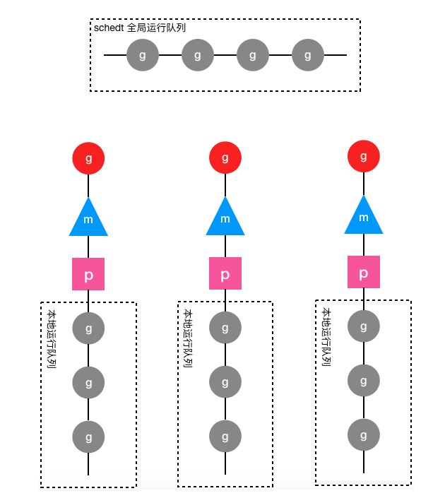
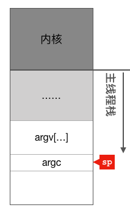
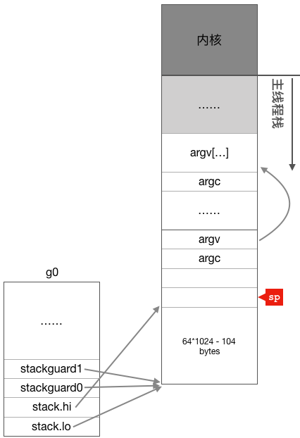

# Go 协程调度——基本原理与初始化


[TOC]


## 调度原理

### 协程的意义

goroutine是Go语言实现的用户态线程，主要用来解决操作系统线程太“重”的问题，所谓的太重，主要表现在以下两个方面：

- 创建和切换太重：操作系统线程的创建和切换都需要进入内核，而进入内核所消耗的性能代价比较高，开销较大；

- 内存使用太重：一方面，为了尽量避免极端情况下操作系统线程栈的溢出，内核在创建操作系统线程时默认会为其分配一个较大的栈内存（虚拟地址空间，内核并不会一开始就分配这么多的物理内存），然而在绝大多数情况下，系统线程远远用不了这么多内存，这导致了浪费；另一方面，栈内存空间一旦创建和初始化完成之后其大小就不能再有变化，这决定了在某些特殊场景下系统线程栈还是有溢出的风险。

相对的，用户态的goroutine则轻量得多：

- goroutine是用户态线程，其创建和切换都在用户代码中完成而无需进入操作系统内核，所以其开销要远远小于系统线程的创建和切换；
- goroutine启动时默认栈大小只有2k，这在多数情况下已经够用了，即使不够用，goroutine的栈也会自动扩大，同时，如果栈太大了过于浪费它还能自动收缩，这样既没有栈溢出的风险，也不会造成栈内存空间的大量浪费。

### 基本工作原理

goroutine建立在操作系统线程基础之上，它与操作系统线程之间实现了一个多对多(M:N)的两级线程模型。

这里的 M:N 是指M个goroutine运行在N个操作系统线程之上，内核负责对这N个操作系统线程进行调度，而这N个系统线程又负责对这M个goroutine进行调度和运行。

所谓的对goroutine的调度，是指程序代码按照一定的算法在适当的时候挑选出合适的goroutine并放到CPU上去运行的过程，这些负责对goroutine进行调度的程序代码我们称之为goroutine调度器。

用极度简化了的伪代码来描述goroutine调度器的工作流程大概是下面这个样子：

```
// 程序启动时的初始化代码
......
for i := 0; i < N; i++ { // 创建N个操作系统线程执行schedule函数
    create_os_thread(schedule) // 创建一个操作系统线程执行schedule函数
}

//schedule函数实现调度逻辑
func schedule() {
   for { //调度循环
         // 根据某种算法从M个goroutine中找出一个需要运行的goroutine
         g := find_a_runnable_goroutine_from_M_goroutines()
         run_g(g) // CPU运行该goroutine，直到需要调度其它goroutine才返回
         save_status_of_g(g) // 保存goroutine的状态，主要是寄存器的值
    }
}

```

这段伪代码表达的意思是，程序运行起来之后创建了N个由内核调度的操作系统线程（为了方便描述，我们称这些系统线程为工作线程）去执行shedule函数，而schedule函数在一个调度循环中反复从M个goroutine中挑选出一个需要运行的goroutine并跳转到该goroutine去运行，直到需要调度其它goroutine时才返回到schedule函数中通过save_status_of_g保存刚刚正在运行的goroutine的状态然后再次去寻找下一个goroutine。

### PMG 协程并发模型

Go语言中支撑整个scheduler实现的主要有4个重要结构，分别是M、G、P、Sched。

- Sched结构就是调度器，它维护有存储M和G的队列以及调度器的一些状态信息等。
- M结构是Machine，系统线程，它由操作系统管理的，goroutine就是跑在M之上的；M是一个很大的结构，里面维护小对象内存cache（mcache）、当前执行的goroutine、随机数发生器等等非常多的信息。
- P结构是Processor，处理器，它的主要用途就是用来执行goroutine的，它维护了一个goroutine队列，即runqueue。Processor是让我们从N:1调度到M:N调度的重要部分。
- G是goroutine实现的核心结构，它包含了栈，指令指针，以及其他对调度goroutine很重要的信息，例如其阻塞的channel。

>
>Processor 数量是在启动时被设置为环境变量GOMAXPROCS的值，或者通过运行时调用函数GOMAXPROCS()进行设置。Processor数量固定意味着任意时刻只有GOMAXPROCS个线程在运行go代码。
>

>
>M：Machine的简称，在linux平台上是用clone系统调用创建的，其与用linux pthread库创建出来的线程本质上是一样的，都是利用系统调用创建出来的OS线程实体。M的作用就是执行G中包装的并发任务。Go运行时系统中的调度器的主要职责就是将G公平合理的安排到多个M上去执行。
>

当正在运行的goroutine阻塞的时候，例如进行系统调用，会再创建一个系统线程（M1），当前的M线程放弃了它的Processor，P转到新的线程中去运行。这样就填补了这个进入系统调用的M的空缺，始终保证 有GOMAXPROCS个工作线程在干活了。

总结起来：

在 Go 进程启动之后，Go 会尝试建立若干个 M，也就是若干个物理线程，接着：

- 每个物理线程在建立之后，都要进入调度函数，一个M调度goroutine执行的过程是一个loop。
- M会从P的local queue弹出一个Runable状态的goroutine来执行，如果P的local queue为空，就会执行work stealing；如果实在找不到就会自动去睡眠。

我们通过 go func()来创建一个goroutine；

- 有两个存储goroutine的队列，一个是局部调度器P的local queue、一个是全局调度器数据模型schedt的global queue。
- 新创建的goroutine会先保存在local queue，如果local queue已经满了就会保存在全局的global queue；
- 创建 G 之后，发现有闲置的 P 就会尝试唤醒物理线程。

这个时候，G 的创建就结束了。

- M 从睡眠状态被唤醒之后，就要绑定一个 P。一个 M 必须持有一个P，M 与 P 是1：1的关系。绑定失败还是要回去睡觉。绑定成功了就会回到调度函数，继续尝试获取一个可运行的 G。
- 一切完美，直接运行 G 指定的代码。
- 当 G 执行了非阻塞调用或者网络调用之后，调度程序会将 G 保存上下文并切出 M，M 会运行下一个 runable 的 G
- 当 G 获得了想要的数据后，sysmon 线程会将 G 放入队列当中，等待着调度运行。
- 当 M 执行某一个 goroutine 时候如果发生了 syscall 或则其余阻塞操作。这种操作并不像非阻塞调用一样可以暂停 G，因为 M 物理线程大概率已经沉入内核，没有办法运行下一个 G，这个系统调用只能占用一个物理线程。但是这个时候 M 实际上可能只是等待内核的 IO 数据等等，并不会占用 CPU。 
- 这时候，sysmon 线程会检测到 M 已经阻塞，如果当前有一些 G 在执行，runtime 会把这个线程 M 从 P 中摘除(detach)，然后再创建一个新的操作系统的线程(如果有空闲的线程可用就复用空闲线程)，尝试让操作系统调度这个新的物理线程来占用这个 CPU，保障并发度；
- 当系统调用结束时候，这个 M 会尝试获取一个空闲的 P 执行。如果获取不到 P，那么这个线程 M 会 park 它自己(休眠)，加入到空闲线程中，然后这个 goroutine 会被放入 schedt 的global queue。
- 当 G 运行结束之后，M 再次回到调度程序，并尝试获取新的 G，无法获取那就接着去睡眠，等待着新的 G 来唤醒它。

简单的说，调度的本质是不断的监控各个线程的运行状况，如果发现某个线程已经阻塞了，那么就要唤醒一个已有的线程或者新建一个线程，尝试让操作系统调度这个物理线程跑满所有的 CPU。

### Go1.0 的调度

在 1.0 前的代码中，线程与M是直接对应的关系，这个解耦还是不够。

Go1.0中将M抽出来成为了一个结构体，startm函数是线 程的入口地址，而goroutine的入口地址是go表达式中的那个函数。总体上跟上面的结构差不多，进出系统调用的时候 goroutine会跟M一起进入到系统调用中，schedule中会匹配g和m，让空闲的m来运行g。如果检测到干活的数量少于 GOMAXPROCS并且没有空闲着的m，则会创建新的m来运行g。出系统调用的时候，如果已经有GOMAXPROCS个m在干 活了，则这个出系统调用的m会被挂起，它的g也会被挂到待运行的goroutine队列中。

在Go语言中m是machine的缩写，也就是机器的抽象。它被设计成了可以运行所有的G。比如说一个g开始在某个m上运行， 经过几次进出系统调用之后，可能运行它的m挂起了，其它的m会将它从队列中取出并继续运行。

每次调度都会涉及对g和m等队列的操作，这些全局的数据在多线程情况下使用就会涉及到大量的锁操作。在频繁的系统调用 中这将是一个很大的开销。为了减少系统调用开销，Go1.0在这里做了一些优化的。1.0版中，在它的Sched结构体中有一个 atomic字段，类型是一个volatile的无符32位整型。

具体地看:

1. 单个全局锁(Sched.Lock)用来保护所有的goroutine相关的操作(创建，完成，调度等)。
2. 不同的G在不同的M上并发运行时可能都需向系统申请资源（如堆内存），由于资源是全局的，将会由于资源竞争造成很多系统性能损耗，
3. 内存缓存MCache是每个M的。而当M阻塞后，相应的内存资源也被一起拿走了。

### Go1.1 的调度

Go1.1相对于1.0一个重要的改动就是重新调用了调度器。前面已经看到，老版本中的调度器实现是存在一些问题的。解决方 式是引入Processor的概念，并在Processors之上实现工作流窃取的调度器。

M代表OS线程。P代表Go代码执行时需要的资源。当M执行Go代码时，它需要关联一个P，当M为idle或者在系统调用中时， 它也需要P。有刚好GOMAXPROCS个P。所有的P被组织为一个数组，工作流窃取需要这个条件。GOMAXPROCS的改变涉 及到stop/start the world来resize数组P的大小。

gfree和grunnable从sched中移到P中。这样就解决了前面的单个全局锁保护用有goroutine的问题，由于goroutine现在被分到 每个P中，它们是P局部的goroutine，因此P只管去操作自己的goroutine就行了，不会与其它P上的goroutine冲突。全局的 grunnable队列也仍然是存在的，只有在P去访问全局grunnable队列时才涉及到加锁操作。mcache从M中移到P中。不过当前 还不彻底，在M中还是保留着mcache域的。

加入了P后，sched.atomic也从Sched结构体中去掉了。

当一个新的G创建或者现有的G变成runnable，它将一个runnable的goroutine推到当前的P。当P完成执行G，它将G从自己的 runnable goroutine中pop出去。如果链为空，P会随机从其它P中窃取一半的可运行的goroutine。
当M创建一个新G的时候，必须保证有另一个M来执行这个G。类似的，当一个M进入到系统调用时，必须保证有另一个M来 执行G的代码。

2层自旋:关联了P的处于idle状态的的M自旋寻找新的G;没有关联P的M自旋等待可用的P。最多有GOMAXPROCS个自旋 的M。只要有第二类M时第一类M就不会阻塞。

### 抢占式调度


Go在设计之初并没考虑将goroutine设计成抢占式的。用户负责让各个goroutine交互合作完成任务。一个goroutine只有在涉 及到加锁，读写通道或者主动让出CPU等操作时才会触发切换。

垃圾回收器是需要stop the world的。如果垃圾回收器想要运行了，那么它必须先通知其它的goroutine合作停下来，这会造成 较长时间的等待时间。考虑一种很极端的情况，所有的goroutine都停下来了，只有其中一个没有停，那么垃圾回收就会一直 等待着没有停的那一个。
抢占式调度可以解决这种问题，在抢占式情况下，如果一个goroutine运行时间过长，它就会被剥夺运行权。

引入抢占式调度，会对最初的设计产生比较大的影响，Go还只是引入了一些很初级的抢占，并没有像操作系统调度那么复 杂，没有对goroutine分时间片，设置优先级等。

只有长时间阻塞于系统调用，或者运行了较长时间才会被抢占。runtime会在后台有一个检测线程，它会检测这些情况，并通 知goroutine执行调度。

目前并没有直接在后台的检测线程中做处理调度器相关逻辑，只是相当于给goroutine加了一个“标记”，然后在它进入函数时 才会触发调度。这么做应该是出于对现有代码的修改最小的考虑。

#### sysmon

前面讲Go程序的初始化过程中有提到过，runtime开了一条后台线程，运行一个sysmon函数。这个函数会周期性地做epoll操 作，同时它还会检测每个P是否运行了较长时间。

如果检测到某个P状态处于Psyscall超过了一个sysmon的时间周期(20us)，并且还有其它可运行的任务，则切换P。

如果检测到某个P的状态为Prunning，并且它已经运行了超过10ms，则会将P的当前的G的stackguard设置为 StackPreempt。这个操作其实是相当于加上一个标记，通知这个G在合适时机进行调度。

#### morestack 的修改

前面说的，将stackguard设置为StackPreempt实际上是一个比较trick的代码。我们知道Go会在每个函数入口处比较当前的栈 寄存器值和stackguard值来决定是否触发morestack函数。

将stackguard设置为StackPreempt作用是进入函数时必定触发morestack，然后在morestack中再引发调度。

所以，到目前为止Go的抢占式调度还是很初级的，比如一个goroutine运行了很久，但是它并没有调用另一个函数，则它不会 被抢占。当然，一个运行很久却不调用函数的代码并不是多数情况。

## 基本数据结构

### 结构体G

系统线程对goroutine的调度与内核对系统线程的调度原理是一样的，实质都是通过保存和修改CPU寄存器的值来达到切换线程/goroutine的目的。

因此，为了实现对goroutine的调度，需要引入一个数据结构来保存CPU寄存器的值以及goroutine的其它一些状态信息，在Go语言调度器源代码中，这个数据结构是一个名叫g的结构体，它保存了goroutine的所有信息，该结构体的每一个实例对象都代表了一个goroutine，调度器代码可以通过g对象来对goroutine进行调度，当goroutine被调离CPU时，调度器代码负责把CPU寄存器的值保存在g对象的成员变量之中，当goroutine被调度起来运行时，调度器代码又负责把g对象的成员变量所保存的寄存器的值恢复到CPU的寄存器。


runtime在接到这样一个调用后，会先检查一下go函数及其参数的合法性，紧接着会试图从局部调度器P的自由G队列中(或者全局调度器的自由G队列)中获取一个可用的自由G。如果没有则新创建一个G。类似M和P，G在运行时系统中也有全局的G列表【runtime.allg】，那些新建的G会先放到这个全局的G列表中，其列表的作用也是集中放置了当前运行时系统中给所有的G的指针。在用自由G封装go的函数时，运行时系统都会对这个G重新做一次初始化。


```
// stack 描述的是 Go 的执行栈，下界和上界分别为 [lo, hi]
// 如果从传统内存布局的角度来讲，Go 的栈实际上是分配在 C 语言中的堆区的
// 所以才能比 ulimit -s 的 stack size 还要大(1GB)
type stack struct {
    lo uintptr  // 栈顶，指向内存低地址
    hi uintptr  // 栈底，指向内存高地址
}

// g 的运行现场
type gobuf struct {
    sp   uintptr    // sp 寄存器
    pc   uintptr    // pc 寄存器
    g    guintptr   // g 指针,记录当前这个gobuf对象属于哪个goroutine
    
    // 保存系统调用的返回值，因为从系统调用返回之后如果p被其它工作线程抢占，
    // 则这个goroutine会被放入全局运行队列被其它工作线程调度，其它线程需要知道系统调用的返回值。
    ret  sys.Uintreg 
}


type g struct {
    // 简单数据结构，lo 和 hi 成员描述了栈的下界和上界内存地址
    stack       stack
    // 在函数的栈增长 prologue 中用 sp 寄存器和 stackguard0 来做比较
    // 如果 sp 比 stackguard0 小(因为栈向低地址方向增长)，那么就触发栈拷贝和调度
    // 正常情况下 stackguard0 = stack.lo + StackGuard
    // 不过 stackguard0 在需要进行调度时，会被修改为 StackPreempt
    // 以触发抢占s
    stackguard0 uintptr
    // stackguard1 是在 C 栈增长 prologue 作对比的对象
    // 在 g0 和 gsignal 栈上，其值为 stack.lo+StackGuard
    // 在其它的栈上这个值是 ~0(按 0 取反)以触发 morestack 调用(并 crash)
    stackguard1 uintptr
    
    sched          gobuf          // goroutine 的现场，g的调度数据, 当g中断时会保存当前的pc和rsp等值到这里, 恢复运行时会使用这里的值

    m              *m             // 当前与 g 绑定的 m
    lockedm        *m             // g是否要求要回到这个M执行, 有的时候g中断了恢复会要求使用原来的M执行
    
    gopc           uintptr // 创建该 goroutine 的语句的指令地址
    startpc        uintptr // goroutine 函数的指令地址
    
    preempt        bool     // 抢占标记，这个为 true 时，stackguard0 是等于 stackpreempt 的
    
    waitsince      int64  // g 被阻塞之后的近似时间
    waitreason     string // if status==Gwaiting
    schedlink      guintptr
}

```

当 g 遇到阻塞，或需要等待的场景时，会被打包成 sudog 这样一个结构。一个 g 可能被打包为多个 sudog 分别挂在不同的等待队列上:

```
// sudog 代表在等待列表里的 g，比如向 channel 发送/接收内容时
// 之所以需要 sudog 是因为 g 和同步对象之间的关系是多对多的
// 一个 g 可能会在多个等待队列中，所以一个 g 可能被打包为多个 sudog
// 多个 g 也可以等待在同一个同步对象上
// 因此对于一个同步对象就会有很多 sudog 了
// sudog 是从一个特殊的池中进行分配的。用 acquireSudog 和 releaseSudog 来分配和释放 sudog
type sudog struct {

    // 之后的这些字段都是被该 g 所挂在的 channel 中的 hchan.lock 来保护的
    // shrinkstack depends on
    // this for sudogs involved in channel ops.
    g *g

    // isSelect 表示一个 g 是否正在参与 select 操作
    // 所以 g.selectDone 必须用 CAS 来操作，以胜出唤醒的竞争
    isSelect bool
    next     *sudog
    prev     *sudog
    elem     unsafe.Pointer // data element (may point to stack)

    // 下面这些字段则永远都不会被并发访问
    // 对于 channel 来说，waitlink 只会被 g 访问
    // 对于信号量来说，所有的字段，包括上面的那些字段都只在持有 semaRoot 锁时才可以访问
    acquiretime int64
    releasetime int64
    ticket      uint32
    parent      *sudog // semaRoot binary tree
    waitlink    *sudog // g.waiting list or semaRoot
    waittail    *sudog // semaRoot
    c           *hchan // channel
}

```

G的各种状态如下：

- Gidle：G被创建但还未完全被初始化。
- Grunnable：当前G为可运行的，正在等待被运行。
- Grunning：当前G正在被运行。
- Gsyscall：当前G正在被系统调用
- Gwaiting：当前G正在因某个原因而等待
- Gdead：当前G完成了运行

G退出系统调用的过程非常复杂：runtime先会尝试获取空闲局部调度器P并直接运行当前G，如果没有就会把当前G转成Grunnable状态并放置入全局调度器的global queue。

最后，已经是Gdead状态的G是可以被重新初始化并使用的(从自由G队列取出来重新初始化使用)。而对比进入Pdead状态的P等待的命运只有被销毁。处于Gdead的G会被放置到本地P或者调度器的自由G列表中。

### 结构体 M

Go调度器源代码中有一个用来代表工作线程的m结构体，每个工作线程都有唯一的一个m结构体的实例对象与之对应，m结构体对象除了记录着工作线程的诸如栈的起止位置、当前正在执行的goroutine以及是否空闲等等状态信息之外，还通过指针维持着与p结构体的实例对象之间的绑定关系。

这里也是截取结构体M中的部分域。和G类似，M中也有alllink域将所有的M放在allm链表中。lockedg是某些情况下，G锁定 在这个M中运行而不会切换到其它M中去。M中还有一个MCache，是当前M的内存的缓存。M也和G一样有一个常驻寄存器 变量，代表当前的M。同时存在多个M，表示同时存在多个物理线程。

结构体M中有两个G是需要关注一下的，一个是curg，代表结构体M当前绑定的结构体G。另一个是g0，是带有调度栈的 goroutine，这是一个比较特殊的goroutine。普通的goroutine的栈是在堆上分配的可增长的栈，而g0的栈是M对应的线程的 栈。所有调度相关的代码，会先切换到该goroutine的栈中再执行。

```
type m struct {
    g0      *g     // 用来执行调度指令的 goroutine
    curg          *g       // 当前运行的用户 goroutine
    lockedg       guintptr // 表示与当前M锁定的那个G。运行时系统会把 一个M 和一个G锁定，一旦锁定就只能双方相互作用，不接受第三者。
    
    p             puintptr // 指向当前与M关联的那个P。
    nextp         puintptr // 用于暂存于当前M有潜在关联的P。 （预联）当M重新启动时，即用预联的这个P做关联
  
    mcache        *mcache // 本地缓存，实际上是 P，只是在 M 多加一份
    
    alllink       *m // 连接到所有的m链表的一个指针。
    freelink      *m      // on sched.freem
    
    spinning      bool // m 失业了，正在积极寻找工作~表示当前M是否正在寻找G。
    blocked       bool // m 正阻塞在 note 上
    park          note // 没有goroutine需要运行时，工作线程睡眠在这个park成员上，，其它线程通过这个park唤醒该工作线程
   
    // 通过TLS实现m结构体对象与工作线程之间的绑定
    tls           [6]uintptr   // thread-local storage (for x86 extern register)
    mstartfn      func()
}

```

M也没有专门字段来维护状态，简单来说有一下几种状态：

- 自旋中(spinning): M正在从运行队列获取G, 这时候M会拥有一个P；
- 执行go代码中: M正在执行go代码, 这时候M会拥有一个P；
- 执行原生代码中: M正在执行原生代码或者阻塞的syscall, 这时M并不拥有P；
- 休眠中: M发现无待运行的G时或者进行 STW GC 的时候会进入休眠，并添加到空闲 M 链表中, 这时M并不拥有P。

M本身是无状态的。M是否是空闲态仅以它是否存在于调度器的空闲M列表 【runtime.sched.midle】 中为依据。

runtime管辖的M会在GC任务执行的时候被停止，这时候系统会对M的属性做某些必要的重置并把M放置入全局调度器的空闲M列表。具体的调用逻辑可以查看上一篇 GC 文章。

单个Go程序所使用的M的最大数量是可以被设置的。在我们使用命令运行Go程序时候，有一个引导程序先会被启动的。在这个引导程序中会为Go程序的运行建立必要的环境。引导程序对M的数量进行初始化设置，默认最大值是10000

### 结构体P

P是一个抽象的概念，并不代表一个具体的实体，抽象地表示M运行G所需要的资源。P并不代表CPU核心数，而是表示执行go代码的并发度。有一点需要注意的是，执行原生代码的时候并不受P数量的限制。同一时间只有一个线程(M)可以拥有P， P中的数据都是锁自由(lock free)的, 读写这些数据的效率会非常的高。

因为全局运行队列是每个工作线程都可以读写的，因此访问它需要加锁，然而在一个繁忙的系统中，加锁会导致严重的性能问题。于是，调度器又为每个工作线程引入了一个私有的局部goroutine运行队列，工作线程优先使用自己的局部运行队列，只有必要时才会去访问全局运行队列，这大大减少了锁冲突，提高了工作线程的并发性。在Go调度器源代码中，局部运行队列被包含在p结构体的实例对象之中，每一个运行着go代码的工作线程都会与一个p结构体的实例对象关联在一起。

MCache被移到了P中，但是在结构体M中也还保留着。在P中有一个 Grunnable的goroutine队列，这是一个P的局部队列。当P执行Go代码时，它会优先从自己的这个局部队列中取，这时可以不 用加锁，提高了并发度。如果发现这个队列空了，则去其它P的队列中拿一半过来，这样实现工作流窃取的调度。这种情况 下是需要给调用器加锁的。

```
type p struct {
    lock mutex
    
    m           muintptr   // 和相关联的 m 的反向指针，如果 p 是 idle 的话，那这个指针是 nil
    
    // runnable 状态的 goroutine。访问时是不加锁的
    runqhead uint32
    runqtail uint32
    runq     [256]guintptr
    
    // runnext 非空时，代表的是一个 runnable 状态的 G，
    // 这个 G 是被 当前 G 修改为 ready 状态的，
    // 并且相比在 runq 中的 G 有更高的优先级
    // 如果当前 G 的还有剩余的可用时间，那么就应该运行这个 G
    // 运行之后，该 G 会继承当前 G 的剩余时间
    runnext guintptr
    
    // G 结构体可复用的对象池
	gFree struct {
		gList
		n int32
	}
    
    mcache      *mcache

    status      uint32 // one of pidle/prunning/...
    link        puintptr // P 的链表，链接这下一个 P
    
    schedtick   uint32     // 每次调用 schedule 时会加一
    syscalltick uint32     // 每次系统调用时加一
    sysmontick  sysmontick // 上次 sysmon 观察到的 tick 时间

    ...
}
```

和M不同，P是有状态机的（五种）：

- Pidel：当前P未和任何M关联
- Prunning：当前P已经和某个M关联，M在执行某个G
- Psyscall：当前P中的被运行的那个G正在进行系统调用
- Pgcstop：runtime正在进行GC（runtime会在gc时试图把全局P列表中的P都处于此种状态）
- Pdead：当前P已经不再被使用（在调用runtime.GOMAXPROCS减少P的数量时，多余的P就处于此状态）

在对P初始化的时候就是Pgcstop的状态，但是这个状态保持时间很短，在初始化并填充P中的G队列之后，runtime会将其状态置为Pidle并放入调度器的空闲P列表【runtime.schedt.pidle】中

在runtime进行GC的时候，P都会被指定成Pgcstop。在GC结束后状态不会回复到GC前的状态，而是都统一直接转到了Pidle 【这意味着，他们都需要被重新调度】。

每个P中都有一个可运行G队列及自由G队列。自由G队列包含了很多已经完成的G，随着被运行完成的G的积攒到一定程度后，runtime会把其中的部分G转移到全局调度器的自由G队列 【runtime.sched.gfree】中。

当我们每次用 go关键字启用一个G的时候，首先都是尽可能复用已经执行完的G。具体过程如下：运行时系统都会先从P的自由G队列获取一个G来封装我们提供的函数 (go 关键字后面的函数) ，如果发现P中的自由G过少时，会从调度器的自由G队列中移一些G过来，只有连调度器的自由G列表都弹尽粮绝的时候，才会去创建新的G。


### Sched

要实现对goroutine的调度，仅仅有g结构体对象是不够的，至少还需要一个存放所有（可运行）goroutine的容器，便于工作线程寻找需要被调度起来运行的goroutine，于是Go调度器又引入了schedt结构体，一方面用来保存调度器自身的状态信息，另一方面它还拥有一个用来保存goroutine的运行队列。因为每个Go程序只有一个调度器，所以在每个Go程序中schedt结构体只有一个实例对象，该实例对象在源代码中被定义成了一个共享的全局变量，这样每个工作线程都可以访问它以及它所拥有的goroutine运行队列，我们称这个运行队列为全局运行队列。


```
type schedt struct {
    // 当修改 nmidle，nmidlelocked，nmsys，nmfreed 这些数值时
    // 需要记得调用 checkdead

    midle        muintptr // idle m's waiting for work
    nmidle       int32    // 当前等待工作的空闲 m 计数
    nmidlelocked int32    // 当前等待工作的被 lock 的 m 计数
    mnext        int64    // 当前预缴创建的 m 数，并且该值会作为下一个创建的 m 的 ID
    maxmcount    int32    // 允许创建的最大的 m 数量

    ngsys uint32 // number of system goroutines; updated atomically

    pidle      puintptr // 空闲 p's
    npidle     uint32
    nmspinning uint32 // See "Worker thread parking/unparking" comment in proc.go.

    // 全局的可运行 g 队列
    runqhead guintptr
    runqtail guintptr
    runqsize int32

    // 被设置了 m.exited 标记之后的 m，这些 m 正在 freem 这个链表上等待被 free
    // 链表用 m.freelink 字段进行链接
    freem *m
}

```

### 重要的全局变量

```
allgs     []*g     // 保存所有的g
allm       *m    // 所有的m构成的一个链表，包括下面的m0
allp       []*p    // 保存所有的p，len(allp) == gomaxprocs

ncpu             int32   // 系统中cpu核的数量，程序启动时由runtime代码初始化
gomaxprocs int32   // p的最大值，默认等于ncpu，但可以通过GOMAXPROCS修改

sched      schedt     // 调度器结构体对象，记录了调度器的工作状态

m0  m       // 代表进程的主线程
g0   g        // m0的g0，也就是m0.g0 = &g0

```

### g/p/m 的关系

Go 实现了所谓的 M:N 模型，执行用户代码的 goroutine 可以认为都是对等的 goroutine。不考虑 g0 和 gsignal 的话，我们可以简单地认为调度就是将 m 绑定到 p，然后在 m 中不断循环执行调度函数(runtime.schedule)，寻找可用的 g 来执行。



## 主进程 m0 与调度初始化

### 程序入口

任何一个由编译型语言（不管是C，C++，go还是汇编语言）所编写的程序在被操作系统加载起来运行时都会顺序经过如下几个阶段：

- 从磁盘上把可执行程序读入内存；
- 创建进程和主线程；
- 为主线程分配栈空间；
- 把由用户在命令行输入的参数拷贝到主线程的栈；
- 把主线程放入操作系统的运行队列等待被调度执起来运行

在主线程第一次被调度起来执行第一条指令之前，主线程的函数栈如下图所示：



在Linux命令行用 go build 编译hello.go，得到可执行程序hello，然后使用gdb调试，在gdb中我们首先使用 info files 命令找到程序入口（Entry point）地址为0x452270，然后用 b *0x452270 在0x452270地址处下个断点，gdb告诉我们这个入口对应的源代码为 runtime/rt0_linux_amd64.s 文件的第8行。

```
bobo@ubuntu:~/study/go$ go build hello.go 
bobo@ubuntu:~/study/go$ gdb hello
GNU gdb (GDB) 8.0.1
(gdb) info files
Symbols from "/home/bobo/study/go/main".
Local exec file:
`/home/bobo/study/go/main', file type elf64-x86-64.
Entry point: 0x452270
0x0000000000401000 - 0x0000000000486aac is .text
0x0000000000487000 - 0x00000000004d1a73 is .rodata
0x00000000004d1c20 - 0x00000000004d27f0 is .typelink
0x00000000004d27f0 - 0x00000000004d2838 is .itablink
0x00000000004d2838 - 0x00000000004d2838 is .gosymtab
0x00000000004d2840 - 0x00000000005426d9 is .gopclntab
0x0000000000543000 - 0x000000000054fa9c is .noptrdata
0x000000000054faa0 - 0x0000000000556790 is .data
0x00000000005567a0 - 0x0000000000571ef0 is .bss
0x0000000000571f00 - 0x0000000000574658 is .noptrbss
0x0000000000400f9c - 0x0000000000401000 is .note.go.buildid
(gdb) b *0x452270
Breakpoint 1 at 0x452270: file /usr/local/go/src/runtime/rt0_linux_amd64.s, line 8.

```

找到 runtime/rt0_linx_amd64.s 文件，该文件是用go汇编语言编写而成的源代码文件:

```
runtime/rt0_linx_amd64.s : 8

TEXT _rt0_amd64_linux(SB),NOSPLIT,$-8
    JMP _rt0_amd64(SB)

```

上面第一行代码定义了_rt0_amd64_linux这个符号，并不是真正的CPU指令，第二行的JMP指令才是主线程的第一条指令，这条指令简单的跳转到（相当于go语言或c中的goto）_rt0_amd64 这个符号处继续执行，_rt0_amd64 这个符号的定义在runtime/asm_amd64.s 文件中：

```
runtime/asm_amd64.s : 14

TEXT _rt0_amd64(SB),NOSPLIT,$-8
    MOVQ 0(SP), DI// argc 
    LEAQ 8(SP), SI // argv
    JMP runtime·rt0_go(SB)

```

rt0_go函数完成了go程序启动时的所有初始化工作，因此这个函数比较长，也比较繁杂，但这里我们只关注与调度器相关的一些初始化，基本步骤是：

- 调整 SP 寄存器的值，同时调整 argc、argv 参数的位置
- 初始化 g0 栈空间
- 初始化 m0 的 TLS 地址
- 绑定 m0 与 g0
- 初始化 m0
- 初始化 allp

### 调整 SP 位置

下面我们分段来看：


```
TEXT runtime·rt0_go(SB),NOSPLIT,$0
    // copy arguments forward on an even stack
    MOVQ DI, AX// AX = argc
    MOVQ SI, BX// BX = argv
    SUBQ $(4*8+7), SP// 2args 2auto
    ANDQ $~15, SP     //调整栈顶寄存器使其按16字节对齐
    MOVQ AX, 16(SP) //argc放在SP + 16字节处
    MOVQ BX, 24(SP) //argv放在SP + 24字节处

```

面的第4条指令用于调整栈顶寄存器的值使其按16字节对齐，也就是让栈顶寄存器SP指向的内存的地址为16的倍数，之所以要按16字节对齐，是因为CPU有一组SSE指令(与并行算法 SIMD 相关)，这些指令中出现的内存地址必须是16的倍数，最后两条指令把argc和argv搬到新的位置。

### 初始化 g0 栈空间

继续看后面的代码，下面开始初始化全局变量g0，前面我们说过，g0的主要作用是提供一个栈供runtime代码执行，因此这里主要对g0的几个与栈有关的成员进行了初始化，从这里可以看出g0的栈大约有64K，地址范围为 SP - 64*1024 + 104 ～ SP。

```
//下面这段代码从系统线程的栈空分出一部分当作g0的栈，然后初始化g0的栈信息和stackgard
MOVQ  $runtime·g0(SB), DI        //g0的地址放入DI寄存器
LEAQ  (-64*1024+104)(SP), BX     //BX = SP - 64*1024 + 104
MOVQ  BX, g_stackguard0(DI)      //g0.stackguard0 = SP - 64*1024 + 104
MOVQ  BX, g_stackguard1(DI)      //g0.stackguard1 = SP - 64*1024 + 104
MOVQ  BX, (g_stack+stack_lo)(DI) //g0.stack.lo = SP - 64*1024 + 104
MOVQ  SP, (g_stack+stack_hi)(DI) //g0.stack.hi = SP

```

运行完上面这几行指令后g0与栈之间的关系如下图所示：



### 初始化 m0 TLS 地址

所谓的初始化 m0，最关键的就是将 m0.tls[1] 的地址赋给 FS 寄存器，FS 寄存器所指向的地址会被认为是 TLS 数据，操作系统在调度物理线程的时候会自动保存恢复 FS 寄存器的值。

这段代码首先调用 settls 函数初始化主线程的线程本地存储(TLS)，目的是把 m0 与主线程关联在一起。设置了线程本地存储之后接下来的几条指令在于验证TLS功能是否正常，如果不正常则直接abort退出程序。

```
//下面开始初始化tls(thread local storage,线程本地存储)
LEAQ runtime·m0+m_tls(SB), DI //DI = &m0.tls，取m0的tls成员的地址到DI寄存器
CALL runtime·settls(SB)       //调用settls设置线程本地存储，settls函数的参数在DI寄存器中

//验证settls是否可以正常工作，如果有问题则abort退出程序
get_tls(BX)                   //获取fs段基地址并放入BX寄存器，其实就是m0.tls[1]的地址，get_tls的代码由编译器生成
MOVQ $0x123, g(BX)             //把整型常量0x123拷贝到fs段基地址偏移-8的内存位置，也就是m0.tls[0] = 0x123
MOVQ runtime·m0+m_tls(SB), AX  //AX = m0.tls[0]
CMPQ AX, $0x123                //检查m0.tls[0]的值是否是通过线程本地存储存入的0x123来验证tls功能是否正常
JEQ 2(PC)
CALL runtime·abort(SB)         //如果线程本地存储不能正常工作，退出程序

```

下面我们详细来详细看一下 settls 函数是如何实现线程私有全局变量的。

```
// set tls base to DI
TEXT runtime·settls(SB),NOSPLIT,$32
//......
//DI寄存器中存放的是m.tls[0]的地址，m的tls成员是一个数组，读者如果忘记了可以回头看一下m结构体的定义
//下面这一句代码把DI寄存器中的地址加8，为什么要+8呢，主要跟ELF可执行文件格式中的TLS实现的机制有关
//执行下面这句指令之后DI寄存器中的存放的就是m.tls[1]的地址了
ADDQ $8, DI                // ELF wants to use -8(FS)

//下面通过arch_prctl系统调用设置FS段基址
MOVQ DI, SI               //SI 存放arch_prctl系统调用的第二个参数，FS 寄存器的值
MOVQ $0x1002, DI          // arch_prctl的第一个参数：ARCH_SET_FS，说明需要设置 FS 寄存器的值。
MOVQ$ SYS_arch_prctl, AX  //系统调用编号
SYSCALL

CMPQ AX, $0xfffffffffffff001
JLS2(PC)
MOVL$0xf1, 0xf1           // crash //系统调用失败直接crash
RET

```

从代码可以看到，这里通过arch_prctl系统调用把m0.tls[1]的地址设置成了fs段的段基址。CPU中有个叫fs的段寄存器与之对应，而每个线程都有自己的一组CPU寄存器值，操作系统在把线程调离CPU运行时会帮我们把所有寄存器中的值保存在内存中，调度线程起来运行时又会从内存中把这些寄存器的值恢复到CPU，这样，在此之后，工作线程代码就可以通过fs寄存器来找到m.tls，可以参考上面初始化tls之后对tls功能验证的代码来理解这一过程。

### 绑定 m0 与 g0

代码首先把 g0 的地址放入主线程的线程本地存储中，然后通过 `m0.g0 = &g0;g0.m = &m0` 把 m0 和 g0 绑定在一起.

```
get_tls(BX)               //获取fs段基址到BX寄存器
LEAQ runtime·g0(SB), CX   //CX = g0的地址
MOVQ CX, g(BX)            //把g0的地址保存在线程本地存储里面，也就是m0.tls[0]=&g0
LEAQ runtime·m0(SB), AX   //AX = m0的地址

//把m0和g0关联起来m0->g0 = g0，g0->m = m0
MOVQCX, m_g0(AX)          //m0.g0 = g0
MOVQAX, g_m(CX)           //g0.m = m0

```

这样，之后在主线程中通过get_tls可以获取到g0，通过g0的m成员又可以找到m0，于是这里就实现了m0和g0与主线程之间的关联。

从这里还可以看到，保存在主线程本地存储中的值是g0的地址，也就是说工作线程的私有全局变量其实是一个指向g的指针而不是指向m的指针，目前这个指针指向g0，表示代码正运行在g0栈。

### 初始化 m0

下面代码开始处理命令行参数，这部分我们不关心，所以跳过。命令行参数处理完成后调用osinit函数获取CPU核的数量并保存在全局变量ncpu之中，调度器初始化时需要知道当前系统有多少个CPU核。

```
//准备调用args函数，前面四条指令把参数放在栈上
MOVL 16(SP), AX        // AX = argc
MOVL AX, 0(SP)         // argc放在栈顶
MOVQ 24(SP), AX        // AX = argv
MOVQ AX, 8(SP)         // argv放在SP + 8的位置
CALL runtime·args(SB)  //处理操作系统传递过来的参数和env，不需要关心

//对于linx来说，osinit唯一功能就是获取CPU的核数并放在global变量ncpu中，
//调度器初始化时需要知道当前系统有多少CPU核
CALL runtime·osinit(SB)      //执行的结果是全局变量 ncpu = CPU核数
CALL runtime·schedinit(SB)   //调度系统初始化

```

接下来继续看调度器是如何初始化的。

```
func schedinit() {
    _g_ := getg() // _g_ = &g0

    ......

    //设置最多启动10000个操作系统线程，也是最多10000个M
    sched.maxmcount = 10000

    ......
   
    mcommoninit(_g_.m) //初始化m0，因为从前面的代码我们知道g0->m = &m0

    ......

    sched.lastpoll = uint64(nanotime())
    procs := ncpu  //系统中有多少核，就创建和初始化多少个p结构体对象
    if n, ok := atoi32(gogetenv("GOMAXPROCS")); ok && n > 0 {
        procs = n //如果环境变量指定了GOMAXPROCS，则创建指定数量的p
    }
    if procresize(procs) != nil {//创建和初始化全局变量allp
        throw("unknown runnable goroutine during bootstrap")
    }

    ......
}

```

schedinit 主要功能就是调用 mcommoninit 函数对 m0(g0.m) 进行必要的初始化，对m0初始化完成之后调用 procresize 初始化系统需要用到的 p 结构体对象。

```
func mcommoninit(mp *m) {
    _g_ := getg() 
     
    ...
     
    //创建用于信号处理的gsignal，只是简单的从堆上分配一个g结构体对象,然后把栈设置好就返回了
    mpreinit(mp)
     
    //把m挂入全局链表allm之中
    mp.alllink = allm 
    atomicstorep(unsafe.Pointer(&allm), unsafe.Pointer(mp))
    
    ...
}

func mpreinit(mp *m) {
	mp.gsignal = malg(32 * 1024) // Linux wants >= 2K
	mp.gsignal.m = mp
}
```

接下来就是最关键的 procresize 函数了。

### 初始化 allp

总结一下这个函数的主要流程：

- 使用 make([]p, nprocs) 初始化全局变量 allp，即 allp = make([]*p, nprocs)
- 循环创建并初始化 nprocs 个 p 结构体对象并依次保存在 allp 切片之中
- 把 m0 和 allp[0] 绑定在一起，即 m0.p = allp[0], allp[0].m = m0
- 把除了 allp[0] 之外的所有p放入到全局变量 sched 的 pidle 空闲队列之中

```
func procresize(nprocs int32) *p {
     old := gomaxprocs //系统初始化时 gomaxprocs = 0
     
     ...
    
     // Grow allp if necessary.
    if nprocs > int32(len(allp)) { //初始化时 len(allp) == 0
        lock(&allpLock)
        if nprocs <= int32(cap(allp)) {
            allp = allp[:nprocs]
        } else { //初始化时进入此分支，创建allp 切片
            nallp := make([]*p, nprocs)

            copy(nallp, allp[:cap(allp)])
            allp = nallp
        }
        unlock(&allpLock)
    }
    
    for i := old; i < nprocs; i++ {
		pp := allp[i]
		if pp == nil {
			pp = new(p)
		}
		pp.init(i) // 初始化 例如 pp.status = _Pgcstop
		atomicstorep(unsafe.Pointer(&allp[i]), unsafe.Pointer(pp))
	}
	
	...
	
	 _g_ := getg()  // _g_ = g0
    if _g_.m.p != 0 && _g_.m.p.ptr().id < nprocs {//初始化时m0->p还未初始化，所以不会执行这个分支
       
        _g_.m.p.ptr().status = _Prunning
        _g_.m.p.ptr().mcache.prepareForSweep()
    } else {//初始化时执行这个分支
        // release the current P and acquire allp[0]
        if _g_.m.p != 0 {//初始化时这里不执行
            _g_.m.p.ptr().m = 0
        }
        _g_.m.p = 0
        _g_.m.mcache = nil
        p := allp[0]
        p.m = 0
        p.status = _Pidle
        acquirep(p) //把p和m0关联起来，其实是这两个strct的成员相互赋值
    }
	
	
	...
	var runnablePs *p
	for i := nprocs - 1; i >= 0; i-- {
		p := allp[i]
		if _g_.m.p.ptr() == p {
			continue
		}
		p.status = _Pidle
		// 初始化时，所有 p 的 runq 都是空的，所以一定会走这个 if
		if runqempty(p) {
		    // 将 p 放到全局调度器的 pidle 队列中
			pidleput(p)
		} else {
			...
		}
	}
	...

}

func pidleput(_p_ *p) {
	if !runqempty(_p_) {
		throw("pidleput: P has non-empty run queue")
	}
	
	// 简单链表操作，sched.pidle 存储着上一个 P，link 指向它就是指向下一个 P
	_p_.link = sched.pidle
	sched.pidle.set(_p_)
	atomic.Xadd(&sched.npidle, 1) // TODO: fast atomic
}
```

## 通用函数解析

### runtime·get_tls

通过上面的初始化过程，现在 FS 寄存器里面就是 m0.tls 的地址了，而在 Golang 的汇编代码中，FS 寄存器实际上是 TLS 虚拟寄存器。因此 get_tls 就是简单的讲 TLS 寄存器的地址赋给参数。g(r) 就是获取在 TLS 上存储的 G 结构体的方法。 

```
get_tls(CX) 
MOVQ g(CX), BX; BX存器里面现在放的是当前g结构体对象的地址

#ifdef GOARCH_amd64
#define	get_tls(r)	MOVQ TLS, r
#define	g(r)	0(r)(TLS*1)
#endif

```

### runtime·systemstack

我们知道，每个 M 都有一个 g0，这个 g0 的栈空间使用的是 M 物理线程的栈空间，而不是其他 g 那样其实是 Golang 的堆空间分配的。这个 g0 没有任何的上下文信息，也就是 shed 属性都是置空的，它唯一的作用就是利用它的栈空间来执行一些函数。

systemstack 会切换当前的 g 到 g0, 并且使用 g0 的栈空间, 然后调用传入的函数, 再切换回原来的g和原来的栈空间。
切换到 g0 后会假装返回地址是 mstart, 这样 traceback 的时候可以在 mstart 停止。

```
TEXT runtime·systemstack_switch(SB), NOSPLIT, $0-0
	RET
	
TEXT runtime·systemstack(SB), NOSPLIT, $0-8
	MOVQ	fn+0(FP), DI	// DI = fn
	get_tls(CX)
	MOVQ	g(CX), AX	// AX = g
	MOVQ	g_m(AX), BX	// BX = m
	
	MOVQ	m_g0(BX), DX	// DX = g0
	
	// 切换栈，保存上下文
	// 进入 systemstack 的 G PC 值都是这个 systemstack_switch，用于 traceback
	MOVQ	$runtime·systemstack_switch(SB), SI
	MOVQ	SI, (g_sched+gobuf_pc)(AX)
	MOVQ	SP, (g_sched+gobuf_sp)(AX)
	MOVQ	AX, (g_sched+gobuf_g)(AX)
	MOVQ	BP, (g_sched+gobuf_bp)(AX)

	// 切换到 g0 栈
	MOVQ	DX, g(CX)
	MOVQ	(g_sched+gobuf_sp)(DX), BX
	// 将 mstart 放到 SP 栈顶，用于 traceback
	SUBQ	$8, BX
	MOVQ	$runtime·mstart(SB), DX
	MOVQ	DX, 0(BX)
	MOVQ	BX, SP

	// 在 g0 调用函数
	MOVQ	DI, DX
	MOVQ	0(DI), DI
	CALL	DI

	// 切换回 g
	get_tls(CX)
	MOVQ	g(CX), AX
	MOVQ	g_m(AX), BX
	MOVQ	m_curg(BX), AX
	MOVQ	AX, g(CX)
	MOVQ	(g_sched+gobuf_sp)(AX), SP
	MOVQ	$0, (g_sched+gobuf_sp)(AX)
	RET

```

### runtime·mcall

mcall 与上面的 runtime·systemstack 非常相似，都是去 g0 栈空间执行新的函数。但是我们需要注意，runtime·systemstack 执行之后还会回来，其实就是执行个函数，当前 g 是不会被调度走的。

但是我们这里的 mcall 不一样，这个函数的基本用途就是调度，当前 g 在 mcall 保存了上下文之后，基本可以确定不会再回来了，因此这个 mcall 要特别小心的保存当前的 PC 与 SP 寄存器的值。

这个函数的第四句汇编有点难懂,得明白整个 golang 的函数调用规则才能明白。我们先用下面这个简单的例子：

```
func start(a, b, c int64) {
    ......
}

func main() {
    ...
    
    start(1, 2, 3)
    
    int a = 1
    
    ...
}

```

golang 中函数调用的布局：

- 当前函数的局部变量
- 被调用函数的参数 3 —— FP 寄存器地址
- 被调用函数的参数 2
- 被调用函数的参数 1
- 调用函数下一个指令的地址，也就是 `int a = 1` 指令地址 —— SP 位置
- 被调用函数的局部变量
    
>golang的函数栈的大小，不包含传入的参数和返回值，这两个部分由调用者管理，mcall 例子中，fn 是传入参数，这个 fn 是放在【调用mcall的函数】的函数栈里的。mcall除了一个传入参数fn之外，没有其他变量了，所以mcall的栈大小就是0。
    
>一个栈大小为0的函数，栈顶，也就是SP指向的位置，刚好就是存的调用mcall的函数的下一条指令，也就是这里所谓的 caller 的 PC。
    
>这个PC值为什么会出现在这里，那就是因为，这是 CALL 指令自动做的事情，也是 golang 编译器做的事情，调用某函数时，先把本函数的下一掉指令 push 进栈。
    
话说回来了，既然mcall不需要额外的栈大小了，前面说了，栈大小是0，所以，自然而然的，SP，存的东西就是调用者 caller 本函数的PC，也就是 mcall 的下一个指令。好，拿到了caller‘s PC，把他存到 gobuf_pc 里。

所以很有趣的是，SP 实际上是被调用函数运行完毕的返回地址，而 FP 这个参数起始地址才是 Goroutine 的栈顶地址。

处理如下:

- 设置g.sched.pc等于当前的返回地址
- 设置g.sched.sp等于寄存器rsp的值
- 设置g.sched.g等于当前的g
- 设置g.sched.bp等于寄存器rbp的值
- 切换TLS中当前的g等于m.g0
- 设置寄存器rsp等于g0.sched.sp, 使用g0的栈空间
- 设置第一个参数为原来的g
- 设置rdx寄存器为指向函数地址的指针(上下文)

调用指定的函数, 不会返回。

回到g0的栈空间这个步骤非常重要, 因为这个时候 g 已经中断, 继续使用g的栈空间且其他M唤醒了这个g将会产生灾难性的后果。
G在中断或者结束后都会通过mcall回到g0的栈空间继续调度, 从goexit调用的mcall的保存状态其实是多余的, 因为G已经结束了。
    
```
TEXT runtime·mcall(SB), NOSPLIT, $0-8
    
    get_tls(CX)           // 获取 TLS 的地址，存储到 CX 寄存器上
    MOVQ    g(CX), AX    // 将 TLS 上的 G 对象地址赋给 AX
    MOVQ    0(SP), BX    // 当前 G 的 SP 栈顶地址赋给 BX
    MOVQ    BX, (g_sched+gobuf_pc)(AX)  // 见上文解释
    LEAQ    fn+0(FP), BX    // FP 是调用函数第一个参数地址，由于 plan9 是由调用者来保存参数地址的，所以这个地址是栈顶地址
    MOVQ    BX, (g_sched+gobuf_sp)(AX) // 保存 SP 地址
    MOVQ    AX, (g_sched+gobuf_g)(AX) 
    MOVQ    BP, (g_sched+gobuf_bp)(AX)
    
    // switch to m->g0 & its stack, call fn
	MOVQ	g(CX), BX          // 获取当前 G 对象，赋给 BX
	MOVQ	g_m(BX), BX        // 获取 M 对象
	MOVQ	m_g0(BX), SI      // 获取 M 的 g0 对象地址

	MOVQ	SI, g(CX)	// g = m->g0 // 替换 TLS 的 G 对象地址为 g0 地址
	
	MOVQ    (g_sched+gobuf_sp)(SI), SP  // sp = m->g0->sched.sp // 将g0的SP值，拿出来，交给寄存器SP，看见没，开始切换了，或者说，已经切完了，下面就是调用 fn (g)
    PUSHQ   AX // AX 是什么，存的就是刚才的g，不是现在的g0，将g放到栈上。这一步就是普通的，我要调用fn函数了，我要把参数g，先放到栈上。
    MOVQ    DI, DX // 这一步把fn存到DX不知道要干嘛，可能后续调用fn的时候，会用到？？不知道，等再接着看。
    MOVQ    0(DI), DI // 这一步和下一步，就是调用 fn
    CALL    DI           // 调用fn
    POPQ    AX
    MOVQ    $runtime·badmcall2(SB), AX
    JMP AX
    RET
    
```


### runtime.gogo

与 mcall 相反，gogo 是专门从 g0 切换到 g 栈空间来执行代码的函数。

runtime.gogo 是汇编完成的，功能就是执行 `go func()` 的这个 func()，由于当前已经是 g0 的栈空间，因此调度的时候，无需保存 g0 的上下文信息，可以直接将 g 对象的 gobuf 里的内容搬到寄存器里即可。然后从 gobuf.pc 寄存器存储的指令位置开始继续向后执行。

- 设置TLS中的g为g.sched.g, 也就是g自身
- 设置rsp寄存器为g.sched.rsp
- 设置rax寄存器为g.sched.ret
- 设置rdx寄存器为g.sched.ctxt (上下文)
- 设置rbp寄存器为g.sched.rbp
- 清空sched中保存的信息
- 跳转到g.sched.pc
- 因为前面创建goroutine的newproc1函数把返回地址设为了goexit, 函数运行完毕返回时将会调用goexit函数。

值得我们注意的是，我们在 gogo 函数中切换到 g 栈空间从来不需要保存 g0 的 sp，但是 mcall 函数中每次都是从 gobuf 中获取 sp 赋值给 SP 寄存器，原因就是调度循环中都是一去不复返的，所以调度循环中 schedule 函数都会重新从 g0 的 sp 作为栈起点，不断的重复利用相同的 g0 栈空间地址。

g0 的 sp 栈地址是 M 物理线程启动初始化时由 mstart1 执行 save 函数保存的，这个值自从保存后就不会再发生变化。

```
TEXT runtime·gogo(SB), NOSPLIT, $16-8
    MOVQ    buf+0(FP), BX        // gobuf
    MOVQ    gobuf_g(BX), DX
    MOVQ    0(DX), CX            // 这行代码没有实质作用，检查gp.sched.g是否是nil，如果是nil进程会crash死掉
    
    #把要运行的g的指针放入线程本地存储，这样后面的代码就可以通过线程本地存储
    #获取到当前正在执行的goroutine的g结构体对象，从而找到与之关联的m和p
    get_tls(CX)
    MOVQ    DX, g(CX)
    
    MOVQ    gobuf_sp(BX), SP     // 把CPU的SP寄存器设置为sched.sp，完成了栈的切换
    MOVQ    gobuf_ret(BX), AX
    MOVQ    gobuf_ctxt(BX), DX
    MOVQ    gobuf_bp(BX), BP
    
    #清空sched的值，因为我们已把相关值放入CPU对应的寄存器了，不再需要，这样做可以少gc的工作量
    MOVQ    $0, gobuf_sp(BX)    // clear to help garbage collector
    MOVQ    $0, gobuf_ret(BX)
    MOVQ    $0, gobuf_ctxt(BX)
    MOVQ    $0, gobuf_bp(BX)
    
    
    MOVQ    gobuf_pc(BX), BX    // 把sched.pc值放入BX寄存器
    JMP    BX                   // JMP把BX寄存器的包含的地址值放入CPU的IP寄存器，于是，CPU跳转到该地址继续执行指令

```